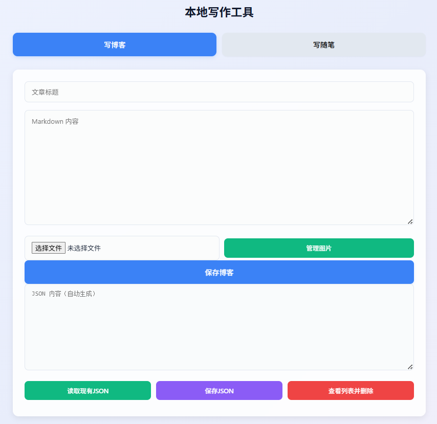
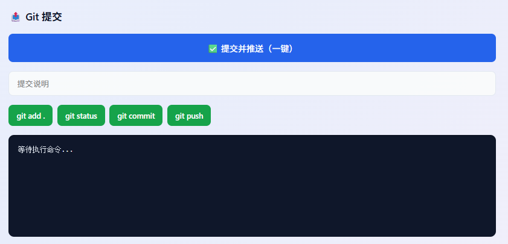

# GitHub Pages 本地写作工具

## ✍️ 博客模块
- 标题输入自动查重，存在直接加载原有内容，杜绝重复标题
- 图片智能插入：有光标插光标处，无光标自动插文末
- 选图即时上传保存，多图不乱跑、不插到文章开头
- 图片路径规范：images/博客标题/图片名
- 独立图片管理弹窗：查看当前博客所有图片，单张删除同步删服务器文件 + 编辑器代码，无残留
- 保存自动生成 MD 文件 + 维护 posts.json 索引
- 删除博客自动清理 MD 文件 + 整个图片文件夹

    
## 📝 随笔模块
- 随笔写作、多图上传、自动归档
- 列表查看、删除联动清文件
- 自动维护 pyq_list.json

    
## 🚀 Git 模块
- 分步 git 操作 / 一键 add+commit+push
- 日志实时输出，一键同步到 GitHub

    
## 📂 基础能力
- JSON 手动导入 / 导出 / 编辑保存
- 弹窗列表选择删除，交互完整
- 目录自动创建、文件安全命名、非法字符过滤

---

# 操作指南

app目录为博客发布工具（Python/Flask），./docs 为 GitHub Page 静态页面（配置pages的根目录为./docs后，app目录不会相互影响），工具仅用于本地编写、发布博客，不影响线上页面。

工具的本地路径、个性化配置全部放在 .env 文件中（该文件仅本地存在，不会上传到 GitHub）。
1. 安装依赖
    
    ```pip install flask python-dotenv```
2. 创建文件
    
    在app目录下新建文件 `.env` 文件
3. 复制配置内容（直接粘贴，修改路径即可）
    ```
    # ====== 博客工具核心配置 ======
    # 1. 博客文章存储目录（修改为你本地的文件夹路径）
    BASE_NOTES=your_local_folder_path\docs\notes

    # 2. 动态内容存储目录（修改为你本地的文件夹路径）
    BASE_PYQ=your_local_folder_path\docs\pyq

    # 3. Git 仓库根目录（本仓库的本地路径，用于同步代码）
    GIT_REPO_PATH=root_directory_path_of_local_repository

    # ======= 运行配置 =======
    # 本地调试模式（开发用True，运行用False）
    FLASK_DEBUG=True
    ```
4. 示例（Windows 参考）
    ```
    BASE_NOTES=D:\MyBlog\docs\notes
    BASE_PYQ=D:\MyBlog\docs\pyq
    GIT_REPO_PATH=D:\MyBlog
    FLASK_DEBUG=True
    ```
5. 启动工具

    a. 可通过 `写作工具.vbs` 快捷启动，自动打开本地网页，关闭网页自动退出
    
    b. 运行 `python app.py` ，打开 `http://127.0.0.1:5000`，启动页面

# 核心功能
- 博客管理：新建、编辑、删除，自动生成 MD 文件与索引
- 随笔管理：快速发布，支持多图上传、预览、删除
- 图片管理：文章图片单张上传、批量管理、自动关联
- 自动加载：标题查重，自动加载已有文章内容
- Git 同步：一键 add/commit/push，同步到 GitHub
- 安全关闭：关闭网页自动停止 Flask 服务
# 目录结构
```plaintext
博客仓库
├── app/
     ├── app.py            # 工具主程序
     ├── .env              # 本地私有配置（不上传）
     ├── templates
          └── index.html   # 管理前端页面
     └── static
          ├── style.css    # 样式文件
          └── script.js    # 交互脚本
└── docs/                  # GitHub Page 静态目录
```
# 注意事项
- .env 为本地私有配置，已被 .gitignore 保护，不会上传到 GitHub
- 工具仅本地运行，内容先保存在本地，再通过 Git 同步
- docs 目录为 GitHub Page 专用，建议通过工具自动更新
- 关闭网页会自动关停服务，重新使用需再次启动
