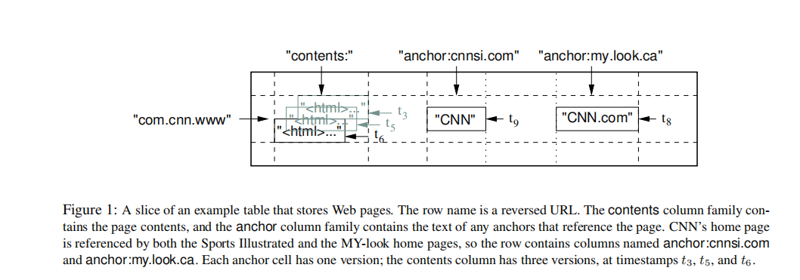
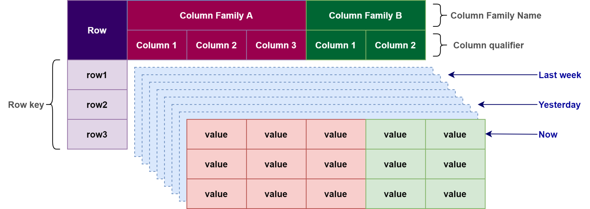
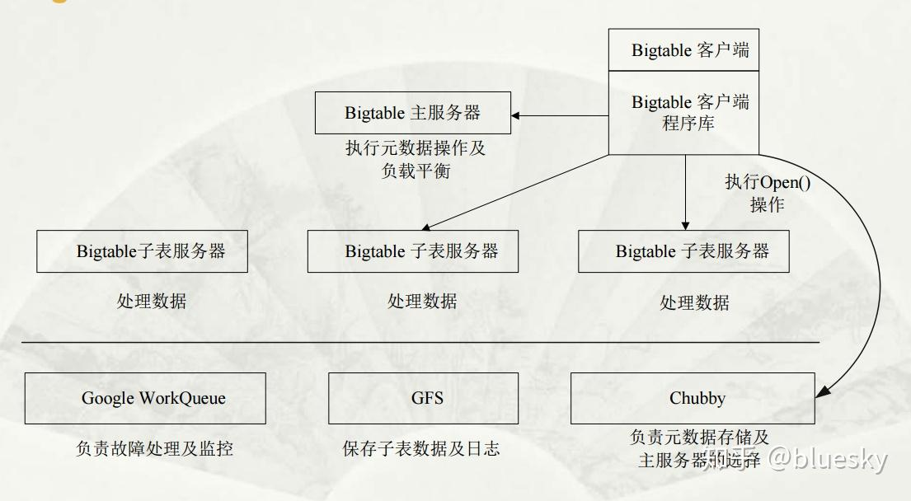
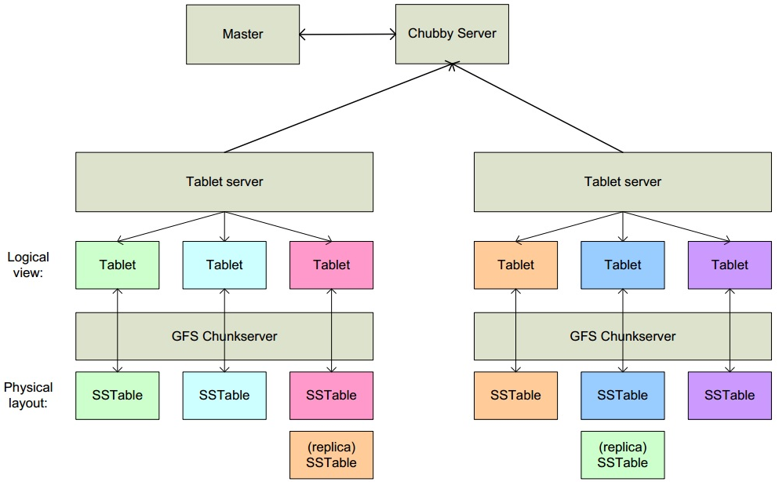
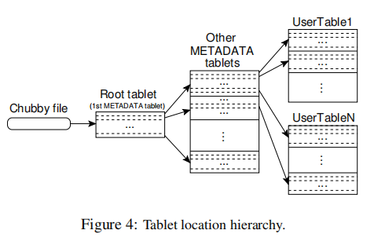
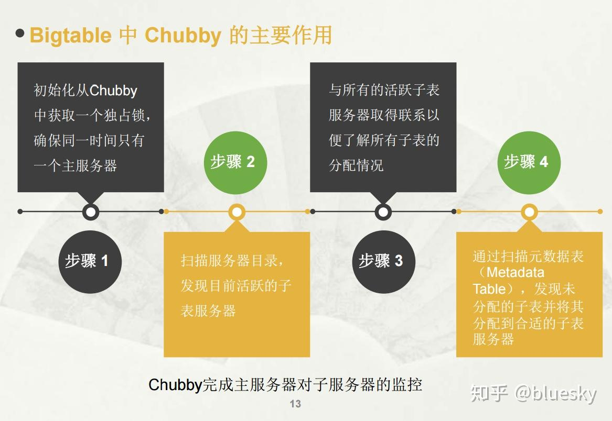
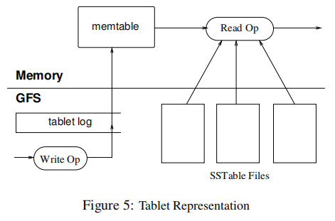

# Bigtable

Bigtable is a sparse, distributed, persistent multidimensional sorted map.

    **Bigtable是一个稀疏的、分布式的、持久化的多维有序映射表。**

Bigtable是谷歌设计的用于**管理结构化数据**的**分布式存储系统**，能够**可靠地扩展至PB级数据和数千台机器**，用于谷歌数十个产品和服务（谷歌分析、谷歌财经、个性化搜索、谷歌地球等），包含各式各样的工作负载，如从吞吐量导向型批量作业，到面向用户的低延迟数据服务。

[cnblogs - Bigtable：一个用于结构化数据的分布式存储系统](https://www.cnblogs.com/lilpig/p/18859002)

[lihuimintu.github.io - BigTable 学习笔记](https://lihuimintu.github.io/2019/03/03/read-bigtable/)

[CSDN - 精读《Bigtable: A Distributed Storage System for Structured Data》](https://blog.csdn.net/jankin6/article/details/143090206)

# 数据存储格式

Bigtable表中的数据通过一个**行关键字(Row Key)**、一个**列关键字(Column Key)** 以及 一个**时间戳(Time Stamp)**进行索引。

在Bigtable中一共有三级索引. 行关键字为第一级索引，列关键字为第二级索引，时间戳为第三级索引。

BigTable中的存储逻辑可以表示为

**（Row：String，Column：String，Time：int64）→ Value：String**

举例：保存大量web页面和相关信息的集合，我们会使用一个名为Webtable的表。使用URL作为row key，web页面的各个方面作为列名，并将web页面的内容存储在contents列中，列值实际存储在他们被抓取的时间戳下

    - 行：”com.cn.www”为网页的URL

    - 列：”contents:”为网页的文档内容，”anchor:”为网页的锚链接文本（anchor:为列族，包含2列cnnsi.com和my.look.ca）

    - 时间戳：t3、t5、t6、t8和t9均为时间戳

## Row Key 行键

- BigTable的**行关键字可以是任意字符串**，但是大小不能超过64KB

- 在**单个 row key 下的数据读写时原子的，**不管读写了多少不同的列

- 表中数据都是根据行关键字排序的，排序使用**字典序维护**

- 表的row range 被动态分区，**每一个row range 称作 tablet,是数据分布和负载均衡的  单位**

- 表按照行键范围自动分片位Tablet（100-200MB）

- 同一地址域的网页会被存储在表中的连续位置

对于一个网站 [www.cnn.com](https://link.zhihu.com/?target=http%3A//www.cnn.com/) 存储在 Bigtable 中的格式是 com.cnn.www

    这样倒排的好处是,（让同域名数据聚集）对于同一域名下的内容,我们可以进行更加快速的索引

## Column Family 列族

- Column Key 被分组到称作 **列族 （Column Family）** 的集合中

- **列族是访问控制（Access Control）的基本单元**

- 列关键字的命名语法： **列族 : 限定词**

- **在任何列数据可以存储进列族之前，列族必须被显式创建**

- 列族必须预先定义，不可动态增删

- 同一列族的数据物理上存在一起

- **Column Qualifier（列限定符）**：列族内的列名，动态创建，无数量限制

- 列键格式为 `family:qualifier`（如 `contents:html`、`anchor:cnnsi.com`）

## Time Stamp 时间戳

- 数据版本通过时间戳来区分

- 时间戳可以被bigtable**实时分配**，也可以被客户端程序**显式指定**

- Bigtable中的时间戳是64位整型数，可精确到毫秒

- 数据版本按时间戳**降序存储**，用于多版本控制

- 为了减轻各版本数据的管理负担，每个列族有2个设置参数，可通过这2个参数可以对废弃版本数据进行自动垃圾收集，**用户可以指定只保存最后n个版本数据**

## Cell 单元格

- 最小存储单元，**由（row，column，timestamp）唯一确定**

- **Cell的值是纯字节数组，Bigtable不解析格式**，可以是 字符串、二进制、序列化对象等等

# 构建块

Bigtable构建在多个谷歌的其它基础设施之上

1. **使用 GFS 存储日志和数据文件**

2. Bigtable集群通常运行在一个共享的机器池上，这些机器同时也在运行着其它分布式应用

3. Bigtable依赖集群管理系统来调度任务、管理资源、处理机器故障、监控机器状态

4. Bigtable内部**使用谷歌的SSTable格式来存储数据**

    - **SSTable 是一个 持久化、排序的、不可更改的 Map 结构**

    - 从内部看，SSTable是一系列的数据块，并通过块索引定位，块索引在打开SSTable时加载到内存中，用于快速查找到指定的数据块

1. **Bigtable依赖高可用的持久性分布式锁——Chubby**

    2. **确保在任意时间只有一个master存在**；

    3. 存储Bigtable数据的boot strap位置；

    4. **发现tablet服务器，释放tablet server**；

    5. 存储Bigtable schema信息； 

    6. **存储访问控制列表**

    如果Chubby挂了，Bigtable就挂了

# BigTable 基本结构

**主要组件**

- 一个链接到所有客户端的库

- 一个 master 服务器

- 许多 tablet 服务器 （可随工作负载变更 动态添加）

## **Master**

    1. **给tablet 服务器分配 tablet**

    2. **检测 tablet 服务器的新增和过期**

    3. 对 tablet 服务器进行 **负载均衡**

    4. **执行 GFS 文件的 GC**

    5. 处理 schema 变化（如 表 和 列族 的 创建）

## **Tablet Server 服务器**

    1. **管理一个 tablet 集合** （通常一个tablet服务器上有 10 - 1000个tablet）

    2. **处理tablet 的读写请求**

    3. **分割变得过大的 tablet**

如同大多数单master的分布式存储系统，客户端直接与tablet server通信以读写数据，而且它们不依赖master来获取tablet位置信息，大多数客户端从不和master通信。实践中master的负载很轻。

一个表初始只包含一个tablet，随着表增大，它自动分割出多个tablet，默认每一个大约100到200MB。

# Tablet 位置寻址架构

使用**三级结构**的**模拟B+ 树**来存储tablet 位置信息

用于高效定位海量数据表分片（Tablet）的所在节点

### 第一层：Chubby文件 （全局入口）

- **Chubby是谷歌的分布式锁和元数据强一致性服务**

- 这个**Chubby文件唯一保存Root Tablet的地址，是整个寻址体系的锚点**

- 所有客户端寻址的第一步 都会先访问 Chubby获取根节点位置

- Chubby服务维护5个活动副本，选择其中一个为Master 并处理请求，通过 Paxos 算法 来保证副本一致性

### 第二层：Root Tablet （META 0）

- Root Tablet是 METADATA 元数据表的第一个分片

- **永远不会分裂，保证层级稳定**

- **存储的是 所有其他METADATA Tablet 的位置信息**

### 第三层：Other METADATA Tablet （META1）

- 这些元数据分片，**每一条记录都保存 用户数据表 Tablet 的路由位置**

- 相当于 二级索引，一次查询可以映射海量用户数据分片

### 第四层：User Tablets 数据表分片

- 最底层数据，真正存储业务数据的 UserTable1 ~ UserTableN

- 每个用户大表，都会被拆分为多个Tablet，分布在整个集群的 Tablet Server 上

### 寻址流程

1. 客户端先访问 **Chubby**，拿到 Root Tablet 地址

2. 访问 **Root Tablet**，找到目标 METADATA Tablet

3. 访问 **METADATA Tablet**，查到目标 User Tablet 所在服务器

4. **直接和对应 Tablet Server 通信，完成数据读写**

5. **客户端会缓存路由结果，后续访问直接命中缓存，大幅降低寻址开销,**

    6. 如果没有缓存或者缓存失效，那么客户端会在树状存储结构中 递归查询

### 设计优势

- **固定三层深度**：Root 永不分裂，层级永远最多 3 层，查找效率极高

- **极强的可扩展性**：单条 METADATA 记录约 1KB，一个 128MB 的元数据分片，就能寻址海量数据分片，理论可支撑超大规模集群

- **高可靠强一致**：依赖 Chubby 保证根元数据绝对可靠，避免单点故障

- **客户端缓存加速**：路由信息本地缓存，绝大多数访问不需要逐级递归查找

# 物理存储分层

**Tablet → Memtable / SSTable → GFS**

# Tablet 分配

- **在任何时刻，一个Tablet只能分配给一个Tablet服务器，**由Master来控制分配

- **master会跟踪存活的tablet server集合，以及当前server上的tablet分配情况（包含未分配的tablet）**

    - 当一个tablet未分配，并且有一个具有足够空间的tablet server，master会通过发送一个tablet负载请求到这个server上来分配tablet

- **Bigtable通过 Chubby 跟踪 Tablet服务器的状态。**

    - **当Tablet服务器启动时，会在指定Chubby目录下注册一个   唯一名称的文件节点 并获取该文件的 独占锁**

    - 当Tablet服务器关闭或者失效时，会释放这个独占锁

- **Master为了检测 Tablet Server的存活性，会周期性的轮询 每一个 Tablet Server是否还持有锁**

    - **当Tablet服务器不提供服务时**，Master会通过轮询 Chubby 上Tablet服务器文件锁 的状态检查出来，**确认后会删除其在 Chubby注册的节点，**使其不再提供服务。最后Master会重新分配这个Tablet Server 上的 Tablet 到其他未分配的 Tablet集合内

## Master启动流程

- 当集群管理系统**启动一个Master服务器后**，这个Master会执行以下步骤：

    1. **从Chubby获取一个唯一的Master锁**，保证Chubby只有一个Master实例

    2. **扫描 Chubby 上的Tablet文件锁目录，获取当前运行的Tablet Server 列表**

    3. **和所有 Tablet Server通信，获取每个Tablet Server 上的 Tablet 分配信息**

    4. **扫描 MetaData 表 获取所有 Tablet 集合**，如果发现还未分配的 Tablet，就将其加入未分配 Tablet 集合等待分配

可能会遇到一种复杂的情况

在METADATA表的 Tablet 还没有被分配之前是不能够被扫描的

因此，在开始扫描之前（步骤4），如果在步骤3中没有发现Root Tablet的分配，则 Master 服务器将 Root Tablet 添加到未分配的Tablet集合中。

这个附加操作确保了Root Tablet会被分配。

由于Root Tablet 包含了所有 METADATA的 Tablet 名称，因此Master服务器扫描完 Root Tablet 以后，就得到了所有的 METADATA表的名称

Tablet集合只会在 以下几种情况下 变更：

1. 表 创建 / 删除 

2. 两个已经存在的Tablet 合并成一个更大的 Tablet

3. 一个已经存在的 Tablet 分割成两个更小的 Tablet

除了第 3 个事件，前两个都是由Master启动的。

**Tablet Split是由Tablet Server启动的。**

## **Tablet分裂**

### **Tablet分裂流程**

1. **分裂触发**：当一个 Tablet 体积过大（默认～100-200MB），Tablet Server 本地将其拆分为 2 个新的**子 Tablet**（左、右分片）。

2. **元数据提交**：分裂完成后，Tablet Server 首先**原子更新 METADATA 元数据表**：

    - 删除原父 Tablet 的路由记录

    - 写入两个新子 Tablet 的行范围、位置等元数据✅ 到这一步，分裂操作**在全局元数据上正式生效**

1. **主动上报 Master**：元数据持久化成功后，Tablet Server 主动向 Master 发送 `Split Complete` 通知，告知分裂完成、新 Tablet 信息。

2. **Master 更新状态**：Master 收到通知，更新全局 Tablet 分布视图，完成负载均衡与状态同步。

### **分裂故障场景**

- 分裂第 2 步**已经完成**：`METADATA表已经永久写入了新子Tablet信息`，分裂本身全局生效

- 第 3 步失败：Tablet Server 发给 Master 的通知**网络丢失**、发送时 Tablet Server 宕机、或 Master 宕机未收到通知

此时状态不一致：

- ✅ METADATA 表：已经存在新的子 Tablet 条目

- ❌ Master 内存视图：还保留旧的父 Tablet，不知道分裂已经发生

在分割通知丢失的情况下（可能 Tablet服务器或 Master服务器中有一个宕机）

### **被动恢复流程**

1. **Master 发起加载 / 调度请求**

    Master 正常进行负载均衡、故障恢复、Tablet 迁移，向 Tablet Server 发送指令，要求加载、管理旧的父 Tablet。

1. **两边信息校验不匹配**

    - Master 视角：要加载的还是**未分裂的完整父 Tablet**

    - Tablet Server + METADATA 视角：METADATA 表已经标记父 Tablet 不存在，仅存在两个拆分后的子 Tablet

    - Tablet Server 对比 METADATA 权威元数据后发现：Master 要求的目标 Tablet**已经不再完整、已经被分裂**。

1. **Tablet Server 补发通知** 

    Tablet Server 不会执行错误的加载指令，而是主动重新向 Master 发送**最新的分裂完成通知**，上报当前真实存在的两个新子 Tablet 的完整信息。

1. **最终一致性收敛**

    - Master 收到补发通知后，更新全局路由视图

    - 废弃旧父 Tablet 记录，接纳新子 Tablet

    - 整个集群分裂状态最终达成一致，整个过程**无需人工干预、自动容错**

### 设计优势

1. **元数据优先原则**

    分裂的提交**永远先落地 METADATA 表**，METADATA 是唯一可信源，内存中的 Master 状态永远以持久化元数据为准，避免脑裂。

1. **幂等 + 自愈**

    通知可重复发送、可丢失，不会导致重复分裂、数据损坏，任意节点宕机重启都可以通过元数据比对自动修正状态。

1. **降低 Master 负担**

    Master 不需要感知分裂细节，仅做全局调度；分裂决策、元数据修改全部下放给 Tablet Server，去中心化、性能更强。

1. **可用性保障**

    即使通知永久丢失，后续正常的负载调度、Tablet 加载动作，一定会触发不一致检查，最终闭环修复。

整个流程保证：**即使出现任意单点宕机、网络临时中断，分裂操作不会丢失、不会产生数据不一致**

# Tablet 服务

- **Tablet的持久状态保存在 GFS 中**。

- **更新操作会提交 Redo 日志**，更新操作分为两类

    - 最近提交的更新操作会存放在一个排序缓存 **MemTable**中

    - 较早提交的更新操作会存放在 **SSTable** 中，落地在GFS中

- **Tablet的恢复**

    - Tablet服务器 从 MetaData 表中读取这个Tablet的元数据

    - 元数据里面包含了组成这个Tablet的SSTable 和 RedoPoint (其指向任意的可能包含数据的提交日志上)

    - Server读取SSTable的索引到内存中，通过重放在RedoPoint已经提交的所有更新来重建MemTable

- **对 Tablet 服务器的写操作**

    - 首先检查操作格式正确性和权限 （从Chubby拉取权限列表）

    - 之后有效的写记录会写入到提交日志（Commit Log）

        - （也支持批量提交）

    - 最后写入的内容插入 MemTable 中

- **对 Tablet 服务器的读操作**

    - 首先检查操作格式正确性和权限

    - 之后有效的读操作在一系列 SSTable 和 MemTable 合并的视图内执行 

        - （因为SSTable以及memtable都是字典序的有序数据结构，可高效生成 合并视图）

在tablet被分割或合并过程中的read和write操作可以继续执行。

# 压缩 Compaction

**写数据进内存（Memtable）→** 

**满了 Minor Compaction 刷成 SSTable →** 

**SSTable 堆积太多   →**

**Major Compaction 合并、瘦身、清垃圾、回收空间，保证读写长期稳定高效。**

## 1. Minor Compaction （小幅合并 / 内存刷盘）

**触发时机**

- **内存中的 Memtable 不断写入、增长，到达预设内存阈值**

- 也会在内存压力、后台定时、Tablet 迁移时被动触发

**执行过程**

1. **当前满的 Memtable 立刻冻结**（停止接收新写入）

2. **后台把冻结的 Memtable 整体序列化、排序、写出为一个不可变的 SSTable 文件，落盘到持久化存储**（GFS/Colossus）

3. **立刻创建一块全新的空 Memtable**，承接新的用户写入

4. 本次操作**不会合并、不会清理旧 SSTable**，仅内存转磁盘

**优势**

✅ **释放 Tablet Server 内存**，避免内存无限膨胀、OOM

✅ **缩短灾难恢复时间**：

- 宕机重启时，只需要重放**最近未落盘的少量 WAL（提交日志）**

- 大量历史数据已经固化为 SSTable，不用再从头回放整条日志

    ✅ 写入路径极快，对前台读写延迟影响极小

## 2. Major Compaction（大幅合并/SSTable重写合并）

**触发背景与问题**

- Minor Compaction 持续运行 → **SSTable 文件会越来越多**

- **一次读操作需要遍历、归并大量 SSTable**（还要配合内存 Memtable），读延迟显著升高、放大 IO 开销

**执行过程**

1. **选取多个（甚至全部）层级的旧 SSTable**

2. **后台全盘读取、多路归并排序**

3. **剔除无效数据**：

    - **被新版本覆盖的旧单元格**

    - **带墓碑标记（Tombstone）的已删除数据**

    - **过期、超出保留版本数量的历史时间戳数据**

1. **生成少量、体积更大、更紧凑的全新 SSTable**

2. 新文件生效后，**原子删除全部旧的小 SSTable**

**核心两大收益**

✅ **控制 SSTable 总数量**，大幅降低读放大，显著提升读取性能

✅ **真正回收磁盘空间**：彻底物理移除已删除、过期、废弃数据，完成空间回收

|维度|Minor Compaction|Major Compaction|
|-|-|-|
|本质|**内存 Memtable → 单个磁盘 SSTable**|**多个旧 SSTable → 少量新 SSTable**|
|频率|高，持续、频繁触发|低，定期 / 阈值触发（重资源操作）|
|主要目标|释放内存、减少日志重放量|减少文件数、优化读性能|
|数据清理|不清理删除 / 过期数据|彻底清理墓碑、旧版本、删除数据|
|资源开销|轻量，前台几乎无感|重度 IO、CPU，后台限速运行|
|空间回收|无|真正回收磁盘存储空间|

## 压缩特点

1. **写路径永远高效**

    **所有用户写入只走「WAL 日志 + 写入 Memtable」**，不需要直接写磁盘 SSTable，所以 Bigtable **写吞吐极高**。

1. **读放大来源**

    **读取时要查：活跃 Memtable → 冻结 Memtable → 全部 SSTable**

    → **文件越多，读放大会越严重**，这就是 Major Compaction 必须存在的根本原因。

1. **层级压缩优化**

    现代 Bigtable 以及衍生系统（HBase、RocksDB、TiDB、CockroachDB）都引入了**分层 Compaction（Leveled Compaction），不再一次性合并全部文件**，进一步削峰、降低业务影响。

1. **运维痛点**

    Major Compaction 曾经是经典痛点：高峰期触发会引发磁盘 IO 打满、集群抖动，所以系统都会做：后台限速、低峰调度、大小分层策略来规避。

# 优化

## 1. 局部性群族

- **用户可以将多个列族组合成一个局部性群族**，Tablet中每个局部性群族都会生产一个SSTable

- **通常不会一起访问的分割成不同局部性群族，可以提高读取效率**

- 可以局部性群族为单位专门设定一些调优参数，如是否存储于内存等

## 2. 压缩

- 用户可以控制一个局部性群族的SSTable是否压缩

- 很多用户使用”**两遍可定制**“的压缩方式：

    - 第一遍采用Bentley and Mcllroy（大扫描窗口内常见长字符串压缩）

    - 第二遍采用快速压缩算法（小扫描窗口内重复数据）

    这种方式压缩速度达到100- 200MB/s , 解压速度达到 400 - 1000MB/s，空间压缩比达到10:1

## 3. 缓存

- Tablet服务器使用**二级缓存策略来提高读操作性能**

    - 第一级缓存为 **扫描缓存**：缓存Tablet服务器通过 SSTable接口获取的 Key-Value 对 （时间局部性）

    - 第二级缓存为 **块缓存**：缓存从GFS 读取的 SSTable 块 （空间局部性）

## 4. 布隆过滤器

- **一个读操作必须读取构成Tablet状态的所有SSTable数据**，故如果这些SSTable不在内存便需多次访问磁盘

- 允许用户**使用一个Bloom过滤器来查询SStable是否包含指定的行和列数据**

    - 付出少量Bloom过滤器内存存储代价，换来显著减少访问磁盘次数

## 5. Commit 日志实现

- 如果每个Tablet 操作的Commit日志单独写一个文件，会导致日志文件数目过多

- 优化：**每个Tablet服务器写一个公共的物理日志文件，里面混合了各个Tablet的修改日志**

- 这个优化显著提高普通操作性能，却让恢复工作复杂化。

    - 当一台Tablet服务器挂了，需要将其上面的tablet均匀恢复到其他Tablet服务器，则其他服务器都得读取完整的Commit日志。

    - 优化：**日志排序**：**为了避免多次读Commit日志，我们将日志按关键字排序`(table, row, log_seq)`，让同一个Tablet的操作日志在物理上是连续存放的**

        - **恢复时只读取自己的连续段** → 恢复速度极快、不互相干扰

Bigtable **用「一台服务器一个共享日志」提升写入性能，再用「日志排序」让故障恢复依然高效**，在写入性能和恢复速度之间做到了完美平衡。

## 6. Tablet 恢复提速

Master迁移Tablet时，源Tablet服务器会对这个Tablet做一次Minor Compaction，减少Tablet服务器日志文件没有归并的记录，从而减少了恢复时间

Master 发起 **Tablet 迁移**（负载均衡、节点下线、故障调度）时：

1. 源 Tablet Server 先对该待迁移 Tablet **主动执行一次 Minor Compaction**；

2. 将该 Tablet 内存中未落地的 Memtable 强制刷盘，转为**SSTable**；

3. 清空该 Tablet 对应、仅存在于 WAL 日志里的未合并数据。

形成闭环：

- 平时：WAL 日志共享、多 Tablet 混合写入，提升吞吐；

- 分片分裂：靠元数据表保证一致性；

- 分片迁移：**主动 Minor Compaction 预落地**，清空日志负担；

- 节点宕机：才需要完整解析、截取排序后的共享日志做恢复。

## 7. 利用不变性

- **Bigtable 整个存储架构最核心的基石设计：SSTable 不可变性（Immutability）**，正是这个特性，极大简化了分布式系统的复杂度。

- Bigtable 利用 SSTable 永久不变的特性，**把复杂的「随机更新、随机修改」难题，彻底转化为「顺序追加、只读合并」的简单问题，**用极简的底层设计支撑了超大规模、高吞吐、高可靠的分布式宽表存储。

### **Bigtable中不变量**

1. **Memtable**：内存可变结构，支持原地更新、删除

2. **Minor Compaction 刷盘生成的 SSTable**：**一旦写入磁盘，永远只读、永远不会被修改、不会原地更新**

3. **Major Compaction 合并生成的新 SSTable**：同样**一经写出，永久不变**

4. 唯一例外：缓存中的视图、内存索引，不属于磁盘原始 SSTable 本体

所有落地的 SSTable 文件，**只追加、删除，不改动**。

### **不可变性带来的系统简化收益**

#### 1. 彻底消除并发写入冲突与锁

- 普通 B + 树需要页分裂、原地覆写、大量锁、并发控制、崩溃恢复的复杂逻辑

- SSTable 不可变：**没有任何修改操作**，读和写完全互不干扰，全程无锁、无页冲突

- 多线程、多客户端同时访问同一个 SSTable，完全不需要加锁保护

#### 2. 崩溃恢复极其简单可靠

- 正在写入的只有当前 Memtable 和 WAL 日志

- 已经落盘的 SSTable 永远完好、永远有效

- 宕机重启：仅重放 WAL 恢复 Memtable，**旧 SSTable 完全不用校验、不用修复**

- 极大降低故障恢复复杂度、大幅缩短宕机时间

#### 3. 读路径极度高效、无副作用

- 读操作可以并行扫描多个 SSTable，完全不用担心读到半更新、脏数据

- 可以安全缓存 SSTable 的索引、布隆过滤器、整块数据到内存缓存

- 缓存永远无需失效、更新，因为底层文件永远不变

#### 4. 副本与分布式复制大幅简化

- SSTable 不变，跨机房、跨节点复制就是**纯文件拷贝**

- 无需增量同步、增量更新、一致性校验，只要完整复制文件即可

- Paxos / 分布式副本管理逻辑被极大简化

#### 5. Compaction 实现逻辑干净优雅

- 删除、更新都**不改动旧文件**，只追加新 SSTable、墓碑标记 (Tombstone)

- Major Compaction：只读多路归并、生成全新干净 SSTable

- 旧文件在新文件完全生效后，一次性原子删除即可

#### 6. 轻松实现多版本、时间旅行

- 旧版本数据永远保存在旧 SSTable 中，不会被改动覆盖

- 天然支持按时间戳读取历史快照、回溯任意时间点数据

### 代价与权衡

- **写放大**：更新 / 删除不会原地覆盖，只会追加新数据，旧垃圾需要 Major Compaction 清理

- **读放大**：一次读需要合并多个 SSTable 的结果，需要靠缓存、布隆过滤器、定期 Major Compaction 抵消

- **空间放大**：短时间内会存在较多重复、过期数据

