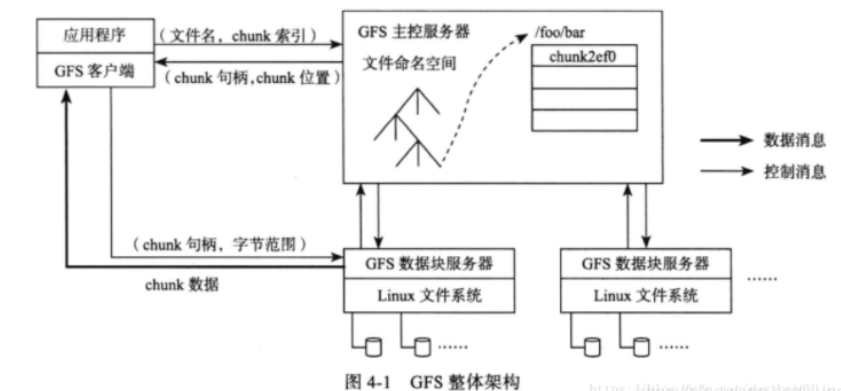
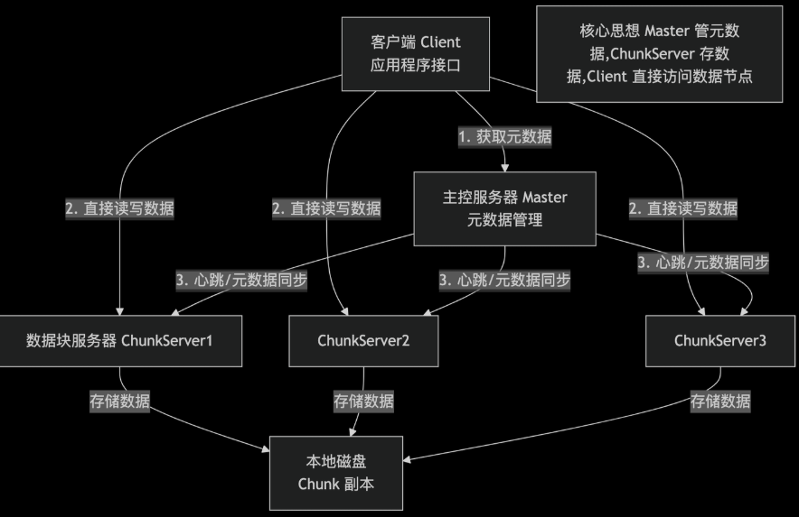
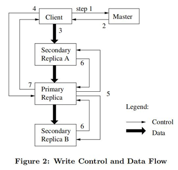
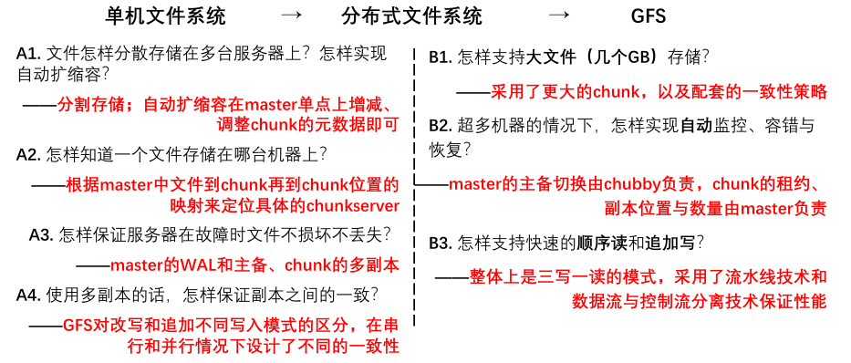

# GFS
Ghemawat S, Gobioff H, Leung S T. [The Google file system](https://scholar.google.com.hk/scholar?hl=zh-CN&as_sdt=0%2C5&q=The+Google+file+system&btnG=)[C]//Proceedings of the nineteenth ACM symposium on Operating systems principles. 2003: 29-43.

**Google File System （GFS）（谷歌文件系统）**

**TFS = Taobao File System    （淘宝文件系统）**

**BFS = Baidu File System      （百度文件系统）**

Google File System (GFS) 是由 Google 在 2003 年提出的分布式文件系统，专为大规模数据密集型应用（如搜索引擎、日志存储）设计。其核心目标是在**普通商用硬件**上实现**高吞吐量**、**高容错性**、**可扩展性**的存储服务。

[zhuanlan.zhihu.com](https://zhuanlan.zhihu.com/p/1948841153492386388)

[blog.csdn.net](https://blog.csdn.net/HugeBrian/article/details/119357226)

## 设计目标

- **海量存储**：支持 PB 级数据存储，单集群可容纳数万台服务器；

- **高容错性**：基于普通硬件构建，通过多副本和故障自动恢复确保数据不丢失；

- **高吞吐量**：优化批量读写性能，满足大数据处理场景的高 IO 需求；

- **简单实用**：针对 Google 内部应用特点定制，放弃部分 POSIX 接口以换取更高效率。

- **低成本**：运行在廉价商用硬件上。

- **简单一致性模型**：提供“最终一致性”语义。

## 核心架构

### 主要组件

GFS 采用 **主从架构（Master-Slave）**，由三种核心角色构成：**主控服务器（GFS Master）**、**数据块服务器（ChunkServer）** 和 **客户端（Client）**。

|组件|角色|
|-|-|
|**Master**|**中心控制节点**，**管理元数据**（命名空间、Chunk位置、访问控制）。**仅一个活跃 Master**（支持影子 Master 备份）|
|**ChunkServer**|**数据存储节点**，存储文件分块（Chunk）。**每个 Chunk 默认为 64MB**|
|**Client**|**应用程序接口**，**与 Master 交互获取元数据，直接与 Chunkserver 读写数据**|

#### **Master（单节点，元数据大脑）**

1. **不存真实数据**，只管理**元数据**：文件目录树、文件→Chunk 映射、Chunk 副本位置、权限。

    - **文件与目录结构**：文件命名空间（目录树）、访问权限等；

    - **文件 - 数据块映射**：记录每个文件由哪些数据块（Chunk）组成；

    - **数据块位置信息**：每个 Chunk 存储在哪些 ChunkServer 上（非持久化，由 ChunkServer 定期汇报）。

1. **元数据存储管理**：

    - 文件和Chunk的命名空间、文件和Chunk的对应关系的元数据存储在Master的本地磁盘中持久化

    - **存储块的位置信息不会持久化**，因为在Master重启时，可以从各个ChunkServer处手机Chunk的位置信息

1. **内存 + 日志**：**元数据全放内存**（极快）；操作日志持久化到磁盘，并远程备份。

    - **元数据全内存存储**：Master 将元数据保存在内存中，减少磁盘 IO 开销，支持高效查询；

    - **元数据持久化**：通过操作日志（Operation Log）记录元数据变更，确保 Master 重启后可恢复状态；

    - **轻量级交互**：仅响应 Client 的元数据查询和 ChunkServer 的心跳请求，不参与数据传输。

1. **全局管控**：Chunk 创建 / 删除、副本调度、负载均衡、故障检测、垃圾回收。

    - **Chunk 租约管理**：通过租约机制授权 ChunkServer 处理写操作（详见下文 “租约机制”）；

    - **数据块复制**：确保每个 Chunk 有足够副本（默认 3 个），在节点故障时自动补全副本；

    - **负载均衡**：将 Chunk 均匀分布到 ChunkServer，避免单点过载；

    - **垃圾回收**：识别并回收无用 Chunk（如文件删除后遗留的 Chunk）。

1. **Master设计**

    - GFS所有的数据流都不经过Master，而是直接由Client和ChunkServer交互

        - GFS将控制流和数据流分离，只有控制流才经过Master

    - GFS的Client会缓存Master中的元数据，在大部分情况下，都无需访问Master

    - 为了避免Master的内存成为系统瓶颈，GFS采用一些手段来节省Master内存

        - 增大Chunk大小以节省Chunk的数量

        - 对元数据进行定制化压缩

        - 一个64MB的Chunk，它的元数据小于64B（64字节）

        - 1TB数据对应的元数据大小为 3 MB

1. **单点但高可用**：**单活跃 Master + 影子 Master（Shadow Master）热备**。

#### **ChunkServer（数据节点，海量）**

- **数据块管理**

    - 存真实数据，文件切为**固定 64MB Chunk（数据块）**（远大于普通 FS 的 4KB）

    - 每个 Chunk 有**全局唯一标识符 64 位** **Chunk Handle**（ID）

    - 以普通Linux文件形式存储Chunk数据，每个Chunk对应磁盘上的一个文件

- **副本存储：Chunk 默认 3 副本**，跨机架 / 机器分布，自动复制、修复。

    - 1 个 **Primary（主副本）**

    - 2 个 **Secondary（备副本）**

- 本地存 Chunk + 校验和（防数据损坏）

- **数据读写**：接收 Client 的读写请求，执行实际的 IO 操作，参与写操作的一致性协调（如租约机制中的主 / 备节点）

#### **Client（应用客户端）**

- Client 是应用程序访问 GFS 的接口，提供一组专用 API（非 POSIX 兼容），负责协调元数据查询和数据读写

- **元数据查询：**与 Master 交互**查元数据**，拿到 Chunk 位置后**直接连 ChunkServer 读写**（Master 不中转数据）。

- **数据读写**：Client 直接与 ChunkServer 交互完成数据传输，无需经过 Master

- **缓存优化：Client** 缓存元数据，减少对 Master 的访问次数。

## 读写流程

**读写需求**

- **读取 → 快速**，为了极致的性能，可以读到落后的版本，但一定不能是错误的

- **写入** → 进一步分为两种：改写（overwrite）和追加（append）

- **改写 → 正确**，通常不用在意性能。在意性能的改写可以转为追加。

- **追加 → 快速**，为了极致的性能，可以允许一定的异常，但**追加的数据一定不能丢失**

### GFS 写入

- 写入要在三个副本都完成写入后才能返回写入结果

- GFS写入技术

    1. **流水线技术**

        - **client会把文件数据发往离自己最近的一个副本**，无论他是否是主（持有租约）。这个副本在接收数据后，就立刻向其他副本转发（一边接收，一边转发），控制数据的流向，节省网络传输带宽

    1. **数据流与控制流分离技术**

        - GFS对一致性的保证不受数据同步的干扰

        - 

#### 写操作流程（数据追加）

1. **Client 请求 Master**：获取目标文件最后一个 Chunk 的 Primary Replica 主副本位置，以及其他副本（Secondary Replicas）的位置  < 通常Client中有缓存>。

2. **Master 分配租约**：指定一个 Chunkserver 作为 Primary，返回所有副本位置。

3. **Client 推送数据**：将数据推送到所有副本（不立即写入磁盘，仅缓存），使用流水线技术，是写入过程中唯一的数据流操作。

4. **Primary 确认数据**：收到所有主、备 所有副本确认后，Client发送正式写入请求到主副本。主副本收到请求，对该Chunk上所有的操作顺序排序，指定写入顺序并通知 Secondary 写入。

    - 
Primary Replica 唯一确定写入顺序，保证副本一致性

1. **Secondary 写入并应答**：Secondary 备副本按顺序写入数据并返回给 Primary 写入成功。

2. **Primary 应答 Client**：所有副本成功写入后，Primary 返回成功写入结果给 Client。

    - 所有副本都写入成功，Client确认写入完成

    - 部分 Secondary 写入失败，Client 认为写入失败，并从第3步  client推送数据 开始重新执行

**租约  Lease = 带时间限制的 “临时授权证书”**

    1. Master 为 Chunk 的某个副本授予 Primary 身份（带租约）。

    2. 租约有效期默认为 60 秒，可续期。

    3. Primary 负责协调该 Chunk 的写入顺序。

    特点：

    - 有**有效期**（GFS 默认 **60 秒**）

    - **到期自动失效，不需要手动撤销**

    - 避免分布式系统中最麻烦的：**脑裂、双主、冲突**

    GFS 每个 Chunk（64MB）有 3 个副本：

    - 1 个 **Primary（主副本）**

    - 2 个 **Secondary（备副本）**

    **租约作用：**

    1. Master 给其中一个副本颁发 **Lease**

    2. **只有持有 Lease 的才是 Primary**

    3. **所有写操作必须由 Primary 统一排序**

    4. 保证多副本写入顺序一致 → **保证一致性**

    **租约解决：**

    - Lease 有**超时时间**

    - 旧主的 Lease 没到期前，**Master 绝对不会给新主发 Lease  (就算旧主失联，也必须等任期结束)**

    - 保证**任何时刻最多一个 Primary**

**特点：通过 Primary 协调写入顺序，保证多副本一致性。**

### 读操作流程

1. Client 收到读取一个文件的请求后，首先查看自身缓存中有没有此文件的元数据信息。如果没有，向 Master 请求 Chunk元数据信息（位置）并缓存。

2. Master 返回 Chunk 所有副本的位置。

3. Client计算文件偏移量对应的Chunk

4. Client **选择最近副本 ChunkServer（基于网络拓扑）发送读请求**

    5. 如果这个chunkserver没有所需的chunk，说明缓存失效，重新请求master获取最新元数据

    6. 读取时进行chunk 校验和确认，如果校验和验证不通过，选择其他副本进行读取

7. Client 返回应用读取结果

## 核心设计特点

### 单一 Master 设计

- **优点**：简化设计，全局视图管理元数据。

- **挑战**：Master 可能成为瓶颈。

- **解决方案**：

    - 客户端缓存元数据。

    - Master 仅存储元数据（不参与数据传输）。

    - 支持影子 Master（Shadow Master）提供只读容灾。

### 大 Chunk 尺寸（64MB）

GFS 将文件划分为 **64MB 的固定大小 Chunk**，远大于普通文件系统的块（如 4KB），这一设计带来多重优势：

- **减少元数据量**：每个 Chunk 仅需一条元数据记录，Master 内存可容纳海量 Chunk 信息；

- **提升 Client 缓存效率**：Client 缓存的 Chunk 位置信息有效期更长，减少元数据查询；

- **优化批量操作**：大 Chunk 适合大数据处理场景的连续读写，降低 IO 次数；

- **简化副本管理**：单个 Chunk 的副本复制和故障恢复成本更低

- **缺点：小文件存储效率低**（内部碎片）。

### 租约机制

GFS 中最常见的写操作是 **追加（Append）**，为避免每次写操作都请求 Master 导致瓶颈，GFS 引入 **租约（Lease）机制** 授权 ChunkServer 自主协调写操作

租约机制核心流程

1. **租约授予**：Master 为某个 Chunk 选择一个 ChunkServer 作为 **主 ChunkServer（Primary）**，授予其租约（默认有效期 60 秒），其他副本所在节点为 **备 ChunkServer（Secondary）**；

2. **写操作协调**：

    - Client 将数据发送到所有副本节点（Primary + Secondary）的缓存；

    - Client 向 Primary 发送写请求，Primary 确定写顺序并通知所有 Secondary 执行；

    - 所有节点完成写操作后，Primary 向 Client 返回成功响应；

1. **租约续期**：Primary 可在租约到期前向 Master 请求续期，确保连续写操作无需频繁请求 Master。

#### 作用与优势

- **减轻 Master 负担**：Master 仅需授予租约，无需参与每次写操作的协调；

- **保证一致性**：由 Primary 统一协调写顺序，确保所有副本的数据一致性；

- **支持并发追加**：多个 Client 可同时追加数据到同一 Chunk，Primary 负责合并顺序并处理冲突。

### 高容错机制

|故障类型|处理机制|
|-|-|
|**ChunkServer宕机**|Master 定期发送心跳检测，若超时则标记为失效，在其他节点重建副本|
|**Master宕机**|通过 Checkpoint + 操作日志快速恢复，影子 Master 接管服务|
|**数据损坏**|通过 Checksum 验证数据完整性（每 64KB 块计算 32位校验和）|

### 高可用设计

#### 1. Master 的高可用设计

- Master的三类元数据中，**namespace** 和 **文件与chunk的对应关系**，因为只存在于master中，**必须要持久化**，保证其高可用

- GFS中 正在使用的Master称为primary master；同时还维持一个 shadow master 作为备份

- Master在正常运行时，对元数据的所有修改操作，都要**先记录日志（Write Ahead Log，WAL）**，再去真正修改内存中的元数据

- primary master 会实时向shadow master同步WAL，**只有 shadow master同步日志完成，元数据修改操作才算成功**

    - 生成新增元数据的日志并写入本地磁盘 → 把WAL传输给shadow master → 得到反馈后再正式修改primary master的内存

- 主备自动切换：如果master 宕机，会通过Google 的 Chubby（共识算法）来识别并切换到shadow master，实现秒级切换

#### 2. Chunk 的高可用设计

- 文件被拆分为一个一个的chunk来存储，每个chunk都有**三个副本**，**文件数据的高可用 是以 chunk维度 来保持的**

- 无法在chunkserver之间建立物理上的主备关系，通过唯一中心节点 **master 维持chunk的副本信息**

- 对一个chunk的每次写入，**必须确保在三个副本中的写入都完成，才视为 写入完成**

- 一个chunk的所有副本都会具有完整的数据 

    - 如果一个chunkserver 宕机，它上面的所有chunk都有另外两个副本依旧保存这个chunk的数据

    - 如果这个宕机的副本在一段时间内没有恢复，那么master就可以在另一个chunkserver重建一个副本，从而始终把chunk的副本数目维持在 3 个

- **GFS会维持每个chunk的校验和**，**读取时可以通过校验和进行数据的校验**。如果校验和不匹配， chunkserver会反馈给master处理，master会选择其他副本进行读取，并重建此chunk副本。

- 为了减少对master的压力，GFS采用**租约机制，把文件的读写权限下放给某一个chunk副本**

    - Master可以把租约授权给某个chunk副本，我们把这个chunk副本称为primary，**在租约生效的一段时间内，对这个chunk的写操作直接由这个副本负责**，租约的有效期一般为60秒。

    - **租约的主备只决定控制流走向，不影响数据流。**

- Chunk副本的放置也是一个关键问题，GFS中有三种情况需要master发起创建chunk副本， 分别是**新chunk创建**、**chunk副本复制**（re-replication）和**负载均衡**（rebalancing）。

    -  **副本复制 :** 是指因为某些原因，比如一个副本所在的chunkserver宕机，导致chunk副本数 小于预期值（一般为3）后，新增一个chunk副本； 

    - **负载均衡：**发生在master定期对chunkserver的监测，如果发现某个chunkserver的负载过高， 就会执行负载均衡操作，把chunk副本搬到另外的chunkserver上。当然，这里的“搬迁”操 作，实际上就是新建chunk和删除原chunk的操作

    - 这三个操作中，master对副本位置的选择策略是相同的，要遵循以下三点：

        1. 新副本所在的chunkserver的**资源利用率较低**

        2. 新副本所在的chunkserver**最近创建的chunk副本不多**。这里是为了防止某个chunkserver瞬 间增加大量副本，成为热点

        3. chunk的**其他副本不能在同一机架**。这里是为了保证机架或机房级别的高可用

### 一致性模型

|操作类型|一致性保证|
|-|-|
|**顺序写**|所有副本按相同顺序执行 → **强一致性**|
|**并发写**|由 Primary 决定顺序 → **所有副本最终一致，但可能部分覆盖**（应用层需处理冲突）|
|**追加写**|至少被原子追加一次（可能包含重复数据），偏移量由 Primary 返回 → **记录级原子性**|

GFS将文件数据的一致性大体上分为三个层次：**inconsistent，consistent，defined**

- **consisitent**：一致的，表示文件无论从哪个副本读取，读结果都一样

- **defined**：已定义的，文件发生了修改操作后，读取是一致的，且Client可以看到最新修改的内容（在consistent基础上还能与用户最新的写入保持一致）

**GFS一致性场景**

- **串行改写成功：defined**。因为所有副本都完成改写后才能返回成功，并且重复执行改写 也不会产生副本间不一致，所以串行改写成功数据是defined。

- **写入失败：inconsistent**。这通常发生在重试了一定次数仍无法在所有副本都写入成功时， 意味着大概率有个副本宕机了，这种情况下一定是不一致的，Client也不会返回成功。

- **并发改写成功：consistent but undefined**。对于单个改写操作而言，成功就意味着副本 间是一致的。但并发改写操作可能会涉及多个chunk，不同chunk对改写的执行顺序不一定 相同，而这有可能造成应用读取不到预期的结果

- 追加写成功：defined interspersed with inconsistent（已定义但有可能存在副本间不一致）。 

    - interspersed with inconsistent，追加的重复执行会造成副本间的不一致

    - 为实现追加的一致性，GFS额外限制：

        1. 单次append的大小不超过64MB

        2. 如果文件最后一个chunk的大小不足以提供此次追加所需空间，则把此空间用padding填满，然后 新增chunk进行append

            - 每次append都会限制在一个chunk上，从而可以保证追加操作的原子性，在并发执行时也可以 保证Client读取符合最新追加的结果

**设计哲学：“放松一致性要求以换取性能与简单性**”（由应用层处理语义冲突）。

## 优缺点分析

### ✅ 优点

- **高吞吐量**：优化大文件顺序读写。

- **高扩展性**：轻松扩展至数千节点。

- **高容错性**：自动故障检测与恢复。

- **成本低**：基于廉价硬件构建。

### ❌ 缺点

- **单 Master 瓶颈**：元数据操作受限于 Master 性能。

- **小文件性能差**：Chunk 尺寸导致存储效率低。

- **弱一致性模型**：需应用层处理并发冲突。

- **专为谷歌场景设计**：不适用于低延迟 OLTP 系统。

**GFS 是分布式文件系统的里程碑式设计**，其核心贡献在于：

- **面向大规模数据处理**：通过大 Chunk、单 Master 简化设计，优化吞吐量。

- **容错优先**：在普通硬件上通过多副本 + 自动恢复实现高可用。

- **松弛一致性模型**：以应用层可接受的代价换取系统性能。

- **启发生态系统**：直接推动了 Hadoop HDFS 等开源系统的诞生。

**GFS 的设计哲学**：

    **在大规模、高故障率的硬件环境中，通过简化设计、放松一致性要求，实现高吞吐、高可用的存储服务。**

## GFS & HDFS 对比

|特性|Google GFS|HDFS（Hadoop Distributed File System）|
|-|-|-|
|数据块大小|64MB|128MB（默认，可配置）|
|主节点|GFS Master|NameNode|
|从节点|ChunkServer|DataNode|
|分布式协调|依赖内部服务|依赖 ZooKeeper（替代 GFS 的内部协调机制）|
|租约机制|用于写操作协调|无租约机制，由 NameNode 直接协调|
|主要写操作|追加（Append）|追加（Append），支持有限的随机写|
|容错性|多副本（默认 3 个）|多副本（默认 3 个）|

