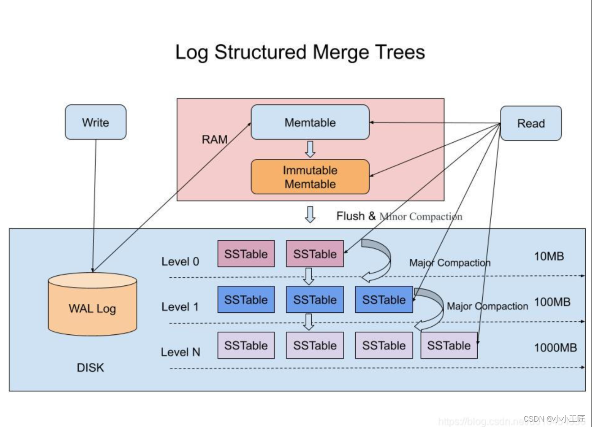
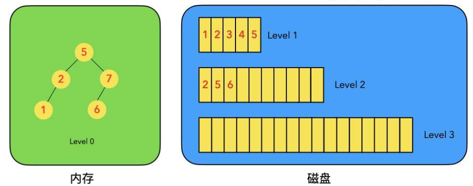
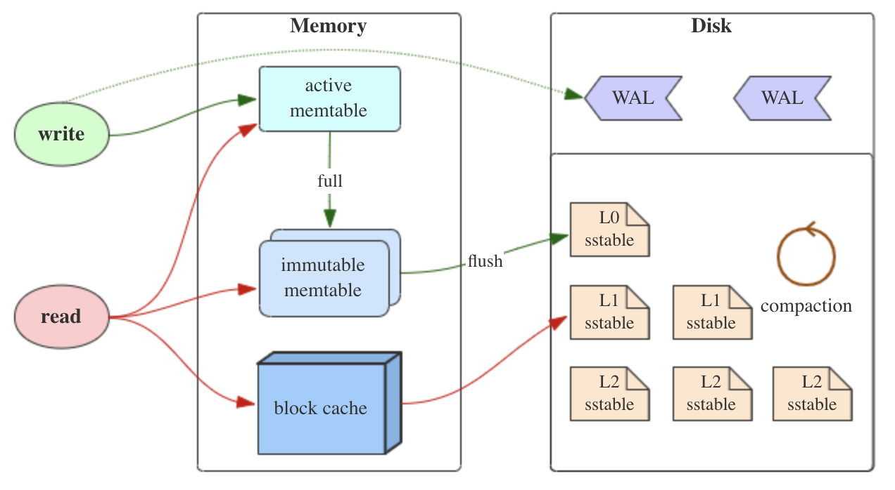
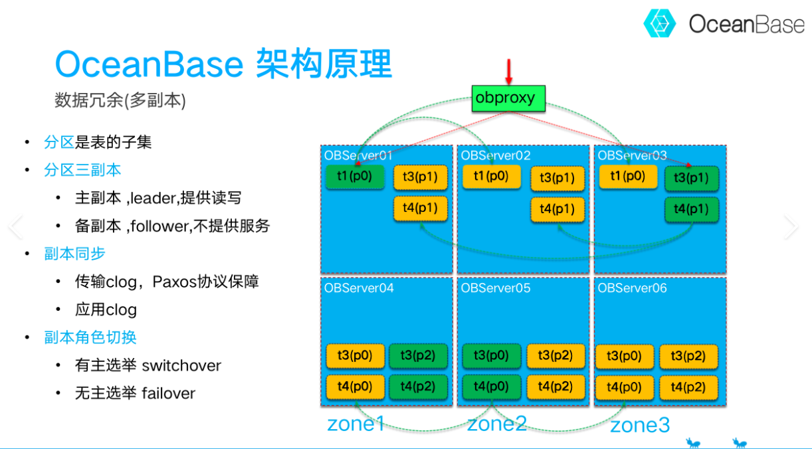
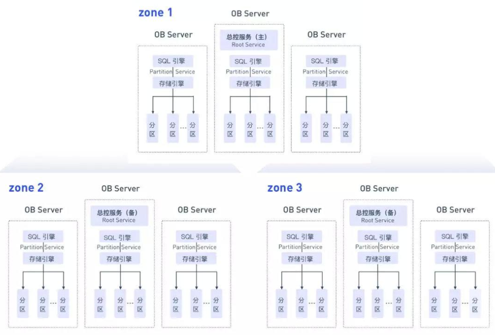

# LSM-Tree

**LSM-Tree → Log-Structured Merge Tree 日志结构合并树**

---
O’Neil P, Cheng E, Gawlick D, et al.[ The log-structured merge-tree (LSM-tree)](https://link.springer.com/article/10.1007/s002360050048)[J]. Acta informatica, 1996, 33(4): 351-385.

---

**LSM 树 是面向高写入吞吐的存储引擎核心数据结构**，也是 Bigtable、OceanBase、RocksDB、LevelDB、HBase 等数据库的底层存储基石。

**LSM-Tree的核心思想是 将所有的更新操作（包括插入、删除和修改）都转换为追加写操作 ，从而充分利用磁盘顺序写性能远高于随机写性能的特性。**

[cnblogs - LSM 树详解](https://www.cnblogs.com/Finley/p/13900987.html)

[CSDN - 精读《B-Tree vs LSM-Tree》](https://hiszm.blog.csdn.net/article/details/143651228?spm=1001.2014.3001.5502)

[cnblogs - LSM-Tree ：结构化的日志合并树——NewSQL数据库的基石](https://www.cnblogs.com/johnnyzen/p/19235030)

---

# 核心思想

**放弃随机写入，全部改为顺序写入，事后再合并整理**

- 传统 B + 树：更新需要随机修改磁盘页，大量磁盘随机 IO，写入上限低

- LSM 树：写入先写内存，满了顺序刷盘，后台定期合并文件，**极致放大写入性能**，用后台的 CPU/IO 开销，换取前端超高写吞吐。

---

# 基础架构

经典 LSM 树分为两大核心部分：

1. **内存层（MemTable）**

    - 内存中的有序可变表(通常是一个有序数组或跳表)，新写入全部优先进入这里

    - 读写速度极快

    - 通常选择 **跳表** 实现作为 Memtable 的数据结构，因为它支持无锁的并发读写

    - 写满后被转换为不可修改的**只读 Immutable Memtable**，停止接收新写入，并创建一个新的空 Memtable，后台线程会将 Immutable MemTable写入到磁盘中形成一个新的SSTable文件，并销毁Immutable MemTable

1. **磁盘层（SSTable / Sorted String Table）**

    - 内存满后，通过 **Minor Compaction**，顺序 dump 生成不可变 SSTable 文件落盘

    - SSTable（Sorted String Table）特点：全局按键有序、**一经写入永久只读、永远不会原地修改**

    - 磁盘上 SSTable 按层级存放（L0 → L1 → L2...），层级越深、文件越大、数据越冷

# 读、写操作流程

LSM 的数据更新是日志式的，修改数据时直接追加一条新记录（为被修改数据创建一个新版本），而使用 B/B+ 树的数据库则需要找到数据在磁盘上的位置并在原地进行修改。

### 1. 写入流程（极高性能）

**WAL 先行 → 写内存 → 满了刷盘 → 后台合并**

LSM 写入先落 WAL 日志，再写入内存 Memtable；

内存写满触发 Minor Compaction 固化为不可变 SSTable；

大量 SSTable 通过后台 Major Compaction 合并、清理过期与删除数据，全程顺序写、规避随机 IO，实现高吞吐写入。

1. **写 WAL 预写日志 (Write-Ahead-Logging)**

    - 先顺序追加写入 重做日志（Commit Log/Redo Log），保证宕机不丢数据，遵循 WAL 机制

1. **写入 Memtable**

    - 数据**顺序追加写入内存有序 Memtable**（跳表 / 红黑树有序结构）

    - 新增、修改、删除全部在内存完成，无磁盘随机 IO，写入极快。

    - **删除：**并不是直接删除数据，而是通过 “**墓碑标记**”来标识删除数据，只会在 Major Compaction时真正清理、回收空间

    - **修改**：直接插入一条**新版本 KV**，覆盖靠版本号 / 时间戳实现

1. **Memtable 达到阈值**

    内存容量达到上限

    - 当前 Memtable 被冻结 （Immutable，不再写入）

    - 新建一块空的 Memtable 承接新的写入

1. **Minor Compaction 内存落盘**

    - 冻结只读的 Immutable Memtable，后台有序批量写出，生成不可变SSTable 落到磁盘

    - SSTable一旦生成，永久只读，不可修改

1. **Major Compaction 大合并**

    不断 Minor Compaction 会产生大量小 SSTable，读放大加重；后台定期触发 Major Compaction：

    - 多路归并多个 SSTable

    - 清理：旧版本数据、被覆盖数据、墓碑删除数据、过期数据

    - 生成更少、更大、紧凑的新 SSTable，删除旧文件，回收空间

✅ 全程**只有内存随机写 + 磁盘顺序写**，无随机 IO，并发、吞吐极强

### 2. 查询读取流程

**数据按时间从新到旧查找，找到最新版本直接返回**

读取需要多层合并查找：

1. **先查活跃 Memtable**

    优先查询正在写入的内存表，最新数据都在这里，命中直接返回

1. **再查冻结 Immutable Memtable**

    活跃内存表没命中，继续查已经冻结、等待刷盘的内存表。

1. **查 Block Cache**

    如果 Memtable 中未找到数据，则从 Block Cache中查找。Block Cache 存储了预先加载到内存中的SSTable块，以提高读取性能

1. **从最新到最旧，逐层扫描磁盘 SSTable**

    从上到下、从新文件到老文件，依次检索每一层 SSTable：

    - 利用**索引、布隆过滤器**快速过滤不存在的 key，减少 IO

    - SSTable 内部有序，二分查找定位数据

1. **版本冲突与合并**

    读到多条同 key 不同版本数据：

    - 保留**时间戳最新、符合当前隔离级别快照**的版本

    - 过滤旧版本、已覆盖数据、过期数据

1. **处理删除墓碑 Tombstone**

    如果读到合法墓碑标记，说明数据已删除，直接返回不存在

1. **找到该 key 最新版本，合并返回结果**

    整合内存 + 磁盘多层结果，返回最终可见数据

👉 代价：一次读需要扫描多个文件，产生 **读放大**

# 三个 “放大”权衡

|放大类型|产生原因|影响|
|-|-|-|
|**写放大**|数据多次反复重写、多次 Compaction|实际磁盘写入量远大于用户写入量|
|**读放大**|查询需要遍历内存 + 多层大量 SSTable|单次读延迟升高|
|**空间放大**|短时间存在大量重复、过期、待删除数据|磁盘临时占用偏高|

- 读放大 : 读取数据时实际读取的数据量大于真正的数据量。例如 LSM 读取数据时需要扫描多个 SSTable.

- 写放大 : 写入数据时实际写入的数据量大于真正的数据量。例如在 LSM 树中写入时可能触发Compact操作，导致实际写入的数据量远大于该key的数据量。

- 空间放大 : 数据实际占用的磁盘空间比数据的真正大小更多。例如上文提到的 SSTable 中存储的旧版数据都是无效的。

# 优缺点

✅ **优势**

1. 极致高吞吐写入，完美适配海量时序、日志、流水、监控数据场景

2. SSTable 不可变，锁、并发、崩溃恢复逻辑极简

3. 天然支持 MVCC 多版本、时间戳快照、历史数据回溯

4. 极易水平扩展，分布式友好

⚠️ **劣势**

1. Compaction 会带来瞬时 IO 毛刺，容易引发集群抖动

2. 点查、高频读取性能弱于 B + 树

3. 存在三大放大的固有权衡开销

OceanBase : 蚂蚁集团自研的开源 NewSQL 数据库 / 分布式关系型数据库

