# OceanBase知识

[www.oceanbase.com](https://www.oceanbase.com/docs/common-oceanbase-database-cn-1000000005682187)

OB 的特性如下：

- **透明可扩展**: OB整体做了存算分离，在总控的帮助下可以按需伸缩，伸缩后自动做负载均衡。

- **极致高可用**： 通过Paxos来实现的高可用，可以保证数据的一致性和完整性。支持单机房、双机房、两地三中心、三地五中心部署。支持基于日志复制的主备库

- **混合事务和分析处理**：同时支持 OLAP 和 OLTP

- **多租户**：支持单集群多租户，基于租户来实现资源隔离

- **高兼容性**：支持 MySQL和 Oracle 语法

- **完整自主知识产权**：好

- **高性能**：准内存数据库，基于 LSM Tree 实现读写性能优化，支持强一致性事务

- **安全性**： 支持各类安全需求。

# OB概述

OceanBase 数据库（OceanBase Database）是一款完全自研的企业级原生分布式数据库，在普通硬件上实现金融级高可用，首创“三地五中心”城市级故障自动无损容灾新标准，刷新 TPC-C 标准测试，单集群规模超过 1500 节点，具有云原生、强一致性、高度兼容 Oracle/MySQL 等特性。

## 核心特性

### 高可用

独创 **“三地五中心” 容灾架构**方案，建立金融行业无损容灾新标准。支持同城/异地容灾，可**实现多地多活**，满足金融行业 6 级容灾标准（RPO=0，RTO< 8s），数据零丢失。

### 高兼容

**高度兼容 Oracle 和 MySQL**，覆盖绝大多数常见功能，支持过程语言、触发器等高级特性，**提供自动迁移工具**，支持迁移评估和反向同步以保障数据迁移安全，可支撑金融、政府、运营商等关键行业核心场景替代。

### 水平扩展

**实现透明水平扩展**，支持业务**快速的扩容缩容**，同时通过准内存处理架构实现高性能。支持集群节点超过数千个，单集群最大数据量超过 3PB，最大单表行数达万亿级。

### 低成本

**基于 LSM-Tree 的高压缩引擎**，存储成本降低 70% - 90%；**原生支持多租户架构**，同一集群可为多个独立业务提供服务，**租户间数据隔离**，降低部署和运维成本。

### 实时 HTAP

基于“同一份数据，同一个引擎”，**同时支持在线 实时交易 TP 及 实时分析 AP 两种场景**，“一份数据”的多个副本可以存储成多种形态，用于不同工作负载，从根本上保持数据一致性。

### 安全可靠

自 2010 年开始**完全自主研发**，代码级可控，**自研单机分布式一体化架构**，连续多年通过大规模金融核心场景的可靠性验证；完备的角色权限管理体系，**数据存储和通信全链路透明加密**，支持国密算法，通过等保三级专项合规检测。

### 共享存储

**共享存储（Shared-Storage）形态下，计算节点和数据存储完全分离**，存储可按需购买，计算节点可灵活扩缩容，从而实现极致的资源弹性与成本优化，并支持 AP、TP、KV 全产品形态。

---

## 产品架构

[https://blog.csdn.net/f80407515/article/details/128225287](https://blog.csdn.net/f80407515/article/details/128225287)

OceanBase 社区版数据库内核开源， 与 MySQL 兼容，对接虚拟化和大数据技术及产品，支持多种图形化的开发工具、运维监控工具和数据迁移工具；同时社区版提供开放的接口和丰富的生态能力，支持企业或个人更好的实现定制化业务需求。

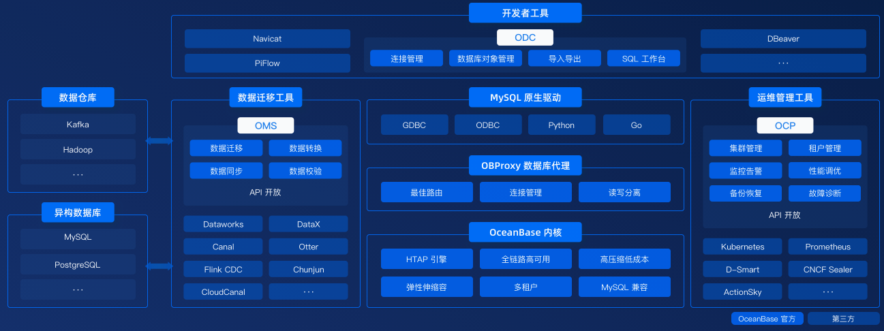

OceanBase 企业版（OceanBase Database）是一款完全自研的企业级原生分布式数据库，在普通硬件上实现金融级高可用，首创“三地五中心”城市级故障自动无损容灾新标准，刷新 TPC-C 标准测试，单集群 规模超过 1500 节点，具有云原生、强一致性、高度兼容 Oracle/MySQL 等特性。

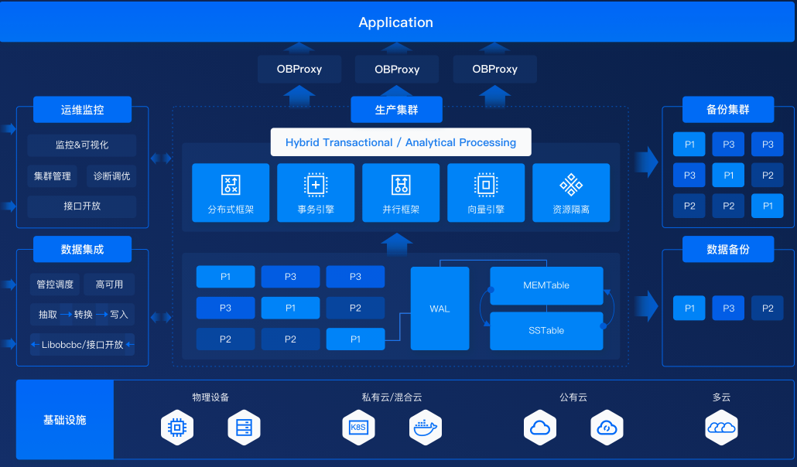

### **迁移评估工具 OMA**

OceanBase 迁移评估工具 （OceanBase Migration Assessment，OMA）是 OceanBase 提供的数据库迁移评估的产品，为数据迁移提供精准的兼容性评估、高效的性能评估以及应用逻辑改造建议。OMA 支持评估Oracle 、DB2 LUW、PostgreSQL 等多种数据库与 OceanBase 的兼容情况，提供画像分析和自动转换方案；支持应用负载回放功能，帮助客户预知迁移后可能的性能风险并提供优化方案；OMA 还支持评估 C、Java 业务代码以及驱动的兼容性以助力用户高效率、低成本迁移至OceanBase。

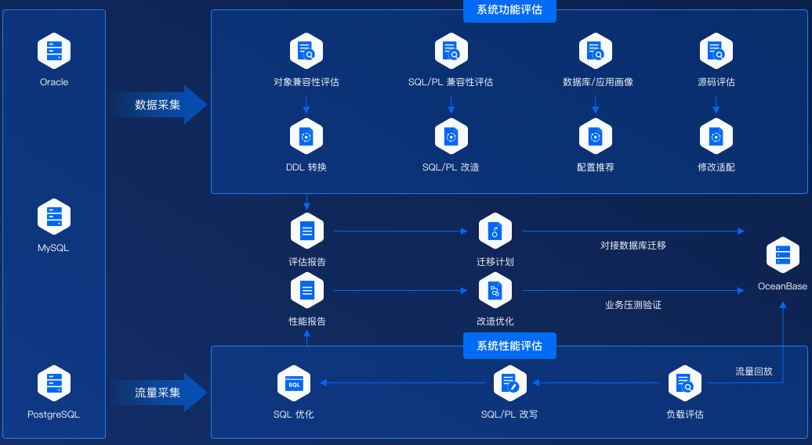

### **迁移工具 OMS**

OceanBase 数据迁移工具（OceanBase Migration Service，OMS）是 OceanBase 数据库一站式数据传输和同步的产品。它支持多种关系型数据库、消息队列与 OceanBase 数据库之间的数据复制，是集数据迁移、实时数据同步和增量数据订阅于一体的数据传输服务，OMS 帮助您低风险、低成本、高效率的实现 OceanBase 的数据流通，助力构建安全、稳定、高效的数据复制架构。

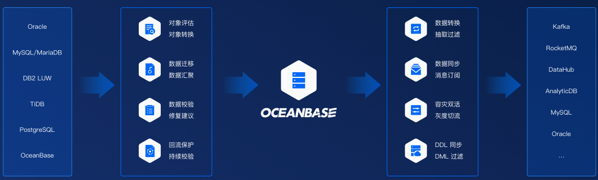

### **开发工具 ODC**

OceanBase 开发者工具（OceanBase Developer Center，ODC）作为 OceanBase 数据库量身打造的企业级数据库开发平台，旨在帮助企业安全、高效的使用数据库。您可通过 ODC 创建和管理数据库中的表、视图等 10 余种数据库对象。基于 WebSQL，ODC 提供了 SQL 窗口和匿名块窗口作为数据库开发者开发和诊断 SQL 和 PL/SQL 的工作区。您还可为指定角色分配对应资源及该资源的访问权限，企业内不同角色间的开发协作亦会变得简单可控。

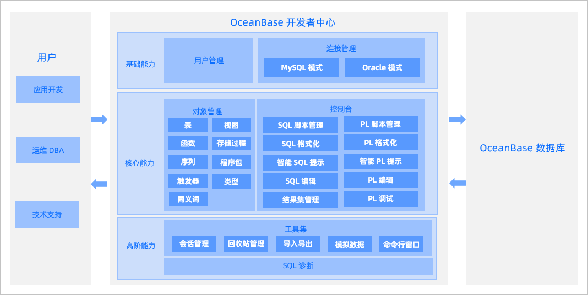

### **运维工具 OCP**

OceanBase 运维管理工具（OceanBase Control Platform ，OCP）是一款为 OceanBase 数据库集群量身打造的企业级管理平台，兼容 OceanBase 所有主流版本。OCP 提供对 OceanBase 集群的图形化管理能力，包括数据库组件及相关资源的全生命周期管理、监控告警、性能诊断、故障恢复、备份恢复等，旨在协助客户更加高效地管理 OceanBase 数据库，降低企业的IT运维成本和用户的学习成本。

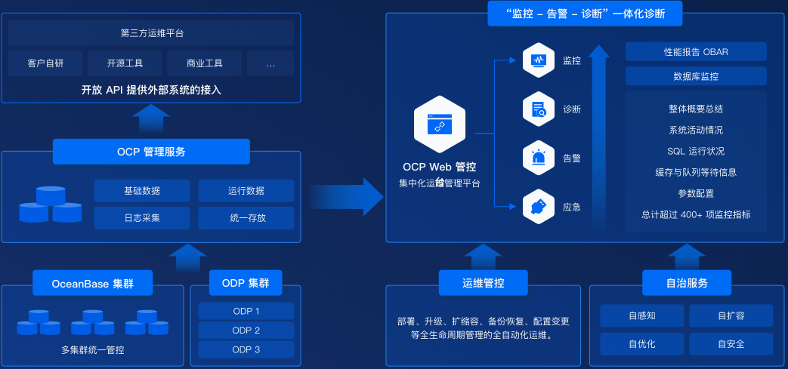

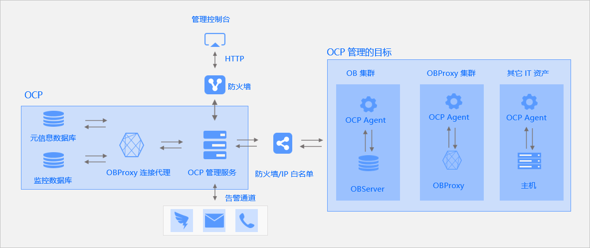

### 自治服务工具 OAS

OceanBase Autonomy Service (OAS)

OAS 是 OceanBase 面向开发、运维、DBA 的一站式智能诊断自治服务，为用户提供可视化监控、性能优化、故障诊断、安全管理、容量管理等能力，帮助用户更简单、更低成本、更高性能的使用 OceanBase 数据库。

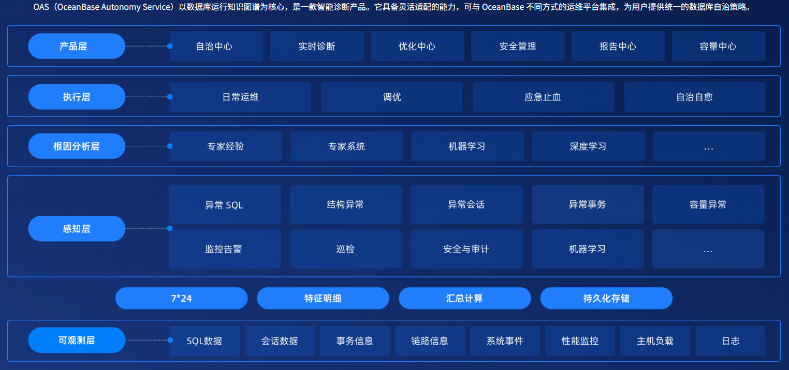

---

---

# 部署模式

OceanBase 数据库支持**无共享（Shared-Nothing，SN）模式** 和 **共享存储（Shared-Storage，SS）模式**两种部署模式。

### 1. 无共享模式 (Shared Nothing，SN)

SN 模式：本地存储、存算一体、对等节点、机房 / 机架级容灾，传统分布式交易场景。

**1.节点特性**

- **所有节点完全对等，无特殊角色**、无主次硬件差异。

- 单节点独立具备完整能力：SQL 引擎 + 存储引擎 + 事务引擎。

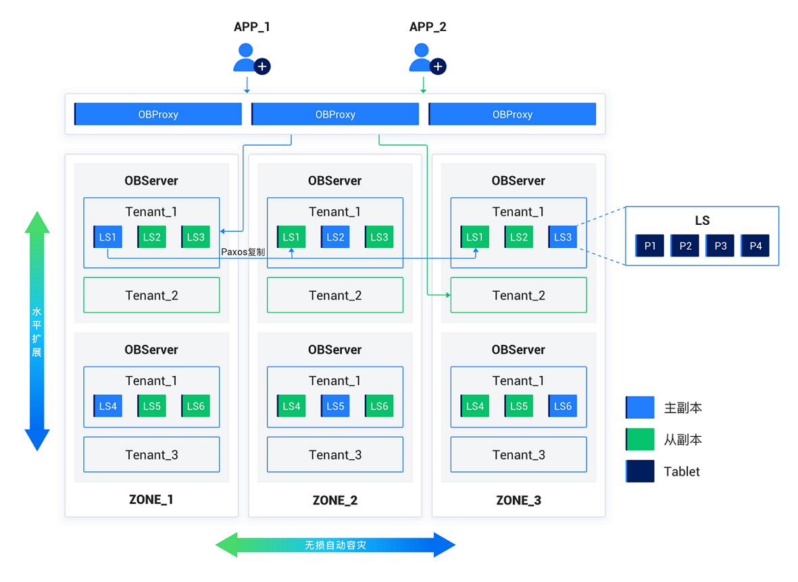

**2. 硬件与存储**

- 基于普通 PC 服务器集群部署，硬件要求通用、成本低；

- **存算绑定，依赖节点本地磁盘存储数据、事务 Redo 日志。**

**3. 核心进程**

- 集群所有服务器统一运行单进程实例：**observer**。

- 使用本地的文件存储数据和事务 Redo 日志。

**4. 可用区 Zone 机制**

- Zone 为**逻辑隔离单元**，由多台服务器组成；

- 同机房部署：Zone 对应同一机架 / 交换机；

- 多机房部署：Zone 对应独立数据中心 IDC。

**5. 多副本与一致性**

- 数据跨可用区存储多副本，兼顾故障容灾、分担读压力；

- 规则：**单可用区内同一租户仅 1 份副本，多可用区实现多副本**；

- 副本间通过 **Paxos 协议** 保障分布式强一致。

**6. 多租户能力**

- 原生内置多租户，单租户等价独立数据库实例；

- 租户可自定义数据分布、副本数量、副本类型；

- 租户间 CPU、内存、IO 资源 **强隔离**，互不干扰。

**7. 架构优势**

- 高扩展、高可用、高性能、低成本、兼容主流数据库。

### 2. 共享存储模式 (SS / Sahred Storage)

SS 模式：共享对象存储、存算分离、本地缓存，云化弹性负载场景。

**1.核心架构**

- **采用 存算分离 设计，计算与底层存储解耦**。

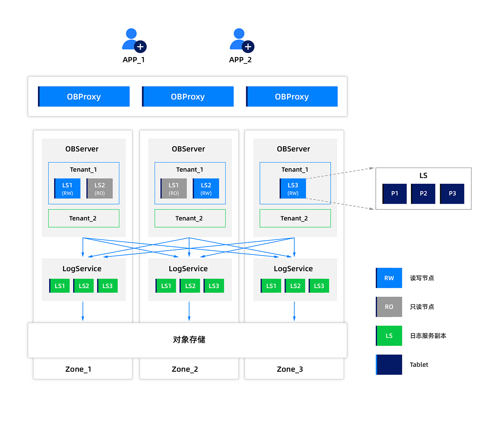

**2.数据存储规则**

- **租户 全量数据、日志 统一持久化至 共享对象存储**；

- **本地磁盘仅做 热点数据 + 热点日志 缓存**，节省本地存储开销。

**3.适用特点**

- 云原生适配性强，支持计算节点弹性扩缩容、读写分离。

---

---

# OB整体架构

[open.oceanbase.com](https://open.oceanbase.com/blog/10900143)

## 集群架构

Region（地域 / 城市） → Zone（可用区） →

OBServer（节点进程） → 分区 / 副本 → 分区服务

全局管控：RootService

流量入口：ODProxy

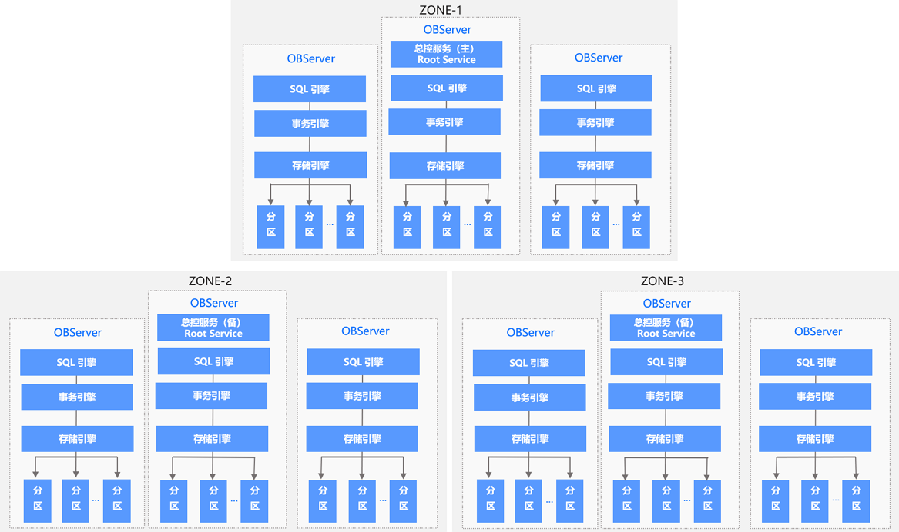

OceanBase 整体架构图，包括3个zone，其中ZONE-1中有总控服务主其它ZONE为总控服务备，每个ZONE中又有OBServer数据库服务和分区服务。

### 常用术语

- **Region 区域**

    - 跨地域 / 跨城市部署的逻辑单元，也叫站点

    - 支持多站点、异地多活、城市级容灾

    - 一个Region 可以包含多个 Zone

- **Zone 可用区**

    - 逻辑概念，不是物理机器

    - 由一台或多台 运行OBServer进程的服务器组成

    - 同机房可按机架/交换机 划分 Zone；多机房可按机房划分

- **OBServer**

    - OceanBase 数据库**核心服务进程**

    - 集群每台节点都部署 OBServer，承担SQL、存储、事务、副本能力

- **OBProxy 接入代理**

    - 专属代理服务，独立进程；

    - 接收用户 SQL 请求，**智能路由转发**到最合适的 OBServer；

    - 把执行结果回传给应用；

    - 屏蔽集群底层分布式细节，应用无感知。

- **副本**

    - 每个Zone 上只会存 **同一个分区的一个副本**

    - 副本类型：**全功能副本、日志副本**

    - 靠多副本 + Paxos 实现高可用、故障容灾

- **分区 & Leader & Primary Zone**

    - 数据最小分发单位是**分区**，副本以分区为粒度存放

    - 同一个分区，跨多个 Zone 存多副本

    - **Leader**：分区主副本所在的 OBServer 节点

    - **Primary Zone**：分区主副本所在的可用区 Zone

    - 读写、强一致查询都走分区 Leader 主副本

- **RootService 总控服务**

    - 部署在某个 OBServer 上

    - 集群内 **1个主 RootService + 多个备用**

    - 集群全局总管：资源调度、资源分配、数据分布管理、Schema 元数据管理

- **分区服务**

    - 每个 OBServer 本地都运行分区服务模块

    - 负责本机所有分区的管理、操作

    - 和 **事务引擎、存储引擎** 深度调用协作，完成分区读写、日志、合并等动作

---

## 总控服务 RootService

总控服务负责整个集群的资源调度、资源分配、数据分布信息管理以及Schema管理等功能。

总控服务 RootServer **运行在 OBserver之上**，集群内只有一个主总控，其余为备用总控，是整个OceanBase**集群的全局管控中心**

**核心功能**

1. **资源调度**

    负责集群节点与租户资源全生命周期管理

    - 集群中 OBServer 的**添加、下线、删除**

    - 在OBServer中创建服务器资源规格

    - 船舰、分配租户资源，供业务使用

1. **资源均衡**

    管控资源在集群内 自动打散、迁移

    - 各类资源在 **Zone之间、OBServer节点之间** 进行迁移

    - 配合均衡层，保证集群负载均衡

1. **数据分布管理**

    决定数据放在哪、怎么分布

    - 统一规划 **分区副本** 存放位置

    - 决策某一个分区分布在哪些 OBServer 节点

    - 管控 Tablet、日志流的分布与迁移策略

1. **Schema 管理**

    统一管控数据库 结构与DDL

    - 调度、统筹管理所有 **DDL语句 (**建库、建表、改表、删表等**)**

    - 全局维护集群元数据、表结构、视图、索引等Schema信息

**RootService（总控）**：**全局宏观管控**，决定分区放哪、调度、均衡、DDL 统筹。

## Partition Service 分区服务

分区服务部署在 **每一台OBServer本地**，是单节点内部 **所有分区的管理模块**

**核心职责**

1. 管理当前OBServer 上 **所有数据分区** 的生命周期和日常操作

2. 负责本及分区的读写、日志、副本同步、合并、迁移等底层动作

3. 和本机 **事务引擎、存储引擎** 紧密联动、互相调用，协同完成分区业务处理

**PartitionService（分区服务）**：**单节点微观执行**，管好本机每一个分区的具体运行和操作。

---

## 数据分区高可用

基于 **Paxos 分布式选举算法** 实现分区数据高可用、强一致。

分区多副本跨 Zone 部署，组内 Paxos 选主、日志同步；写统一走主分区，主分区分散多节点实现多点写入，故障自动选举新主，保障高可用。

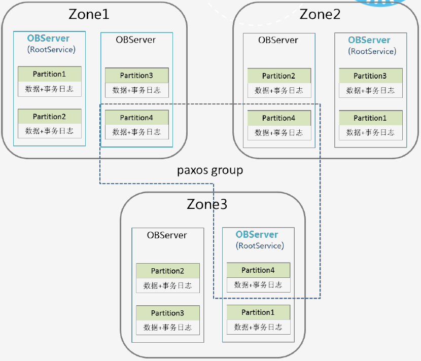

1. **副本分布规则**

    2. 同一个数据分区，会在**所有Zone上分别存放一个副本**

    3. 多副本之间依靠 **Paxos协议** 做Redo日志同步

    4. 一个分区 + 它的所有副本，组成 **独立的Paxos 复制组**

5. **主备角色划分**

    - **主分区 Leader**：复制组中选举产生的主副本

    - **备分区 Follower**：其余所有副本

1. **读写路由规则**

    所有针对该分区的**写请求**，自动路由到 **主分区 Leader** 执行

1. **性能优势：多点写入**

    - 不同分区的主分区，可以分散部署在不同 OBServer 节点上

    - 业务写请求会打散到多个数据节点，实现 **多点并行写入**，提升整体集群并发性能

1. **高可用保障**

    - 主分区所在节点故障 → Paxos 重新选举 → 从备分区中选出新主分区

    - 业务无感知自动切换，保证分区数据不丢、服务不中断

---

## 存储引擎

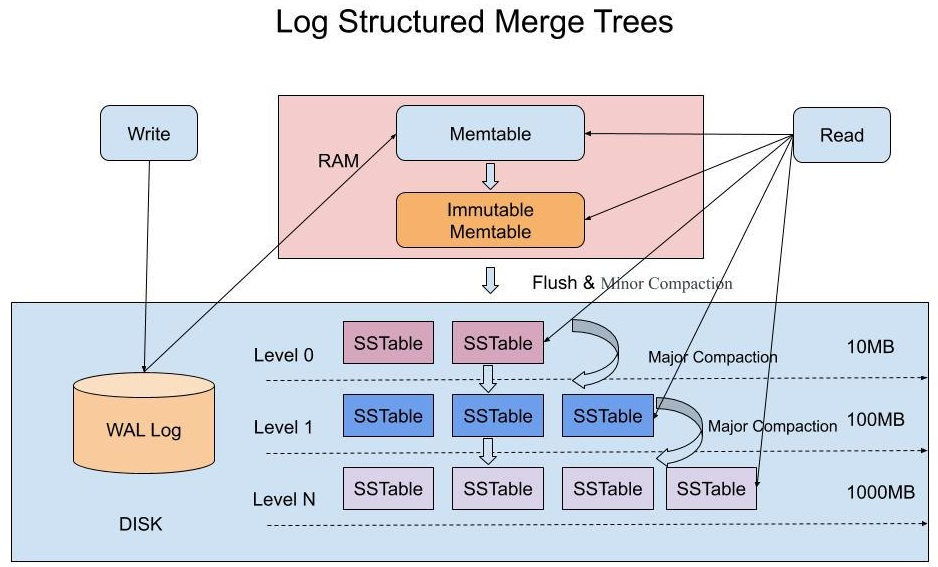

### LSM-Tree 整体架构

1. **数据分层存放**

    2. 基线历史数据：持久化在磁盘 **SSTable**

    3. 增量新数据：写入内存 (**MemTable**)

4. **定时合并机制**

    每天业务低峰期，自动把 **内存增量数据** 合并、落盘，持久化到磁盘 SSTable，形成新的基线

1. **DML读写特点**

    2. 增删改 DML 操作 **先在内存执行**

    3. 读取数据时：需要 **合并内存最新版本 + 磁盘基线版本，**合并数据最新快照返回

### SSTable 核心概念

Sorted String Table 

SSTable：磁盘有序不可变 KV 结构，按 Block 组织，尾部索引二分查找，支持 MMap 内存映射加速。

1. **三大特性**

    2. **持久化：存放在磁盘 SSTable**

    3. **有序：按键有序排列**

    4. **不可变**：**一旦生成不再修改，只能合并生成新 SSTable**

5. **存储结构**

    6. 键值KV结构，Key、Value 均为任意字节数组

    7. 支持两大核心能力

        8. 根据指定 Key 精确查找

        9. 按 Key 范围区间遍历

    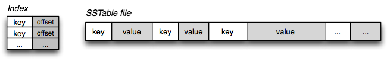

1. **内部 Block 结构**

    2. SSTable由多个 **Block 块** 组成，典型大小 **64KB**

    3. **所有Block 的索引** 统一存放在 **SSTable尾部**

    4. 打开SSTable时：

        索引加载进内存 

        → 二分查找定位 Key所在Block磁盘偏移量 

        → 读取磁盘对应块数据

1. **加速优化：MMap内存映射**

    内存充足时，可通过 **MMap 技术** 把整个 SSTable 映射至内存，省去磁盘IO，查询速度大幅提升

---

## SQL引擎

OceanBase的SQL引擎分为分为解析器、优化器、执行器三部分。当 SQL 引擎接受到了 SQL 请求后，经过语法解析、语义分析、查询重写、查询优化等一系列过程后，再由执行器来负责执行。

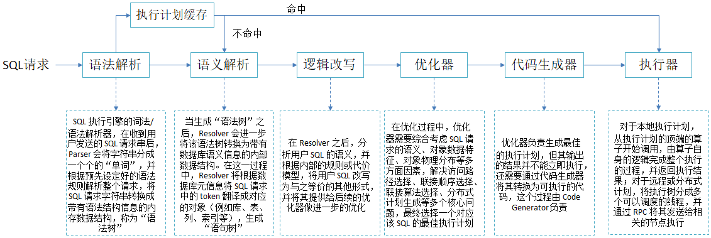

---

## ODP代理

OceanBase Database Proxy（简称 ODP）是OceanBase数据库专用的代理服务器。OceanBase 数据库的用户数据以多副本的形式存放在各个OBServer上，ODP接收用户发出的SQL请求，并将SQL请求转发至最佳目标OBServer，最后将执行结果返回给用户。

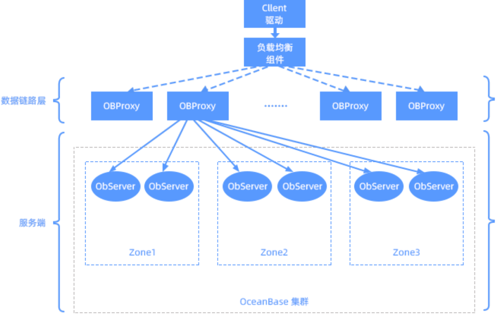

---

---

# OB分层架构

OceanBase 集群的数据库实例内部由不同的组件相互协作，这些组件从底层向上由 **多租户层、存储层、复制层、均衡层、事务层、SQL 层、接入层** 组成。

[www.oceanbase.com](https://www.oceanbase.com/docs/common-oceanbase-database-cn-1000000005682187)

## 多租户层

多租户：一集群多实例、双数据库兼容、资源强隔离、运维低成本。

1. **设计目的**

    简化多业务数据库大规模部署管理，**降低硬件与运维成本**。

1. **租户核心概念**

    2. **同一集群内可创建多个相互隔离的租户，租户 = 独立数据库实例。**

        3. 每个租户等同于一个独立的数据库实例

    4. 租户支持两种兼容模式：

        - MySQL 租户：可创建用户、Database，体验与原生 MySQL 一致。

        - Oracle 租户：可管理 Schema、管理角色，体验与原生 Oracle 一致。

1. **系统租户**

    集群初始化自带 **sys 系统租户**：

    - 固定为 **MySQL 兼容模式**；

    - **存储整个集群 核心元数据 ，负责集群管理**。

1. **资源隔离机制**

    2. 隔离载体：**每个observer 进程内有多个属于不同租户的虚拟容器** (**资源单元 UNIT** )，限定单租户CPU、内存资源。

    3. 资源池：每个租户在多个节点上的多个资源单元，共同组成 **资源池**，实现资源统一管控与隔离。

## 存储层

存储核心：Tablet 分片 + 四层 LSM 结构 + 定时合并 + 列编码 + 双层压缩。

1. **最小存储粒度**

- **以 一张表 / 一个分区为数据管理粒度**；

- 单个分区、非分区表，均对应一个独立 **Tablet（数据分片）**。

1. **Tablet 四层 LSM-Tree 结构**

    2. **MemTable**

        内存缓冲区，所有 DML（增删改）优先写入。

    1. **L0层 Mini SSTable**

        MemTable 写满后，落盘转储生成L0。

    1. **L1层 Minor SSTable**

        L0 数量达阈值后，多个 L0 合并生成L1。

    1. **Major SSTable**

        业务低峰期自动触发全量合并，合并对象：MemTable + L0 + L1，合并成一个 Major SSTable。

1. **SSTable 物理存储结构**

    2. **宏块**：每个SSTable由若干个 **2MB** 的 定长宏块组成，**为 SSTable 基础组成单位。**

    3. **微块**：宏块内部由多个不定长微块组成，**是数据编码、压缩的最小单元。**

4.  **双层压缩优化**

    5. 列级编码（内置）

        **Major SSTable的微块在 合并时通过编码方式进行格式转换**：

        - **列内编码**：字典、游程、常量、差值 编码；

        - **列间编码**：对多列进行列间等值、子串等规则优化。

        作用：**高压缩率 + 过滤特征，提升查询性能**。

    b. 通用无损压缩编码完成后，支持用户自定义压缩算法二次无损压缩，进一步降低存储占用。

---

---

**数据库SQL操作分类**

    ---

    **DDL  管结构**（建表、改表、删库）

    **DML 管数据**（增删改）

    **DQL  查数据**（查）

    **DCL  管权限**

    **TCL   管事务**

    ---

    1. **DDL 数据定义语言（Data Definition Language）**

        - 定义 / 修改 / 删除 数据库、表、索引、视图 等**结构**

        - 常用指令：`CREATE`、`ALTER`、`DROP`、`TRUNCATE`、`RENAME`

    1. **DML 数据操纵语言（Data Manipulation Language）**

        - 操作**表里面的数据**（增删改）

        - 常用指令：`INSERT`、`UPDATE`、`DELETE`

    1. **DQL 数据查询语言（Data Duery Language）**

        - 查询数据，最常用

        - 常用指令：`SELECT`

    1. **DCL 数据控制语言（Data Control Language）**

        - 权限管理、安全控制

        - 常用指令：`GRANT`（授权）、`REVOKE`（回收权限）

    1. **TCL 事务控制语言（Transaction Control Language）**

        - 管理事务，保证ACID

        - 常用指令：`COMMIT`、`ROLLBACK`、`SAVEPOINT`

---

---

## 复制层

1. SN 模式

    存算一体，日志流与 OBServer 绑定，计算节点同时承担日志存储，Paxos 副本为节点级。

1. SS 模式

    日志服务独立部署，计算无状态，持久化与计算解耦，弹性更强、云原生适配更好。

### 无共享 SN 模式 - 复制层

1. **核心载体：日志流 LS（Log Stream）**

    - **复制层使用日志流（Log Stream，LS）在多副本之间同步状态**。

    - **每一个 Tablet 绑定一个固定日志流；**

        **一个日志流可管理多个 Tablet。**

    - **数据表 DML 产生的 Redo 日志，统一持久化至对应日志流**。

1. **副本分布与读写规则**

    - **日志流多副本跨不同可用区部署，基于共识协议选主；**

    - 副本角色：**主副本 Leader + 从副本 Follower**；

    - 约束：**Tablet 的 DML 写入、强一致性查询，仅在主副本执行。**

    - 部署特点：每个租户在每台机器一般只部署**一个 LS 主副本**，可承载多个 LS 从副本；日志流总数由 `Primary Zone`、`Locality` 配置决定。

1. **一致性：改进版 Paxos 协议**

    - **主副本：本地持久化 Redo 日志 + 同步发送至从副本**；

    - **从副本：日志持久化后向主副本应答**；

    - 提交条件：**多数派副本持久化成功，Redo日志才算持久化成功；**

    - 数据同步：**从副本利用 Redo 日志实时回放，与主副本数据保持一致**。

        - 回放 = 照着日志，重新做一遍主副本的所有操作

1. **租约 Lease 机制**

    - 日志流的主副本选举成为Leader后获取租约（Lease）；

    - **正常工作的主副本在租约有效期内会不停通过选举协议延长租约期**

    - 主副本仅在租约有效期内可承担主节点工作；

    - 作用：保障异常场景下的节点切换与数据安全。

1. **故障自愈与高可用**

    - **少于半数的从副本故障：集群服务无影响**；

    - **主副本宕机：租约无法续期、自动失效；**

    - **集群重新选举**，从副本产生新主并颁发租约，快速恢复服务。

---

### 共享存储 SS 模式 - 复制层

1. **核心架构：日志与计算彻底解耦**

    - 云原生（Cloud Native）存算分离设计；

    - 独立拆分出**分布式日志服务**，专门负责日志持久化、高可用；

        - **将日志（日志服务）与计算（计算节点，分为读写节点和只读节点）分离**

    - 计算节点、日志服务节点完全解耦部署。

1. **组件划分**

    - 日志服务 LS：**通过一致性协议同步日志来保障数据持久性（Durability）**，独立多副本、强一致；

    - 计算节点：**计算节点个数保障服务可用性（Availability）**，分为：

        - RW 读写节点（主节点）

        - RO 只读节点

1. **日志同步与读写逻辑**

    - **RW 读写节点当选 Leader 后获取租约 Lease**，规则同 SN 模式；

    - 写入流程：**RW 通过 Paxos 向日志服务多副本写日志**，**多数派应答即提交成功**；

    - 读取流程：**RO 只读节点就近拉取已提交日志，本地回放构建数据视图**。

1. **故障与高可用能力**

    - **日志服务半数以内节点故障：数据持久化高可用不受影响**；

    - **计算节点不依赖节点多数派，可依托共享存储 + 日志服务快速拉起、恢复；**

    - 额外能力：天然支持**读写分离**，RO 节点分担查询压力。

---

## 均衡层

均衡层：靠**LS 分裂 + 合并 + 迁移**，自动适配扩容、缩容、日常负载均衡。

1.  **核心作用**

    **基于负载均衡原则，合理分配 日志流 LS、Tablet**；

    解决新建分区、扩缩容、长期运行数据分布不均问题，保证集群各节点负载均衡。

1.  **基础均衡规则** 

    新建表 / 分区时，自动按均衡策略分配日志流与 Tablet。

1. **扩容场景**

    2. 租户新增服务器资源；

    3. 均衡层对原有日志流进行**分裂**；

    4. 拆分部分 Tablet 至新日志流；

    5. 将新日志流迁移至新增节点，充分利用新资源。

6. **缩容场景**

    7. 下线指定服务器；

    8. 迁移待缩容节点上的日志流；

    9. 与其他节点日志流进行**合并**；

    10. 释放机器资源，完成缩容。

11. **日常自动均衡**（无增减机器）

    - 长期删表、写入不均，会导致各节点 Tablet 数量失衡；

    - 均衡层定期生成均衡计划：

        1. 负载高节点：分裂临时日志流，带出部分 Tablet；

        2. 迁移临时日志流至负载低节点；

        3. 目标节点完成日志流合并，实现数据均衡打散。

---

## 事务层

### 核心目标

保障：**跨单 / 多个日志流事务的原子性** + **并发事务多版本隔离性**。

- 事务原子：单 LS 靠 WAL，多 LS 靠优化 2PC，宕机可自动恢复事务状态。

- 事务隔离：依托 GTS 全局时间戳 + MVCC，实现多隔离级别与分布式快照读。

### 1、原子性保障

1. **单日志流事务** 依赖 **WAL 预写日志**

    同一 Log Stream 内多张表、多个 Tablet 修改，通过Write-Ahead Log 保证事务原子性提交。

1. **多日志流分布式事务** 采用 **优化版 2PC 两阶段提交**：

    - 每个日志流会产生并持久化各自的 write-ahead log；

    - 事务会选定某一条日志流作为 2PC的 **协调者**；

    - **阶段一：协调者确认所有参与 LS 的 WAL 全部持久化**；

    - **阶段二：全部就绪后，统一通知各 LS 写入 Commit 日志，事务正式生效**；

    - 当 从副本回放、实例重启时，依靠 Commit 日志判定事务最终状态。

1. **宕机故障重启恢复**

    - 宕机前未完成事务：**已写 WAL、无 Commit 日志**；

    - 依靠 WAL 中记录的**全量参与 LS 日志流列表**，**复原协调者状态**；

    - **自动再次推进 2PC**，最终落实事务 **提交 / 回滚**。

---

### 2、隔离性保障

1. 核心依赖：**GTS 全局时间戳服务**

    GTS → Global Timestamp Service

    - **在租户内生成 连续递增 的 全局时间戳**；

    - **多副本部署，基于日志流同步机制保证高可用**。

1. **版本号机制**

    - **提交阶段：**

        - **事务在提交时会从 GTS 获取一个时间戳作为 提交版本号**

        - 并持久化在日志流的WAL中

        - 事务内所有修改数据都以此提交版本号标记

    - **读取阶段：**
从 GTS 获取一个时间戳作为语句或事务的读取版本号。

        - **RC 读已提交：单条 SQL 语句开始获取读取快照时间戳**；

        - **RR 可重复读 / 串行化：整个事务起始获取统一读取时间戳**。

1. **多版本快照读取**

    - 读取数据时，会跳过比自己大的事务版本号，**只选取小于当前读版本号的最新数据**（比当前读取版本号小的所有版本号中最大的版本号的数据）；

    - 基于全局时间戳，为读取操作 **实现统一分布式数据快照**，支撑 MVCC 隔离。

---

## SQL 层

SQL 层：六阶段流水线处理 SQL，三类执行计划 + 计划缓存 + 并行执行，兼顾灵活与性能。

1. **核心作用**

    **接收用户 SQL 请求，经过解析、改写、优化、生成、执行，最终转化为对一个或多个 Tablet 的数据访问操作。**

1. **完整执行流程**（六大组件）

    2. **Parser 语法解析**

        对 SQL 做词法、语法解析，拆分 Token，**生成语法树 Syntax Tree**。

    1. **Resolver 语义解析**

        根据**集群元数据**，将SQL请求中的Token翻译成对应的对象，绑定库、表、字段、索引等数据库对象，**生成Statement Tree。**

    1. **Transformer 逻辑改写**

        在语句树基础上做**等价逻辑变换**，优化 SQL 结构，为优化器提供更优输入。

        在原 Statement Tree 上做等价变换，变换的结果仍然是一棵 Statement Tree。

    1. **Optimizer 优化器**

        综合语义、数据特征、数据分布，**选择最佳执行计划**：

        - 选择访问路径、连接顺序、连接算法

        - 生成本地 / 远程 / 分布式执行计划

    1. **Code Generator 代码生成器**

        将优化后的执行计划，**转换为可执行代码**，不做策略优化。

    1. **Executor 执行器**

        **调度并真正执行 SQL 计划**，完成数据读写返回结果。

1. **性能加速机制**

- **Plan Cache：缓存历史执行计划**，避免重复解析、优化，提升高频 SQL 性能。

- **Fast-parser：快速词法分析**，SQL 参数化处理，提升 Plan Cache 命中率。

1. **三类执行计划**

    2. **本地计划**：仅访问当前 OBServer 本机 Tablet 数据。

    3. **远程计划**：仅访问单台的 非本地节点 数据。

    4. **分布式计划**：跨多台节点访问数据，**执行计划会 拆解 成  多个子计划 并行执行**。

5. **并行执行能力**

    - 支持本地、分布式计划并行拆分；

    - **多线程调度执行**，充分发挥 CPU、IO 资源；

    - 降低大查询响应耗时，提升整体吞吐。

---

## 接入层（ODP / OBProxy）

接入层：OBProxy 统一接入、协议兼容、精准路由、屏蔽分布式细节，是应用访问 OB 的中间代理。

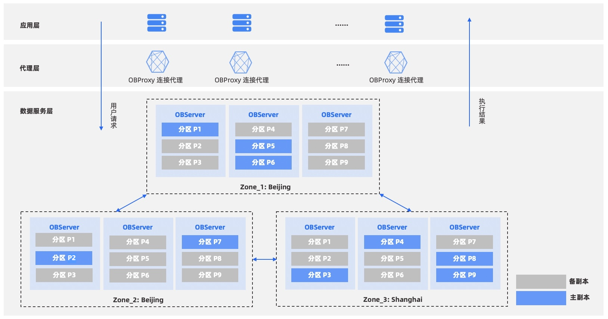

1.  **核心定义**

    **ODP（OceanBase Database Proxy），OceanBase 专属接入代理，作为集群统一流量入口，负责请求路由转发**。

1.  **基础特性**

    - **独立进程部署，与 OBServer 解耦**；

    - 兼容 MySQL 协议，原有 MySQL 驱动、应用无需改造即可直连OceanBase。

1.  **核心能力**

    2. **自动感知集群拓扑、租户信息、Tablet 数据分布**；

    3. 解析 SQL 访问范围，精准路由到**数据所在 OBServer 节点**；

    4. 屏蔽底层分布式细节，对应用透明无感知。

5.  **两种部署模式**

    6. 分离部署：独立机器 / 与应用同机部署，解耦性强；

    7. 同机部署：直接部署在 OBServer 所在服务器，部署简单。

8.  **高可用入口**

    **多台 ODP 可配合负载均衡，统一对外提供单一访问地址**，实现代理层高可用、流量分担。

---

---

# 发展历程

[www.oceanbase.com](https://www.oceanbase.com/docs/common-oceanbase-database-cn-1000000005682187)

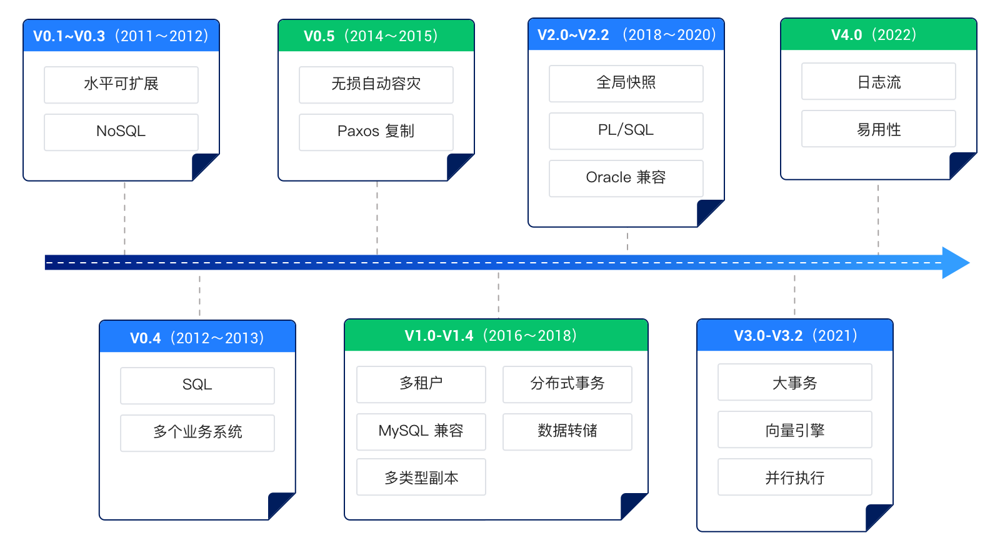

- **诞生 （2010）**

    - 阳振坤博士带队启动 OceanBase 项目

    - 首个落地业务：淘宝收藏夹，至今仍在使用

    - 核心痛点解决：高并发场景、大表联小表、海量单表数据难题

- **转型关系型数据库（2012）**

    - 早期：业务依赖定制 API 访问

    - 2012 迭代出 **SQL 支持版本**，正式成为通用型**关系型数据库**

- **切入金融场景 （2014）**

    - 落地支付宝 / 蚂蚁集团，进军金融级业务

    - 2014 双十一：承载部分交易库流量

    - 网商银行成立后，**全核心交易库**统一使用 OceanBase

- **架构定型-金融核心全覆盖 （2016）**

    发布重构架构的 **OB 1.0**：

    1. 完整支持**分布式事务**

    2. 高并发写入横向扩展

    3. 落地**多租户架构**（经典架构沿用至今）同年双十一：支付宝**100% 核心库**全量上线 OB，覆盖交易、支付、会员、账务核心系统。

- **对外商业化起步（2017）**

    - 打破内部使用壁垒，试点外部客户

    - 标杆案例：**南京银行**，正式走向政企金融外部市场

- **商业化加速・Oracle 兼容（2018）**

    - 发布 **OB 2.0**；

    - 关键能力：新增 **Oracle 兼容模式**；

    - 价值：大幅降低传统数据库迁移改造成本，快速规模化对外交付

- **性能登顶・世界级标杆（2019–2020）**

    - 2019（V2.2）：TPC-C 权威评测，**6000 万 tpmC** 全球第一；

    - 2020：刷新纪录，达 **7 亿 tpmC**；

    - 核心意义：

        1. 全球首个上榜 TPC-C 的**分布式数据库**

        2. 首个登顶该榜单的**国产数据库**验证：强扩展、高稳定、高性能金融级能力。

- **HTAP 混合负载能力突破（2021）**

    - 发布 **OB 3.0**，搭载全新**向量化执行引擎**；

    - TPC-H 大数据评测（30000GB）刷新榜单；

    - 实现：**单引擎同时支撑 TP 交易 + AP 分析**，完成 HTAP 基础能力落地。

- **全面开源（2021）**

    - 2021 年 6 月 1 日，OceanBase 正式**全面开源**；

    - 战略：开放生态、共建社区、扩大产业落地。

- **一体化架构 + 品牌升级 + 云化（2022）**

    - 新品牌 Slogan：**“海量记录 笔笔算数”**

    - 发布 **OceanBase 4.0（小鱼）**，业内首个**单机 / 分布式一体化架构**

    - 同时发布 **OceanBase Cloud**，正式进军公有云市场

- **生态完善 + 多云覆盖 + 规模化落地 （2023）**

    - 重点打磨 **4.0 稳定版（4.2.x LTS）**，增强兼容性、稳定性、可观测性，成为金融核心系统主力版本

    - 完成**多云适配**：稳定运行于阿里云、华为云、腾讯云、AWS、Azure 等主流云平台，支持一套架构跨云部署

    - 金融持续渗透：覆盖**国有大行、政策性银行、头部城商行 / 农商行**核心系统；非金融（政务、交通、能源、医疗）规模化落地

- **AP 能力里程碑（4.3）+ 国际化起步 （2024）**

    - 发布 **OceanBase 4.3**，**原生列存引擎正式落地**，HTAP 能力重大升级：

        - 支持**行列混合存储**：行存跑交易、列存跑分析；

        - 基线列存、增量行存，实现**写入即分析**；

        - 向量化引擎全面增强，复杂分析查询性能数倍提升。

    - 发布 **4.3.5 LTS**：AP 能力成熟稳定，成为**生产环境可用的 HTAP 版本**

- **商业化突破 + TP/AP 大融合 + AI战略（2025）**

    - 自 2020 年商业化以来，**全球客户突破 4000 家**，连续五年增速超 **100%**

    - 金融 “百行计划” 里程碑：覆盖 **100+ 千亿级银行**、**190+ 核心系统**；**75% 头部保险集团**已采用

    - **发布 OceanBase 4.4.2 LTS**：**TP/AP 大融合里程碑**，深度整合事务与分析能力

    - **AI 战略（Data×AI）**：

        - 内核深度集成**向量数据库**能力，跻身 DB-Engines 全球前十；

        - 开源 **SeekDB**：AI 原生混合搜索数据库，统一支持向量 / 全文 / 标量 / GIS 检索，兼容 30+ AI 框架；

        - **4.5 版本**：全面优化向量索引（IVF/IVF_PQ）、内存稀疏向量索引、混合搜索与语义索引，面向 AI 应用场景

# 多租户架构

[www.oceanbase.com](https://www.oceanbase.com/docs/common-oceanbase-database-cn-1000000005682719)

# 事务管理

[www.oceanbase.com](https://www.oceanbase.com/docs/common-oceanbase-database-cn-1000000005683256)

# 存储架构

[www.oceanbase.com](https://www.oceanbase.com/docs/common-oceanbase-database-cn-1000000005682693)

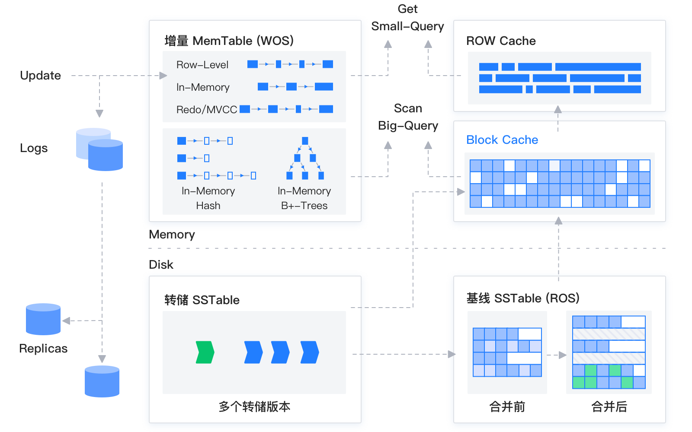

# OBServer节点架构

[www.oceanbase.com](https://www.oceanbase.com/docs/common-oceanbase-database-cn-1000000005682710)

# 存储管理

## 转储管理

[www.oceanbase.com](https://www.oceanbase.com/docs/common-oceanbase-database-cn-1000000005684842)

## 合并管理

[www.oceanbase.com](https://www.oceanbase.com/docs/common-oceanbase-database-cn-1000000005684834)

# OB术语

[www.oceanbase.com](https://www.oceanbase.com/docs/common-oceanbase-database-cn-1000000005688389)

