# Paxos 共识算法

---

Lamport L. [Paxos made simple](https://scholar.google.com.hk/scholar?hl=zh-CN&as_sdt=0%2C5&q=Paxos+Made+Simpl&btnG=)[J]. ACM SIGACT News (Distributed Computing Column) 32, 4 (Whole Number 121, December 2001), 2001: 51-58.

---

- **Basic Paxos 算法**：描述多节点之间如何就单个值（value）达成共识。

- **Multi-Paxos 思想**：通过执行多个 Basic Paxos 实例，就一系列值达成共识。

针对非拜占庭场景（无恶意节点），除 Raft 外，**ZAB 协议**、**Fast Paxos** 等都是基于 Paxos 改进的共识算法。

针对拜占庭场景（存在恶意节点），通常使用 **工作量证明（PoW，Proof-of-Work）**、**权益证明（PoS，Proof-of-Stake）** 等共识算法，典型应用为区块链系统。

# Basic Paxos

## 角色定义

Basic Paxos 中存在 3 个重要的角色：

1. **提议者（Proposer）**：也可以叫做协调者（coordinator），负责接受客户端请求并发起提案。提案信息通常包括提案编号（proposal ID）和提议的值（value）。

2. **接受者（Acceptor）**：也可以叫做投票员（voter），负责对提案进行投票，同时需要记住自己的投票历史。

3. **学习者（Learner）**：负责学习（learn）已被选定的值。在复制状态机（RSM）实现中，该值通常对应一条待执行的命令，由状态机按序 apply 后再由对外服务层返回结果。

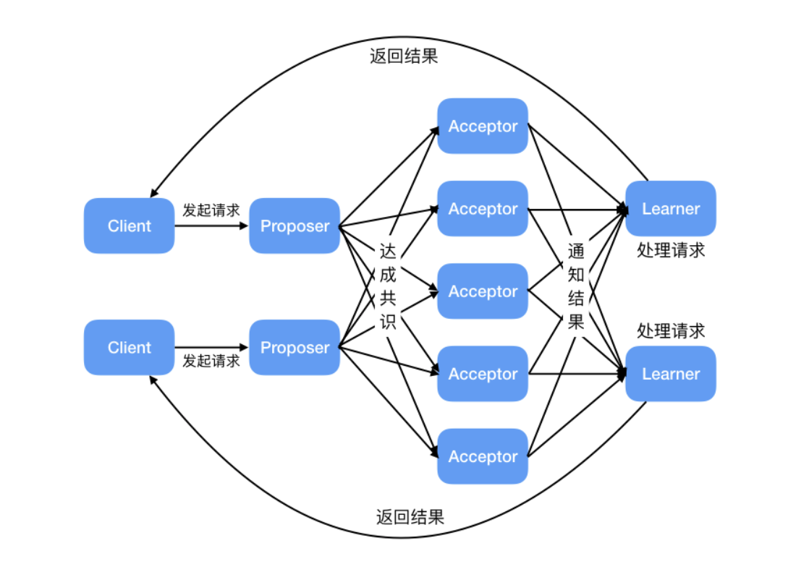

角色交互关系


为了减少实现该算法所需的节点数，一个节点可以身兼多个角色。并且，一个提案被选定需要被半数以上的 Acceptor 接受。这样的话，Basic Paxos 算法还具备容错性，在少于一半的节点出现故障时，集群仍能正常工作

## 执行流程

Basic Paxos 通过两个阶段达成共识：**Prepare/Promise（准备/承诺）阶段**   和   **Accept/Accepted（接受/已接受）阶段**。

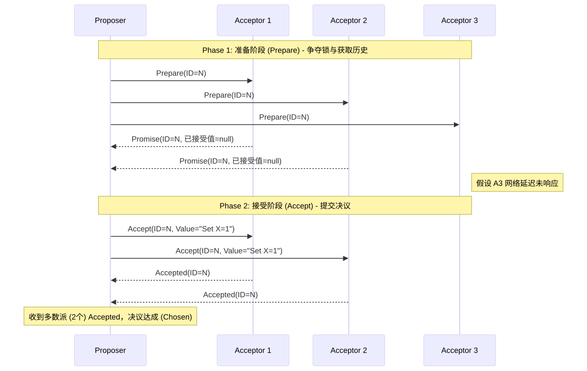

### Phase 1: Prepare/Promise（准备/承诺阶段）

Proposer 选择一个提案编号 n（必须全局唯一且递增），向超过半数的 Acceptor 发送 `Prepare(n)` 请求。

**Acceptor 的处理逻辑**（对每个提案编号 n 的处理逻辑）：

- 若 n > 该 Acceptor 见过的最大提案编号 max_n

    - 返回 `Promise(n, max_v)`，其中 max_v 是之前接受过的最大编号提案的值（若有）

    - 承诺不再接受编号 < n 的提案

- 若 n ≤ max_n

    - 拒绝或忽略该请求

**目的**：让 Proposer 了解当前系统中已被接受或准备接受的提案，避免提出冲突的值。

### Phase 2: Accept/Accepted（接受/已接受阶段）

当 Proposer 收到超过半数 Acceptor 的 Promise 响应后，选择响应中 max_v 最大的值（若无则任意选择一个值），向超过半数的 Acceptor 发送 `Accept(n, v)` 请求。

**Acceptor 的处理逻辑**：

- 若 n ≥ 该 Acceptor 在 Phase 1 承诺的 max_n

    - 接受该提案，记录 (n, v)，并返回 `Accepted(n, v)`

- 否则

    - 拒绝该请求

#### 收敛条件

当 Proposer 收到超过半数 Acceptor 对 `Accept(n, v)` 的响应时，提案 v 被**选定（chosen）**。Proposer 通知所有 Learner 提案已被选定。

### Paxos提案示例

#### 无历史提案

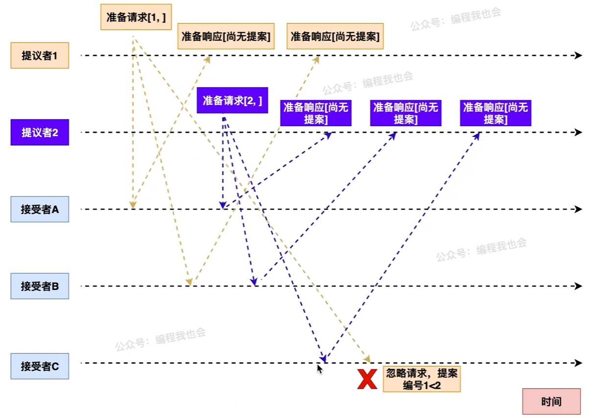

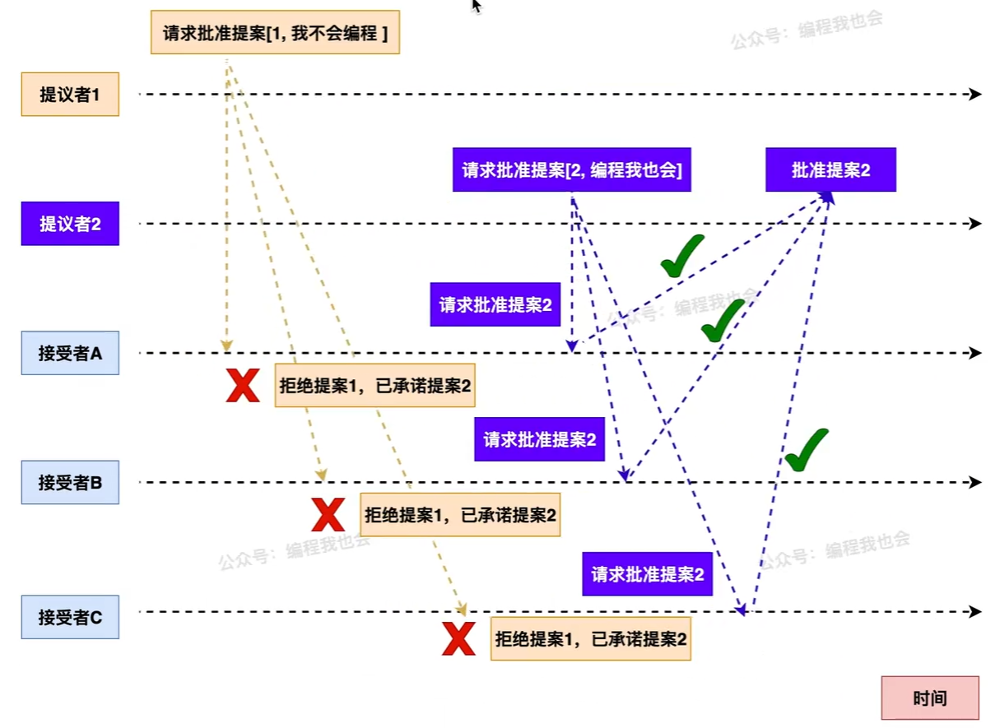

#### 有历史提案

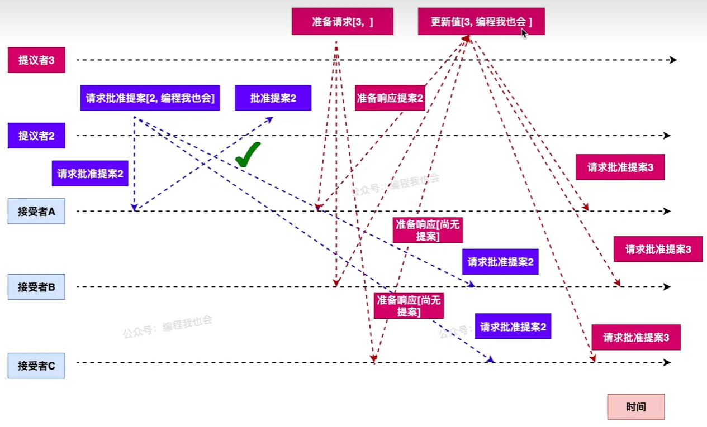

### 安全性保证

Basic Paxos 保证以下安全性：

- 一致性：一旦某个值被选定，所有后续选定的值都是该值

- 可终止性：若无 Proposer 竞争且通信可靠，最终能选定一个值

**核心机制**：通过 Phase 1 收集 Promise，Proposer 只能选择已经被 Acceptors 承诺过的值（或选择新值），保证了不会有冲突的值被选定

### Paxos算法的几个核心要点

- **提案编号与优先级**:提案编号用于标识提案的先后顺序，编号越大的提案优先级越高。接受者总是优先处理编号更大的提案，这保证了新的提案能够覆盖旧的提案，避免出现旧提案干扰新提案的情况。

- **提案值一致**:提议者如果发现存在接受者之前批准过的提案，就将这些提案中编号最大的提案值作为自己要提议的值;否则，使用自己原本想提议的值。

- **多数派原则**:系统中超过半数的接受者接受某个提案，就可以确定该提案的值最终达成一致。这确保了在分布式环境下，即使部分节点出现故障，也能达成一致性，并且不会出现多个不同的值同时被选定的情况。

### 活锁问题

Basic Paxos 存在**活锁（Livelock）**风险：

- **若多个 Proposer 同时发起提案，且提案编号交错递增**

- **可能导致没有提案能获得超过半数的 Accept**

- **系统陷入无限竞争，无法达成共识**

**活锁示例**（Dueling Proposers）：

假设有两个 Proposer P1 和 P2 同时发起提案：

1. P1 发送 `Prepare(1)`，P2 发送 `Prepare(2)`

2. Acceptor 们承诺给编号较大的 P2

3. P1 发现编号被超越，发送 `Prepare(3)`

4. P2 发现编号被超越，发送 `Prepare(4)`

5. ... 循环往复，永远无法进入 Phase 2

**活锁时序图**

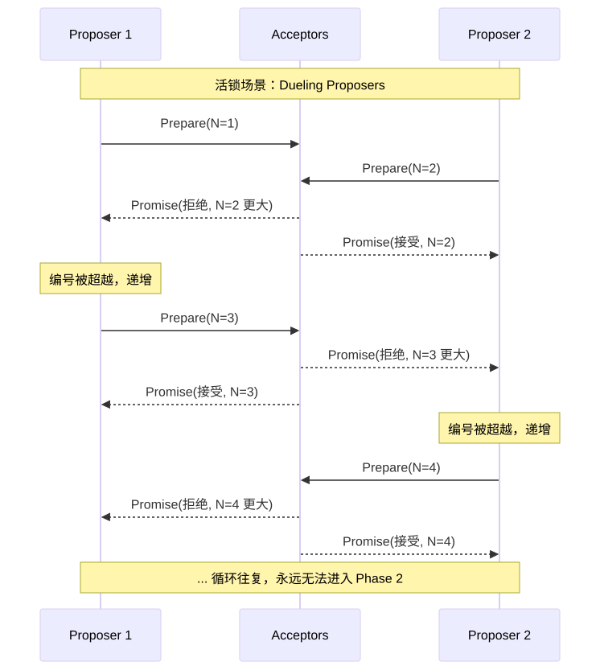

**解决方案**：**通过 Multi-Paxos 引入稳定的 Leader 机制。**

**随机退避算法（Randomized Exponential Backoff）**：

为防止多个 Proposer 竞争导致活锁，生产级实现通常引入随机退避：

当 Proposer 的 Prepare 请求被拒绝（编号过小）时：

1. **等待随机时间**：**`base_delay * random(1, 2^attempt)`**

2. 选择更大的提案编号（如：`n = n + k`，`k > 0`）

3. 重试 Prepare 阶段

这种机制确保竞争者不会同时重试，最终某个 Proposer 能成功完成 Phase 1。

**分区处理**：若发生网络分区，多数派一侧可继续选举 Leader 并提交新提案；少数派无法形成法定人数（quorum），只能等待分区恢复

# Multi-Paxos

## 核心思想

Multi-Paxos 的核心优化思想是**复用 Leader**：**通过 Basic Paxos 选出一个稳定的 Proposer 作为 Leader，后续提案直接由该 Leader 发起，跳过 Phase 1 的 Prepare/Promise 阶段**。**后续所有日志都直接 Accept。**

**目的**：**把 Basic Paxos 的 2 轮 RPC，变成 1 轮，大幅提速**。

## 优化机制

#### 1. Leader稳定选举

- **通过 Basic Paxos 选出唯一的 Proposer 作为 Leader**

- Leader 崩溃后，通过新一轮 Basic Paxos 选举新 Leader

- **避免多 Proposer 竞争导致的活锁（提案冲突）**

#### 2. 只执行一次Prepare

这次 Prepare 成功后：

- Leader 获得**所有 Acceptor 的承诺**：不再接受比它小的编号

- **后续所有日志、所有实例，都不再 Prepare！**

#### 3. 跳过 Phase 1

- **Leader 稳定后，后续提案直接进入 Phase 2（Accept 阶段）**

- 无需每次都执行 Prepare/Promise，减少一轮 RPC

- **延迟优化**：Basic Paxos 每个提案需要 2-RTT（Prepare + Accept），Multi-Paxos 后续提案仅需 1-RTT（仅 Accept），**提案提交延迟降低 50%**（2-RTT → 1-RTT）

**性能优化对比图**

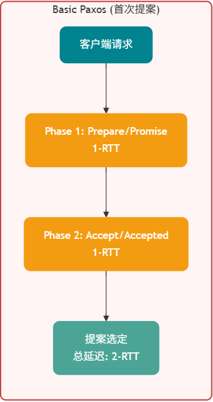

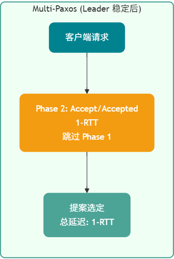

#### 4. 日志序号

- **为每个提案分配递增的日志索引（log index）**

- **保证全局顺序**：Leader 按顺序追加日志，Acceptor 按序号接受

- **支持空洞**：某位置的提案可能因 Leader 切换而暂时缺失，后续可补齐

#### 5. 日志空洞(gap) & NOP填补

**问题描述**：当新 Leader 上线时，可能遇到一种棘手场景——前任 Leader 已经在某个日志位置上达成了共识，但新 Leader 不知道这个值。如果新 Leader 试图在该位置提交新值，就会覆盖已经选定的值，破坏一致性。

**解决方案：NOP（No-Operation）日志**

Multi-Paxos 通过引入 NOP 日志来解决这个问题：

1. **场景检测**：新 Leader 在 Phase 1（Prepare）阶段，收集到 Acceptor 返回的已接受值

2. **必须复用**：如果发现某位置已有被选定的值，新 Leader **必须**复用该值，不能提出新值

3. **NOP 占位**：对于空洞位置（无任何已接受值），新 Leader 可以提交特殊值——NOP（空操作）

4. **状态机跳过**：NOP 日志虽然占用日志位置，但状态机回放时会跳过，不执行任何业务逻辑

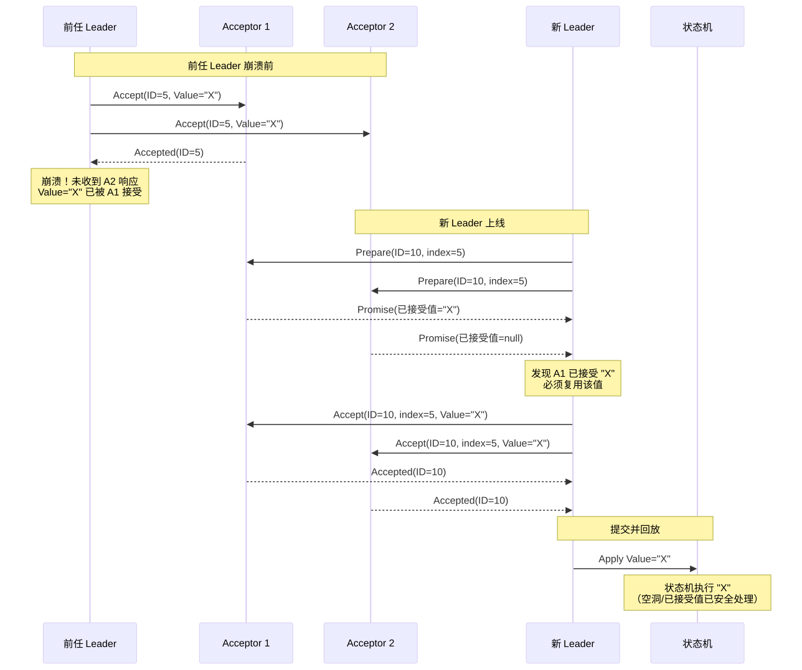

### 执行流程

1. **Leader 选举**：通过 Basic Paxos 选出 Leader

2. **日志复制**：Leader 接收客户端请求，追加到本地日志，分配递增索引

3. **直接 Accept**：Leader 向 Acceptor 发送 `Accept(index, value)`（跳过 Prepare）

4. **响应处理**：Acceptor 按序号接受日志，记录到本地

5. **提交确认**：当超过半数 Acceptor 接受某位置的日志后，该位置可提交

### 容错与恢复

- **Leader 崩溃**：新 Leader 通过日志比对找出已提交位置，补齐未提交日志

- **网络分区**：多数派一侧继续服务，少数派等待恢复

- **日志空洞**：新 Leader 可填补前任 Leader 未提交的日志位置

**新Leader恢复流程图**

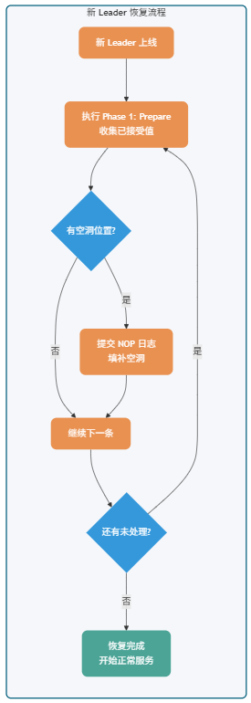

### Multi-Paxos & Basic Paxos 关键区别

|项目|Basic Paxos|Multi-Paxos|
|-|-|-|
|**每次决议**|**2 轮 RPC**（Prepare+Accept）|**1 轮 RPC**（仅 Accept）|
|**Proposer**|多个，冲突严重|**唯一 Leader**|
|**Prepare 次数**|每次决议都要|**仅初始化 1 次**|
|**性能**|低|**高（工业标准）**|
|**实际使用**|理论|**etcd / TiKV / BFS 等底层都是 Multi-Paxos 思想**|

