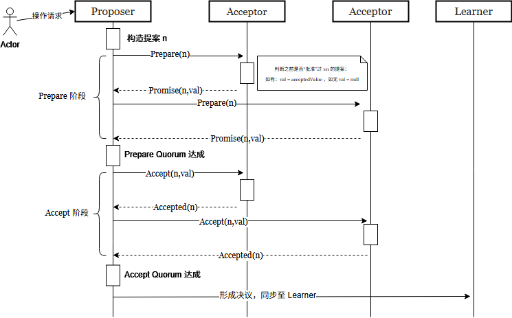

**The Paxos algorithm, when presented in plain English, is very simple.**

# 2.1 The Problem

假设有一组可以**提议值**的进程。**共识算法需要保证：在所有被提议的值中，仅有一个值会被选定**。如果没有任何值被提议，则不应选定任何值；一旦某个值被选定，进程应当能够获知这个被选定的值。

共识算法的**安全性要求**如下：

- 只有被提议过的值，才可能被选定；

- 最终只会有**一个值**被选定；

- 进程绝不会错误地 “认为” 某个值已被选定，除非该值确实已被选定。

共识算法中的三个角色：**提议者（Proposer）**、**接受者（Acceptor）**、**学习者（Learner）**。

采用经典的**异步、非拜占庭模型**，该模型满足：

- 代理以任意速度运行，可能因停机而故障，也可以重启。由于所有代理都可能在某个值被选定后发生故障并重启，因此**必须要求代理在故障重启后能够保留部分信息**，否则算法无法正确运行。

- 消息的传输延迟可以任意长，可能重复，也可能丢失，但**不会被篡改**。

# 2.2 Choosing a Value

Paxos 算法的**核心灵魂**，Lamport 没有直接抛出算法规则，而是从「解决分布式共识的核心问题」出发，通过「**朴素方案→发现缺陷→补充约束→解决冲突→推导最终算法**」的递进逻辑，一步步证明了 Paxos 两阶段协议的必然性。

## 一、基础设计：从单点故障到「多数派」核心思想

这是整个算法的起点，解决的是「**怎么避免单点故障，同时保证只有一个值被选中**」的问题。

1. **朴素方案的致命缺陷**最容易想到的共识方案是「单个 Acceptor（接受者）」：Proposer（提议者）发提案给唯一的 Acceptor，Acceptor 选第一个收到的值。这个方案足够简单，但 Acceptor 一旦宕机，整个系统直接瘫痪，完全没有容错能力。

2. **多数派（Majority）的核心设计**解决方案是用**多个 Acceptor 组成集群**，规则是：**一个提案（值）被「正式选定」，当且仅当它被超过半数的 Acceptor 接受**。

    - 正确性的根源：**任意两个多数派集合，必然存在至少一个公共的 Acceptor**。比如总共有 5 个 Acceptor，多数派需要至少 3 个，集合 A（1、2、3）和集合 B（3、4、5）必然共享 3 号 Acceptor。

    - 安全保证：只要约定「一个 Acceptor 最多只能接受一个值」，就永远不可能出现两个不同的值同时拿到多数派 —— 因为公共的 Acceptor 不可能同时接受两个不同的值，从根源上避免了「选取出两个值」的风险。

---

## 二、初始约束 P1：解决「单提案也能成功」，却暴露了新问题

1. **为什么需要 P1 约束**我们需要保证：在无故障、无消息丢失场景下，哪怕只有一个 Proposer 发起了一个提案，系统也能成功选定这个值。因此提出了最基础的约束：

    > **P1：Acceptor 必须接受它收到的第一个提案** 

    > **P1.  An acceptor must accept the first proposal that is receives.**

1. **P1 带来的致命冲突   多个 Proposer 可能同时发起不同的提案**

    - 比如 3 个 Acceptor，Proposer1 给 1 号发了 v1，Proposer2 给 2 号发了 v2，Proposer3 给 3 号发了 v3。按照 P1，每个 Acceptor 都接受了自己收到的第一个提案，但**没有任何一个值拿到多数派**，系统选不出值，陷入僵局。

1. **关键结论   必须允许 Acceptor 接受多个提案，否则永远解决不了上述僵局。**

    - 为了区分多个提案，我们**给每个提案加一个「全局唯一、递增的编号」**，提案变成「(编号 n, 值 v)」的格式，选定规则更新为：**当某个提案被多数派 Acceptor 接受，这个提案（及其值）就被正式选定。**

---

## 三、核心安全约束的递进推导：从 P2 到 P2c

这部分是 Paxos 最精妙的推导，核心目标是：**允许多个提案被接受，但必须保证所有被选定的提案，值完全相同**（否则就违反了「只能选一个值」的核心安全要求）。

### 1. 顶层约束 P2：保证选定值的唯一性

> **P2：如果一个值为 v 的提案被选定，那么所有编号更高的、被选定的提案，值必须也是 v**

- 逻辑基础：提案编号是全序的（数字越大，提案越新），只要满足 P2，就永远不会出现「旧提案选了 v1，新提案选了 v2」的情况，直接保证了「最终只有一个值被选定」。

### 2. 约束 P2a：从「选定」下沉到「接受」

要满足 P2，最直接的思路是从提案的必经环节下手：**提案要被选定，必须先被 Acceptor 接受**。因此把 P2 下沉为：

> **P2a：如果一个值为 v 的提案被选定，那么任何 Acceptor 接受的所有编号更高的提案，值必须也是 v**

- **逻辑关系：只要 P2a 成立，P2 必然成立**。

### 3. 约束 P2b：解决 P1 和 P2a 的冲突

P2a 和 P1 是完全矛盾的，这里用一个最典型的例子就能看懂：

> 总共有 3 个 Acceptor（A、B、C），Proposer1 给 A、B 发了 (1, v1)，A、B 都接受了，v1 被正式选定（拿到多数派）。但 **C 全程掉线，从来没收到过任何提案**。此时一个新的 Proposer2 唤醒，给 C 发了 (2, v2)。按照 P1，**C 必须接受自己收到的第一个提案 (2, v2)，但这直接违反了 P2a（已经选定了 v1，却接受了更高编号的 v2）**。

要解决这个冲突，不能修改 P1（否则单提案场景无法成功），只能从源头约束：**Proposer 不能乱发不同值的提案**。因此把约束强化为：

> **P2b：如果一个值为 v 的提案被选定，那么任何 Proposer 发起的所有编号更高的提案，值必须也是 v**

- 逻辑关系：提案必须先被 Proposer 发起，才能被 Acceptor 接受。只要 P2b 成立，P2a 必然成立，P2 也随之成立，同时和 P1 不再冲突。

### 4. 约束 P2c：P2b 的可落地实现

P2b 是一个理论约束，工程上无法直接实现：Proposer 怎么知道「有没有值已经被选定？选定的值是什么？」。因此我们需要一个可落地、可执行的规则，来保证 P2b 成立，这就是 P2c：

> **P2c：对于任意的 v 和 n，如果发起编号为 n、值为 v 的提案，必然存在一个多数派 Acceptor 集合 S，满足以下两个条件之一：**

    - **(a) S 中没有任何 Acceptor 接受过编号小于 n 的提案；**
    
    - **(b) v 是 S 中 Acceptor 已接受的、编号小于 n 的提案里，编号最大的那个的值。**

这是整个 Paxos 算法的核心规则，它的**正确性根源**在于：

- **如果已经有值 v 被选定，那必然存在一个多数派集合 C，C 里的每个 Acceptor 都接受了 v。**

- **你现在要发起新提案，找的任何一个多数派 S，必然和 C 有至少一个公共的 Acceptor**（多数派的交集特性）。

- **因此 S 里一定有 Acceptor 接受过 v，且 v 是编号最大的，你必须用 v 作为新提案的值，绝对不能发别的值，完美保证了 P2b。**                                     

---

## 四、从 P2c 推导出两阶段协议

P2c 明确了 Proposer 发起提案的前置要求：

1. 必须先找到一个多数派 Acceptor，获取它们已接受的、编号小于 n 的最大提案；

2. 必须让这些 Acceptor 承诺：不再接受任何编号小于 n 的提案（避免你查到信息后，又有新的小编号提案被接受，导致你选的值失效）。

基于这两个要求，就自然推导出了 Paxos 的**两阶段执行流程**。

### 阶段 1：Prepare（准备）阶段 —— 查信息 + 拿承诺

1. **Proposer 的动作**：**选一个新的提案编号 n，给多数派 Acceptor 发送「编号 n 的 Prepare 请求」**，核心是两件事：

    - 问 Acceptor：你有没有接受过编号小于 n 的提案？有的话把编号最大的那个告诉我；

    - 让 Acceptor 承诺：以后不要再接受任何编号小于 n 的提案了。

1. **Acceptor 的动作**：**只有当 n 大于我之前所有响应过的 Prepare 请求的编号时，我才会响应，否则直接忽略**。响应内容包括：

    - 遵守承诺：**保证不再接受编号小于 n 的提案**；

    - **返回我已接受的、编号小于 n 的最大提案（如果有的话）**。

### 阶段 2：Accept（接受）阶段 —— 发提案 + 完成选定

1. **Proposer 的动作**：**如果收到了多数派 Acceptor 的 Prepare 响应，就确定提案值 v，然后给这些 Acceptor 发送「Accept 请求」**：

    - 确定 v 的规则：如果响应里有 Acceptor 返回了已接受的提案，**v 必须是这些提案里编号最大的那个的值**；如果**所有响应都没有已接受的提案，v 可以自己随便选**。

1. **Acceptor 的动作**：**只要没有响应过编号大于 n 的 Prepare 请求，就必须接受这个提案**。

**接受者的行为规则**

接受者会收到提议者发来的两类请求：**准备请求**和**接受请求**。接受者可以忽略任何请求，且不会破坏算法的安全性。因此，我们只需要定义它被允许响应请求的时机：

- 它可以**在任何时候响应准备请求**；

- 而对于接受请求，当且仅当它没有承诺过不接受该提案时，才可以响应并接受这个提案。

> **P1a. 当且仅当接受者没有响应过编号大于 n 的准备请求时，它才可以接受编号为 n 的提案。**

可以发现，P1a 完全包含了 P1 的要求。

---

## 五、工程优化与持久化要求

### 1. 核心优化：减少无效通信

Acceptor 收到 Prepare 请求时，如果这个请求的编号 n，小于等于自己已经响应过的最大 Prepare 编号，**可以直接忽略，无需响应**。

- 原因：我已经承诺过不接受小于更大编号的提案，就算响应了这个 n 的 Prepare，后续的 Accept 请求我也会拒绝，完全没必要浪费通信资源。

### 2. 不可妥协的持久化要求

Acceptor 必须把两个信息**持久化到稳定存储（磁盘）**，哪怕故障重启也不能丢失：

1. 自己已经接受的**编号最大的提案**；

2. 自己已经响应过的**编号最大的 Prepare 请求**。

- 原因：如果故障重启后丢失了这些信息，Acceptor 就会违背自己之前的承诺，比如之前答应过不接受小于 5 的提案，重启后忘了，又接受了编号 3 的提案，直接破坏算法的安全性。

### 3. Proposer 的灵活性

Proposer 可以在任意时刻放弃一个提案，只要它不再用同一个编号发起新提案即可。

- 原因：就算提案的请求 / 响应在放弃后才到达，也不会影响算法的安全性 ——Acceptor 会根据自己的持久化信息，自动忽略无效的请求。

这部分完整证明了：**Paxos 的两阶段算法不是凭空设计的，而是为了满足分布式共识的安全要求，一步步推导出来的必然结果**。

- 它解决了「单点故障」问题，**用多数派实现了容错**；

- 它解决了「多提案冲突」问题，**用递增编号和约束递进，保证了永远只有一个值被选定**；

- 它给出了可落地的工程实现，两阶段流程兼顾了安全性和可执行性，同时给出了明确的优化和持久化要求。

# 2.3 Learning a chosen Value

**三种实现方案：在延迟、通信成本、容错性之间做权衡**

### 方案 1：全量广播方案（最直观的理想方案）

#### 具体做法

每个 Acceptor，只要接受了一个提案，就立刻**向所有 Learner 全量广播**这个提案。Learner 收到消息后，只要凑齐「多数 Acceptor 接受同一提案」的记录，就可以确认该值已被选定。

#### 举个通俗的例子

5 个 Acceptor（投票委员）、3 个 Learner（需要知道投票结果的人）。每个委员投完票，都给 3 个需要结果的人分别发一遍投票结果。只要某个人收到了至少 3 个委员的同一投票结果，就知道这个议案通过了。

#### 优缺点

- ✅ 优点：**延迟最低**，Learner 能以最快速度获知已选定的值，没有任何多余的转发环节。

- ❌ 缺点：**通信成本爆炸**。**总通信量 = 「Acceptor 数量 × Learner 数量」**，呈平方级增长。如果集群规模大（比如 10 个 Acceptor、10 个 Learner），一次提案就要产生 100 条消息，网络压力会非常大。

#### 适用场景

仅适用于**节点规模极小、对延迟要求极高**的场景，工业界几乎不会大规模使用。

---

### 方案 2：单主 Learner 方案（通信成本最优的折中方案）

#### 具体做法

选举一个**唯一的主 Learner（Distinguished Learner）**，所有 Acceptor 只把提案接受结果发给这个主 Learner。主 Learner 确认值被选定后，再把结果转发给其他所有普通 Learner。

#### 对应上面的例子

5 个委员只把投票结果发给 1 个指定的主负责人，主负责人确认议案通过后，再把结果通知另外 2 个需要知道结果的人。总通信量从 15 条降到了 5+2=7 条。

#### 优缺点

- ✅ 优点：**通信成本大幅降低**，**总通信量 = 「Acceptor 数量 + Learner 数量」**，呈线性增长，网络压力极小。

- ❌ 缺点：两个核心问题

    1. **延迟增加**：多了一轮主 Learner 的转发环节，普通 Learner 拿到结果的时间更晚；

    2. **单点故障**：主 Learner 一旦宕机，所有普通 Learner 都无法获知结果，容错性极差。

#### 适用场景

仅适用于对通信成本极度敏感、能接受一定延迟，且有额外机制保障主 Learner 高可用的场景。

---

### 方案 3：多主 Learner 方案（工业界最常用的平衡方案）

#### 具体做法

在方案 1 和方案 2 之间做折中：选择**一组主 Learner（而非单个）**，所有 Acceptor 把提案接受结果发给这组主 Learner，再由它们把结果转发给其他普通 Learner。

#### 对应上面的例子

选 2 个主负责人，5 个委员把投票结果发给这 2 个人，再由他们通知剩下的 1 个普通 Learner。总通信量 12 条，比全量广播少，容错性比单主 Learner 好。

#### 优缺点

- ✅ 优点：完美平衡了可靠性和通信成本。主 Learner 的数量越多，容错性越好（不会因为一个节点宕机就全链路失效）；数量越少，通信成本越低。

- ❌ 缺点：依然存在转发延迟，通信成本高于单主 Learner 方案。

#### 适用场景

**多主 Learner 方案 —— 是工业界 Paxos 实现的标准方案**。实际落地中，集群里的每个节点都会同时扮演 Proposer、Acceptor、Learner 三个角色，天然就是「多主 Learner」架构 —— 每个节点都能直接拿到 Acceptor 的接受记录，无需额外的转发节点，兼顾了延迟、容错和成本。

---

## 异常场景处理：消息丢失导致 Learner 无法获知结果

这部分是 Lamport 补充的边界场景处理，也是 Paxos 设计的精妙之处 —— 异常处理完全复用了核心共识逻辑，没有引入任何额外的复杂机制。

### 1. 异常场景

因为消息可能丢失，可能出现「值已经被多数 Acceptor 选定，但所有 Learner 都没收到消息，完全不知情」的情况。

### 2. 常规解决方案的缺陷

Learner 可以主动向所有 Acceptor 发起查询，问它们「你接受了哪些提案」，然后自己凑多数记录判断结果。但这个方案有个致命问题：**如果有 Acceptor 宕机，Learner 无法获取它的接受记录，就可能无法确认「某个提案是否被多数 Acceptor 接受」**。比如总共有 5 个 Acceptor，2 个宕机了，Learner 只能拿到 3 个节点的记录，无法确定宕机的 2 个节点的状态，也就无法 100% 确认结果。

### 3. 最终解决方案：复用 Paxos 共识流程

**如果 Learner 需要立即确认是否有值被选定、以及选定的值是什么**，**可以让 Proposer 按照之前的两阶段协议，重新发起一轮提案**。

这个方案的正确性根源，来自 2.2 节的 P2c 约束：如果之前已经有值被选定，那么新提案的 value，一定会被强制设置为之前已经选定的值。重新走一遍两阶段流程，要么会确认之前已选定的值，要么会重新选定同一个值，Learner 可以安全地拿到最终结果，不会破坏一致性。

# 2.4 Progress

**Paxos 虽然安全（永远不会错），但可能卡死不动；解决办法就是 选一个唯一的 Leader，只让它发提案。**

## Paxos **活锁**

**活锁 —— 无限死循环**：

假设有 **两个 Proposer（提议者）：p 和 q**

1. p 先发起编号 n1，完成 Phase1

2. q 立刻发起编号 n2 > n1，也完成 Phase1

3. Acceptor 已经承诺**不再接受比 n2 小的提案**

4. 所以 p 的 n1 提案直接废掉

5. p 不服气，再发起 n3 > n2，又把 q 的 n2 废掉

6. 循环往复…… 永远没人能走到 Phase2 成功选定

结果：**系统一直在跑消息，但永远选不出一个值！**这就叫 **活锁（Livelock）**。

因为 Paxos 的规则是：**编号更大的提案，会直接覆盖、废掉编号小的提案。**

## 解决活锁问题

**只允许一个 Proposer 发提案**

论文给出的标准答案：**选一个唯一的 Distinguished Proposer（Leader / 主提议者）**只有它能发提案，别人不许发。

为什么这样就解决了？

- 只有一个人发提案 → 没人跟它卷编号

- 它只要拿到多数派响应 → 一定能成功选定

- 活锁直接消失

这就是所有分布式共识算法（Paxos / Raft / ZAB）都必须**选主**的根本原因！

## FLP 不可能性定理

**异步分布式系统里，不可能完全靠消息可靠选举主节点。**想要选举，必须用：

- **超时（时间）**

- **随机数**

意思是：Paxos 不能 100% 保证一定能选出主，但**就算选不出来，系统也不会出错，只是暂时不干活**。

**活性（Liveness）：需要选主才能保证**

- 不选主 → 可能活锁，卡死不动

- 选主成功 → 系统正常跑

- 选主失败 → 系统暂时不干活，但**不会出错**

**Paxos 保证永远不犯错，但可能卡住不动；选一个唯一 Leader，就能让它一直跑起来。安全永远在线，活性靠选主。**

# 2.5 The Implementation

## 角色分配

**每个进程同时扮演提议者、接受者和学习者三种角色**。

- 简单、少通信、好实现。

算法会选出一个**领导者（Leader）**，由它同时担任**主提议者**和**主学习者**。

- 主 Proposer（唯一能发提案的）→  只有 Leader 能发起新提案 → 解决活锁

- 主 Learner（负责收集结果）      →  只有 Leader 负责收集投票结果 → 简化学习流程

## 消息发送

请求和响应就是普通消息，只是要**带上提案编号**

|阶段|提议者|接受者|
|-|-|-|
|准备阶段|向多数派发送 **`Prepare(n)`** 请求|收到请求后，若 n 大于已响应的最大编号，则回复 **`Promise(n, v)`**（承诺不再接受小于 n 的提案，并返回已接受的最大提案值 v）|
|接受阶段|收到多数派的 Promise 后，确定提案值 v，向多数派发送 **`Accept(n, v)`** 请求|收到请求后，若未响应过大于 n 的准备请求，则接受该提案，并回复 **`Accepted(n, v)`**|

## 持久化

系统使用**持久化存储**（故障后数据不丢失）来保存接受者必须记住的信息。**接受者在真正发送响应之前，会先把要回复的内容写入持久化存储**。

> Acceptor 必须把关键信息存在**稳定存储（磁盘 / 数据库）**并且：**先存盘，再发回复**

**Acceptor 必须存 2 个东西：**

1. 我响应过的**最大 Prepare 编号**

2. 我接受过的**最大编号提案（n，v）**

为什么必须存？

- 如果节点宕机重启，**忘记承诺过的编号**，就会破坏一致性！

## 提案编号

- 规则 1：**不同 Proposer 使用不重叠的编号段  → 永远不冲突**

- 规则 2：**每个节点自己记住用过的最大编号     →** 下次发提案必须**比之前更大**

**工程实现**

    **一个节点身兼三职**：Proposer + Acceptor + Learner
    
    **必须选 Leader**：解决活锁，统一发提案
    
    **消息带编号**：防止混淆
    
    **Acceptor 必须持久化**：先存盘再回复，保证重启不丢承诺
    
    **编号全局唯一**：分段分配 + 自增，永不重复

# 3. Implementing a State Machine

**Multi-Paxos理论 → 分布式共识**

## **状态机实现**

- **一台永远按顺序执行命令的机器，输入相同 → 输出一定相同。**

- 只要**所有机器执行完全一样的命令顺序**，它们的结果就完全一样。

## **为什么要用多台服务器？**

- 单台服务器：挂了就全挂

- 多台服务器：每台都跑同样的状态机

- **只要命令顺序一样，所有机器状态就一样**

这就叫 **状态机复制（State Machine Replication）**

## **怎么保证所有机器执行相同命令顺序？**

答案：**为每一条命令，运行一次 Paxos 共识。**

- 第 1 条命令 → Paxos 实例 1

- 第 2 条命令 → Paxos 实例 2

- 第 135 条命令 → Paxos 实例 135

每个实例独立选值，最终形成**全局唯一、所有人一致**的命令序列。

## 正常流程：选一个 Leader 统一发号

为了不活锁、不乱套：

- **只让 Leader 发提案**

- 客户端把命令发给 Leader

- Leader 给命令分配序号：1、2、3……

- Leader 为每个序号启动 Paxos 实例

这样就不会乱，不会冲突，效率极高。

---

## 最关键的场景：Leader 挂了，新 Leader 上任

新 Leader 刚上来，可能**知道一部分命令，但中间缺了一些**。

比如：

- 已知：1~134、138、139

- 缺口：135、136、137

**新 Leader 必须做两件事：**

1. **对所有缺口执行 Phase1**一次性批量做，非常快。

    - 因为新 Leader **不知道缺口里到底有没有值**。

    - 问所有 Acceptor：“135、136、137 号实例，你们有没有接受过值？”

    - 把所有历史信息**全部确认一遍，**保证不覆盖、不冲突

    - 不做会出现：

        - 不知道缺口里有没有值

        - 可能覆盖已经达成共识的值

        - **破坏一致性，系统出错**

1. **用 no-op（空命令）填上缺口不修改状态，只是占个位置**，让序列连续。

    - 因为缺口必须**有个值**，才能让序列连续。

    - 但缺口里**本来就没有业务命令**，所以填一个**什么都不做的空命令（no‑op）**

        - **占住位置**

        - **让序号连续**

        - **不改变系统状态**

        - **让后面的命令可以正常执行**

填满后，整个命令序列就连续了，可以继续执行。

## 为什么可以 “超前提交”？

Leader 可以不等命令 141 确认，就直接发 142、143…

这叫 **pipeline（流水线）**，极大提升速度。

代价：最多会产生少量缺口，新 Leader 上来用 no-op 填上即可。

## 为什么 Paxos 是最优的？

因为正常情况下（有 Leader）：**只需要跑 Phase2，不需要跑 Phase1！**

Phase1 只在新 Leader 上任时跑一次。Phase2 是分布式共识**理论最低通信成本**。

所以 Paxos 是**最优算法**。

## 安全 vs 活性

- **Safety（安全）永远保证**永远不会两条不同命令占同一个序号。

- **Liveness（活性）需要 Leader**没 Leader 就不干活，但不会错。多个 Leader 可能卡住，但不会不一致。

## 集群扩缩容怎么做？

**把集群成员列表也当作一条命令存在状态机里。**

修改集群配置 = 执行一条普通命令。

这叫 **动态配置变更**。

