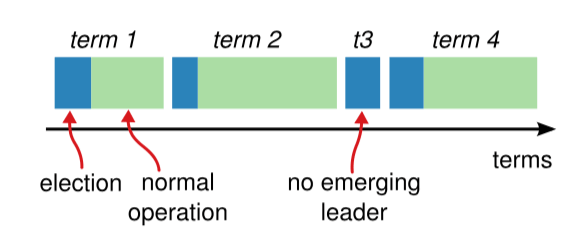
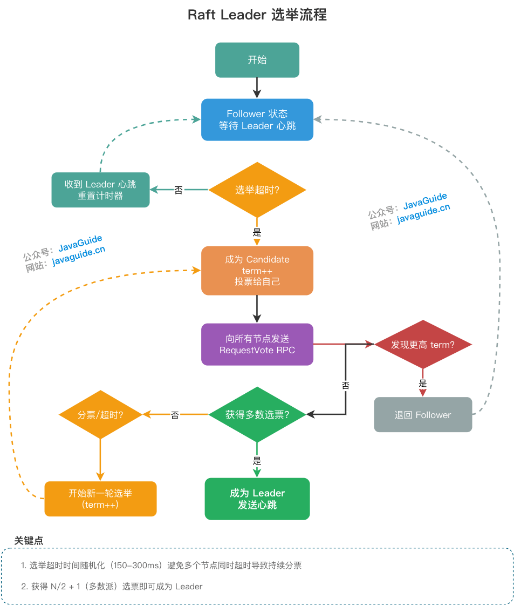

# Raft 共识算法

---
Ongaro D, Ousterhout J. [In search of an understandable consensus algorithm](https://scholar.google.com.hk/scholar?hl=zh-CN&as_sdt=0%2C5&q=In+Search+of+an+Understandable+Consensus+Algorithm&btnG=)[C]//2014 USENIX annual technical conference (USENIX ATC 14). 2014: 305-319.

---

Raft协议将复杂的共识问题拆解成了几个独立的模块：

- **Leader 选举**：使用随机化选举超时（工程上常见如 150–300ms 或更大范围，具体取决于网络与故障模型）。

- **日志复制**：Leader 通过 AppendEntries RPC 广播日志。

- **安全性**：包括选举限制和日志匹配。

**非拜占庭容错（CFT）场景：节点只会 “不说话”，不会 “说假话”**

- 节点只会发生 **故障（crash）**、**宕机**、**网络延迟 / 丢包**

- **不会**发生：

    - 伪造消息

    - 发送错误数据

    - 故意撒谎、作恶、合谋攻击

基于这个假设，Raft 可以通过**多数派投票**实现高效的一致性，是工业界分布式系统的主流选择。

# 基础概念

## Raft节点类型

一个 Raft 集群包括若干服务器，以典型的 5 服务器集群举例。**在任意的时间，每个服务器一定会处于以下三个状态中的一个**：

- **Leader（领导者）**：大当家。全权负责接待客户端、写账本、并把账本同步给小弟。为了防止别人篡位，他必须不断地向全员发送心跳，宣告“我还活着”。

- **Follower（跟随者）**：安分守己的小弟。平时绝对不主动发起请求，只被动接收老大的心跳和账本同步。

- **Candidate（候选人）**：临时状态。如果小弟迟迟等不到老大的心跳，就会觉得自己行了，变身候选人开始拉票。

在正常的情况下，只有一个服务器是 Leader，剩下的服务器是 Follower。Follower 是被动的，它们不会发送任何请求，只是响应来自 Leader 和 Candidate 的请求。

## 任期



Raft 算法将时间划分为任意长度的**任期（term）**，任期用连续的数字表示，看作当前 term 号。

**每一个任期的开始都是一次选举**，在选举开始时，一个或多个 Candidate 会尝试成为 Leader。

- 如果一个 Candidate 赢得了选举，它就会在该任期内担任 Leader。

- 如果没有选出 Leader（例如出现分票 split vote），该任期可能没有 Leader；随后在新的选举超时后会进入下一个任期并重新发起选举。

- 只要多数节点可用且网络最终可达，系统通常能够在若干轮选举后选出 Leader。

每个节点都会**存储当前的 term 号**，当服务器之间进行通信时会**交换当前的 term 号**；如果有服务器发现自己的 term 号比其他人小，那么他会**更新到较大的 term 值**。

- 如果一个 Candidate 或者 Leader 发现**自己的 term 过期了，他会立即退回成 Follower。**

- 如果一台服务器**收到的请求的 term 号是过期的，那么它会拒绝此次请求。**

**分票（Split Vote）**

    选票被多个节点瓜分，没有任何一个节点拿到多数票。

    - 多个节点**同时**发起选举 / 提案

    - 选票被均匀分散

    - **没有任何一个节点获得 >N/2 的支持**

    1. **Raft解决分票问题**

        **随机选举超时（Randomized Election Timeout）**

        - 每个节点超时时间随机（150ms~300ms）

        - 必然有一个节点**最先超时**

        - 先发起选举，先拿到多数票

        - 其他节点还没超时就收到新 Leader 心跳，**放弃选举**

    1. Paxos解决分票问题

        - **全局唯一且递增的提案编号**

        - 编号大的提案会覆盖编号小的

        - 最终一定有一个编号最大的提案胜出

## 日志

**只有 Leader 有资格往账本里追加记录（Entry）**。

一条日志包含三个核心要素：**`<当前任期, 索引号, 具体操作指令>`**。

这里有两个非常关键的进度指针：

- **`commitIndex`**：大家公认已经安全落地的日志进度（已经被复制到过半数节点）。

- **`lastApplied`**：这台机器本地真正执行完的日志进度。

# 领导人Leader选举



当一个 **Follower 在 election timeout 时间段内，没有收到来自 Leader 的 AppendEntries RPC（心跳）**，它就会认为当前 Leader 已失效，**自己转为 Candidate，发起新一轮选举**。

Raft 使用**心跳机制来触发 Leader 的选举**。

如果一台服务器持续收到来自 Leader 的 AppendEntries（心跳或日志复制）等合法 RPC，它会保持为 Follower 状态并刷新选举计时器。

Leader 会向所有的 Follower 周期性发送心跳来保证自己的 Leader 地位。如果一个 Follower 在一个周期内没有收到心跳信息，就叫做选举超时，然后它就会认为此时没有可用的 Leader，并且开始进行一次选举以选出一个新的 Leader。

为了**开始新的选举**，Follower 会**自增自己的 term 号**并且**转换状态为 Candidate**。然后他会**向所有节点发起 RequestVote RPC 请求**， Candidate 的状态会持续到以下情况发生：

- 赢得选举

- 其他节点赢得选举

- 一轮选举结束，无人胜出

**赢得选举的条件是：一个 Candidate 在一个任期内收到了来自集群内的多数选票（N/2+1），就可以成为 Leader。**

在 Candidate 等待选票的时候，它可能收到其他节点声明自己是 Leader 的心跳，此时有两种情况：

- **该 Leader 的 term 号大于等于自己的 term 号**，说明对方已经成为 Leader，则**自己回退为 Follower。**

- **该 Leader 的 term 号小于自己的 term 号，那么会拒绝该请求并让该节点更新 term**。

由于可能同一时刻出现多个 Candidate，导致没有 Candidate 获得大多数选票，如果没有其他手段来重新分配选票的话，那么可能会无限重复下去。

Raft 使用了**随机的选举超时时间**来避免上述情况——分票。每一个 Candidate 在发起选举后，都会随机化一个新的选举超时时间，这种机制使得各个服务器能够分散开来，在大多数情况下只有一个服务器会率先超时；它会在其他服务器超时之前赢得选举。

# 日志复制

一旦选出了 Leader，它就开始接受客户端的请求。每一个客户端的请求都包含一条需要被**复制状态机（`Replicated State Machine`）**执行的命令。

**强 Leader 模型**：

- **日志只能由 Leader 流向 Follower**，Follower 完全被动接收，不主动发起日志同步。

- **所有客户端写请求都由 Leader 统一处理**，保证全局顺序一致。

Leader 收到客户端请求后，会**生成一个 entry**，包含`<index,term,cmd>`，再将这个 entry **添加到自己的日志末尾**后，**向所有的节点广播该 entry**，要求其他服务器复制这条 entry。

- 如果 Follower 接受该 entry，则会将 entry 添加到自己的日志后面，同时返回给 Leader 同意。

- **如果 Leader 收到了多数 Follower 对该日志复制成功的响应，Leader 会推进自己的 commitIndex，并在随后将这些已提交（committed）的日志按顺序应用（apply）到状态机后再向客户端返回结果**。

**Leader 只能基于"当前任期（current term）内产生的日志在多数派上复制成功"来推进 commitIndex**。

对于之前任期遗留的日志，即使它们已经被复制到多数节点，Leader 也不应仅凭多数派直接提交；通常会通过提交当前任期的一条新日志（常见做法是**当选后新Leader追加并提交一条 no-op 日志**）**来间接推动历史日志一并提交**。

**为什么不能直接提交旧任期日志？**

    **旧任期的日志即使已经复制到多数派，仍然可能被新 Leader 覆盖回滚。**

    如果允许 Leader 直接提交旧任期日志，就会出现：

    - ✅ 日志被提交

    - ❌ 随后又被覆盖

    - → **破坏一致性，违反 Safety**

    Raft 为了**绝对安全**，强制规定：

    **只有当前任期的日志被多数派确认，才能证明 Leader 拥有最新的日志，此时历史日志才是真正安全、不会被覆盖的。**

    1. no-op 属于**当前 Leader 任期**

    2. 它被多数派复制成功 → 说明 Leader 已获得多数派认可

    3. 此时 Leader 可以安全地把 **no-op 之前所有日志（包括旧任期）全部提交**

    4. 这些历史日志从此**永远不会被覆盖**

Follower 不会自行决定提交点；它们从 Leader 的 AppendEntries RPC 中携带的 leaderCommit 得知当前可提交的最大索引，并将本地 commitIndex 更新为 **`min(leaderCommit, lastLogIndex)`**，再按序 apply 到状态机。

## 日志匹配属性（Log Matching Property）

Raft 通过 **日志匹配属性（Log Matching Property）** 保证日志绝对不会分叉，这是 Raft 安全性的基石之一。该属性包含两个核心保证：

- **保证一**：**如果两个日志在相同 index 位置的 entry 具有相同的 term，那么它们存储的 cmd 一定相同**

- **保证二**：**如果两个日志在相同 index 位置的 entry 具有相同的 term，那么该位置之前的所有 entry 也完全相同**

### 归纳法证明

日志匹配属性通过归纳法得以保证：

- 基础情况：日志为空时，属性自然成立

- 归纳步骤：假设日志在 **`index N`** 之前完全一致，当 Leader 尝试追加 **`entry N+1`** 时，通过 AppendEntries RPC 的一致性检查 确保：

```Shell
AppendEntries RPC 参数：
- prevLogIndex：前一条日志的索引（Leader 认为与 Follower 对齐的位置）
- prevLogTerm： 前一条日志的任期
- entries[]：   待追加的新日志条目
```


**一致性检查逻辑**：

- Follower 收到 AppendEntries 请求后，检查本地日志中 **`index = prevLogIndex`** 的位置

- 如果该位置的 **`entry.term == prevLogTerm`**，说明Leader和Follower在**`prevLogIndex`**之前的日志完全一致，通过检查

- 如果不存在或 term 不匹配，拒绝追加，返回失败

**关键点**：通过检查 **`prevLogIndex`** 和 **`prevLogTerm`** 的配对，Leader 和 Follower 能够**数学上确保**它们对日志历史达成一致。只有当"最后一个已知一致点"确实一致时，才会追加新日志。这形成了归纳证明的传递链条：

```Shell
entry[0] 一致 → entry[1] 一致 → entry[2] 一致 → ... → entry[N] 一致
    ↑_____________通过 prevLogIndex/prevLogTerm 递归验证_____________↑
```

因此，日志绝不会出现两个不同的值在同一 index 位置被"提交"的情况——即**日志不分叉**。

### 工程实现优化

在实际生产实现（如 etcd 3.5.x）中，除了上述基础的一致性检查外，还包含多项工程优化：

- **快速回退（Fast Backup）**：当 AppendEntries 一致性检查失败时，Follower 返回冲突日志对应的 term 及其边界索引（该 term 的第一条和最后一条 index），Leader 据此一次性跳过整段冲突区间，而非逐条递减 nextIndex 重试。

- **重试风暴防护**：高负载下可能出现大量 AppendEntries 失败重试，实现中通常会加入：

    - **Jitter 退避**：重试间隔加入随机抖动，避免多个 Follower 同时重试

    - **背压机制**：限制单个 Follower 的重试速率，防止占用过多网络带宽

这些优化不影响日志匹配属性的理论正确性，而是提升了系统在异常场景下的恢复效率。

## 日志不一致的恢复

Leader 宕机、新 Leader 选举后，集群遗留**未对齐脏数据**，新 Leader 发起 `AppendEntries` 会触发**一致性检查报错**。

**核心原则**

**以现任 Leader 日志为绝对权威**，Follower 不一致记录必须被**抹除并强制覆盖**。

**冲突解决流程**

1. **寻找分叉点**：Leader 与 Follower 回溯日志，找到**最后一致的历史节点**。

2. **清理冲突日志**：Follower 删除分叉点之后的所有错误日志。

3. **同步正确日志**：Follower 从 Leader 复制分叉点之后的最新日志，完成对齐。

- **`nextIndex`**：Leader 为每个 Follower 维护的指针，代表**预估发送给该 Follower 的下一条日志索引**。

- **初始策略**：新 Leader 上任时，所有 Follower 的 `nextIndex` 默认为**自身最新日志索引 + 1**，首次同步大概率失败。

**回退找分叉点方案**

- 1. 朴素方案：**逐条试探**

    - 逻辑：同步失败 → `nextIndex -= 1` → 重试，循环直到匹配。

    - 缺点：回退慢、网络 RPC 多，**生产环境性能极差**。

- 2. 工业优化：**Fast Backup 快速回退**

    - 逻辑：Follower 拒绝同步时，**主动返回冲突日志的任期 term 及该任期头尾索引**。

    - 优势：Leader 直接跳过整段错误任期，**大幅减少 RPC 重试次数**，是工业级标准实现。

`nextIndex` 精准定位共识起点 → 冲突数据清空、缺失日志补齐 → 任期内 Leader 与 Follower 日志**全程强一致**。

# 安全性

## 1. 选举限制

- **Leader 需要保证自己存储全部已经提交的日志条目**。这样才可以使日志条目只有一个流向：从 Leader 流向 Follower，**Leader 永远不会覆盖已经存在的日志条目**。

- **每个 Candidate 发送 RequestVote RPC 时，都会带上最后一个 entry 的信息**。所有节点收到投票信息时，会对该 entry 进行比较，如果发现自己的更新，则拒绝投票给该 Candidate。

- 判断日志新旧的方式：**如果两个日志的 term 不同，term 大的更新；如果 term 相同，更长的 index 更新**。

## 2. 日志提交规则

- **Leader 推进 commitIndex 时，需要满足"当前任期产生的某条日志已复制到多数派**"这一条件。

- 对于旧任期遗留的日志，即使它们已经复制到多数派，Leader 也不应仅凭此直接提交；通常**新Leader通过提交当前任期的一条新日志（常见为 no-op）来间接提交历史日志**。这一限制用于避免 Leader 频繁切换时出现已提交日志被覆盖的安全性问题。

## 3. 节点崩溃与网络分区

- **Follower 和 Candidate 崩溃**

    - 之后发送给它的 RequestVote RPC 和 AppendEntries RPC 会失败。由于 Raft 的所有请求都是幂等的，所以失败的话会无限的重试。如果崩溃恢复后，就可以收到新的请求，然后选择追加或者拒绝 entry。

- **Leader 崩溃**

    - 节点在 electionTimeout 内收不到心跳会触发新一轮选主；**在选主完成前，系统通常无法对外提供线性一致的写入**（以及线性一致读），表现为一段不可用窗口。

**量化分析**：在 5 节点集群中，Leader 崩溃后的不可用窗口通常小于 1 秒（P99 < 500ms 选举超时 + 一轮选举时间）。这是 **PACELC 定理**的体现：发生分区（P）时，系统选择牺牲可用性（A）以保证一致性（C）。幂等重试机制确保节点恢复后能安全追赶数据状态

### 单节点隔离与Term暴增问题

在标准 Raft 算法中，**单节点网络隔离**可能导致 **Term 暴增（Term Inflation）** 问题，造成"劣币驱逐良币" —— 一个被隔离的少数派节点在恢复后破坏健康集群的稳定性。

**场景推演**：

假设一个 5 节点集群，Leader 为节点 A，Follower 为 B、C、D、E。此时节点 E 发生网络分区，被彻底隔离：

```Shell
正常区域：{A, B, C, D}    （Leader A + 多数派，可正常服务）
隔离区域：{E}             （单节点隔离，无法收到心跳）
```

|时间线|正常区域 {A, B, C, D}|隔离区域 {E}|
|-|-|-|
|T0|Leader A 正常服务，Term = 5|E 收不到心跳，选举超时|
|T1|集群继续正常工作|E 自增 Term 发起选举（Term 6），但无响应|
|T2|........|E 继续自增（Term 7, 8, ...），假设涨到 Term 99|
|T3|网络恢复，E 带着 Term 99 接入集群|E 向 {A, B, C, D} 广播 RequestVote (Term 99)|
|T4|节点 A 收到 Term 99 > 自己的 Term 5，被迫退位|E 的"高 Term"破坏了健康集群|

这是标准 Raft 的一个已知边界问题：**少数派节点的"疯狂选举"会干扰多数派的正常运行.**

#### Pre-Vote机制

为了解决上述问题，Raft 的扩展方案 **Pre-Vote** 被提出。Pre-Vote 要求节点在真正发起选举前，先进行一次"预投票"：

1. **预投票阶段**：Candidate 向其他节点发送 PreVoteRequest，携带自己的日志信息

2. **预投票条件**：

    - 候选人的日志至少与接收者一样新（选举限制）

    - **接收者确认自己与 Leader 的连接已断开**（超过 electionTimeout 未收到心跳）

1. **正式选举**：只有收到多数节点的 PreVote 响应后，才

    - **`Term++`**

    - 转为 Candidate

    - 发起 RequestVote

1. 否则退回 Follower，**Term 不变**

**Pre-Vote 如何防止 Term 暴增**：

- 在上述单节点隔离场景中，E 在隔离期间发起 Pre-Vote 时，**其他节点仍能收到 Leader A 的心跳**

- 因此其他节点会**拒绝 E 的 PreVote 请求**（因为与 Leader 连接正常）

- E 无法获得多数 PreVote 响应，**不会真正增加 Term**

- 网络恢复后，E 的 Term 仍然较低，不会干扰健康的 Leader A

**核心思想**：只有确认自己与 Leader 失去连接后，节点才开始真正增加 Term。这有效防止了少数派节点的 Term 暴涨干扰多数派。

**Pre-Vote 就是给 Raft 加了一层 “选举资格审查”，杜绝单节点隔离导致的 Term 暴增与集群扰动。**

## 4. 时间与可用性

Raft 的要求之一就是安全性不依赖于时间：系统不能仅仅因为一些事件发生的比预想的快一些或者慢一些就产生错误。为了保证上述要求，最好能满足以下的时间条件：

**`broadcastTime << electionTimeout << MTBF`**

- `broadcastTime`：向其他节点并发发送消息的平均响应时间；

- `electionTimeout`：选举超时时间；

- `MTBF(mean time between failures)`：单台机器的平均健康时间；

**`broadcastTime`应该比`electionTimeout`小一个数量级**:

- 为的是使`Leader`能够持续发送心跳信息（heartbeat）来阻止`Follower`开始选举；

**`electionTimeout`也要比`MTBF`小几个数量级:**

- 为的是使得系统稳定运行。当`Leader`崩溃时，大约会在整个`electionTimeout`的时间内不可用；我们希望这种情况仅占全部时间的很小一部分。

由于`broadcastTime`和`MTBF`是由系统决定的属性，因此需要决定`electionTimeout`的时间。

一般来说，broadcastTime 一般为 `0.5～20ms`，electionTimeout 可以设置为 `10～500ms`（工程上常见如 150–300ms），MTBF 一般为一两个月。

