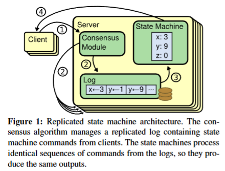
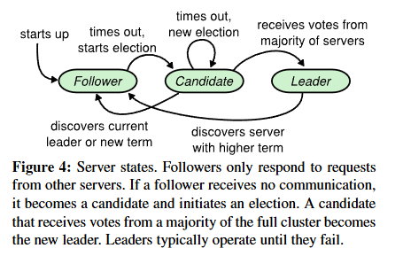
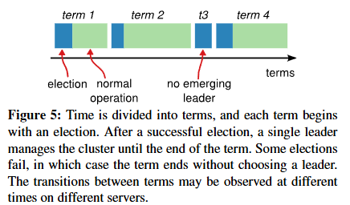
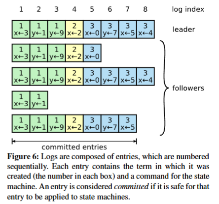
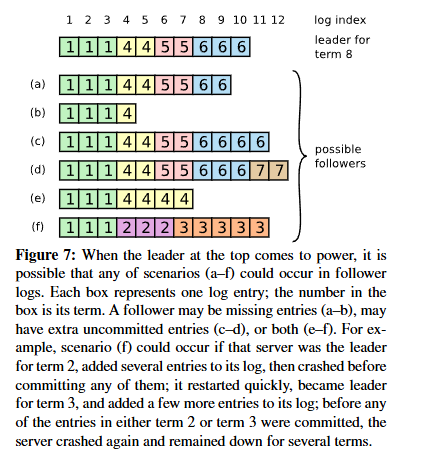
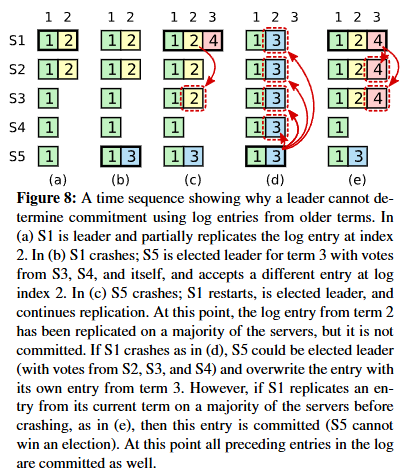
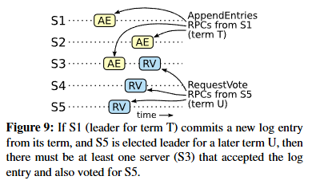

# Raft 论文解读

**Raft 将可理解性作为第一优先级**

# 1. Introduction

Raft 的核心设计思路是**强领导者模型**，先选举出集群中唯一的领导者，由领导者全权负责复制日志的管理。

将复杂的共识问题，分解为三个相对独立、可分别解决的子问题：**领导者选举、日志复制、安全性**，通过分解大幅提升了算法的可理解性。

- **强领导者模型：日志只能从 Leader 流向 Follower**，逻辑超级简单。

- **随机超时选举：用随机化选举超时时间避免投票分裂**，选主快、不打架。

- **安全的集群成员变更：**用 “**重叠多数派” 保证加节点、减节点时不会脑裂**。

# 2. Replicated state machines

**复制状态机**

**复制状态机 = 让多台机器像一台机器一样干活，数据完全一样，坏几台也不影响。**

共识算法，通常就是为了**复制状态机**而设计的。

复制状态机一般通过**复制日志**实现。每台服务器都保存一份日志，日志中包含一系列命令，状态机按顺序执行这些命令。

**所有日志都包含相同顺序的相同命令**，因此所有状态机都会处理完全一致的命令序列。由于状态机是确定性的，每台机器最终都会计算出相同的状态，并输出相同的结果。

**保证复制日志的一致性**，正是共识算法的核心任务。服务器上的共识模块接收来自客户端的命令并写入日志，再与其他服务器的共识模块通信，确保最终所有日志都包含**相同顺序的请求**，即便部分服务器发生故障也不受影响。

面向实际系统的共识算法通常具备以下特性：

- **安全性**：在所有非拜占庭故障条件下（包括网络延迟、分区、丢包、重复包、乱序），**永远不会返回错误结果**。

- **可用性**：**只要集群中多数服务器正常运行且能相互通信、与客户端通信，系统就能完整提供服务**。例如，一个 5 台服务器的集群可容忍任意 2 台故障。服务器故障以停机形式发生，后续可从持久化存储中恢复状态并重新加入集群。

- **时序无关性**：**不依赖时钟来保证日志一致性**；时钟错误或极端消息延迟最多只会影响可用性，不会破坏一致性。

- **高效性**：常规情况下，**一条命令只需集群多数节点完成一轮远程过程调用（RPC）即可完成**；少数慢速服务器不会影响整体系统性能。

# 3. What's wrong with Paxos?

### 1. 极度难理解

- 原始论文晦涩，即使简化版也很难懂

- 以**单决议**为基础，两阶段逻辑无直观解释

- 多 Paxos 组合规则更复杂，很难建立直觉

- 研究者与学生普遍难以掌握

### 2. 工程实用性差

- 没有**标准、完整**的 multi-Paxos 实现方案

- 理论与实际系统差距巨大，必须大改

- 对称对等架构不适合实际系统

- 实际实现与理论脱节，正确性证明失效

- 开发耗时、易出错

Paxos 不适合**教学**，也不适合**工程实现**，因此需要新算法 → **Raft**

# 4. Designing for understandability

**以 “易理解性” 为目标进行设计**

1. **问题分解:** 尽可能把问题拆成相对独立的子问题，分别解决、解释、理解。

    - 例如 Raft 把**领导者选举、日志复制、安全性、成员变更**分开。

1. **简化状态空间:** 减少需要考虑的状态数量，让系统更规整，尽可能消除不确定性。

    - 例如日志不允许有空洞，限制服务器之间不一致的方式。

虽然尽量消除非确定性，但有些场景下，随机化反而能提升易理解性。比如**随机化选举超时**，虽然引入了非确定性，但能用统一方式处理所有情况，让算法更简单。

# 5. The Raft consensus algorithm

Raft 通过**先选举一个专属领导者**，再将管理复制日志的全部职责交给该领导者，来实现共识。领导者接收来自客户端的日志条目，将它们复制到其他服务器，并告知各服务器何时可以安全地将日志条目应用到其状态机。

Raft 将共识问题分解为三个相对独立的子问题，将在后续小节中分别讨论：

- **领导者选举**：当现有领导者发生故障时，必须选出新的领导者（第 5.2 节）。

- **日志复制**：领导者必须接收来自客户端的日志条目，并在整个集群中进行复制，强制其他日志与自身保持一致（第 5.3 节）。

- **安全性**：Raft 的关键安全属性是图 3 中的**状态机安全性**：如果任何服务器将某一日志索引对应的条目应用到了状态机，那么其他服务器永远不会在同一索引位置应用不同的命令。第 5.4 节描述 Raft 如何保证这一属性；该方案会对第 5.2 节描述的选举机制增加额外限制。

## 5.1 Raft basics

### 1.节点状态

Raft 集群里每个节点任何时候都只能是**三种状态**之一：

- **领导者 Leader**：唯一处理客户端请求、负责日志复制

- **跟随者 Follower**：被动响应，不主动发请求

- **候选人 Candidate**：专门用来竞选新领导者

正常运行时，集群**只有一个领导者**，其他全是跟随者。

---

### 2.任期（Term）

- 把时间分成一段一段的**任期**，编号连续递增。

- 每个任期**先选举，再正常工作**。

- **一个任期里最多只能有一个领导者**。

- **任期相当于逻辑时钟，用来识别过期信息**。

---

### 3.通信方式

节点之间只靠两种 RPC 通信：

1. **RequestVote RPC**：选举时候选人拉票用

2. **AppendEntries RPC**：领导者复制日志、发心跳用

服务器未及时收到RPC响应，会重试；为性能，服务器会并行发送RPC

---

### 4.核心规则

- **节点收到更大的任期号，立刻更新自己的任期，并转为跟随者。**

- **过期的小任期请求会被直接拒绝**。

- **领导者、候选人发现自己任期过时，马上变回跟随者**。

## 5.2 Leader election

### **1. 触发条件**

    - **Raft 使用心跳机制来触发领导者选举**

    - 跟随者在**选举超时**内没收到领导者的心跳（空 AppendEntries），就认为领导者宕机，开始竞选。

### **2. 竞选流程**

    1. 跟随者先把自己**变成候选人**

    2. **任期号 Term +1**

    3. **给自己投一票**

    4. 向集群中所有节点**并行发送**请求投票 **RequestVote RPC**

    可能出现情况：

    - 它赢得选举

    - 另一台服务器确立为领导者

    - 一段时间后仍未产生胜者

### **3. 当选规则**

- 谁**拿到集群大多数节点的选票**，谁就成为新领导者，之后立刻发送心跳维持地位。

### **4. 选票分裂问题**

    - 如果多个节点同时竞选，票数分散，选不出主。

    - Raft 用**随机选举超时**（比如 150–300ms）解决，让节点不同时超时，快速选出主。

### **5. 状态切换**

- **候选人收到更大任期的领导者心跳 → 自动变回跟随者**

    - 任期（包含在 RPC 中）**至少与候选人的当前任期一样大**

- **选举超时仍没选出主 → 重新开始新一轮选举**

**集群启动时，无领导者**

    - 所有节点默认都是 **Follower（跟随者）**。

    - 每个节点的 **任期 Term = 0**。

    - 每个节点独立设置一个 **随机选举超时**（通常 150～300ms）。

    - 因为还没有 Leader，所以 **没有任何心跳**。

    - **选举触发：谁先超时谁先竞选**

## 5.3 Log replication

### **1. 基本流程**

    1. 客户端请求先到领导者

    2. 领导者把命令追加到本地日志

    3. 并行地向所有其他服务器发送 AppendEntries RPC将日志复制到所有跟随者

    4. 复制到**大多数节点**后，日志标记为已提交

    5. 再将日志应用到状态机并返回结果

    如果跟随者崩溃、运行缓慢，或者网络丢包，领导者会无限重试 AppendEntries RPC，直到所有跟随者最终都存储了所有日志条目

### **2. 日志结构**

    - 每条日志包含：**命令、任期号、索引**。

    - 任期号用来判断日志是否一致，索引表示位置。

### **3. 日志匹配属性**

    - 如果两条不同日志中的两个条目拥有**相同索引和相同任期**，那么它们存储的是相同的命令。

        - **相同索引 + 相同任期 → 命令一定相同**

    - 如果两条不同日志中的两个条目拥有**相同索引和相同任期**，那么在该索引之前的所有条目，两条日志也完全相同。

        - **相同索引 + 相同任期 → 前面所有日志都完全一致**

### **4. 日志不一致处理**

领导者处理不一致的方式是**强制跟随者的日志和自己完全一致**。

- **领导者为每个跟随者维护 nextIndex**，从最新位置开始尝试同步

- 如果不一致，就**回退 nextIndex** 重试，直到找到一致点；然后**强制覆盖**跟随者后续冲突日志，保证和领导者完全一样。

### **5. 关键规则**

**领导者只追加日志，不会修改或删除自己的旧日志。**

**特性**

**只要大多数节点正常，日志就能同步；一轮 RPC 即可完成提交，不受少数慢节点影响。**

## 5.4 Safty

到目前为止描述的机制**尚不足以**确保每台状态机都以完全相同的顺序执行完全相同的命令。例如，当领导者提交多个日志条目时，某台跟随者可能处于不可用状态，之后它可能被选为领导者并用新条目覆盖这些已提交条目；结果就是，不同状态机可能执行不同的命令序列。

本节通过**对可当选领导者的服务器增加限制**，完善 Raft 算法。该限制确保**任何任期中的领导者都包含之前所有任期中已提交的全部条目**（图 3 中的领导者完整性属性）。

### 5.4.1 Election restriction

**选举约束**

1. **核心目的**：**保证从当选起，新领导者就包含所有之前所有任期已提交的日志条目**，无需额外传输缺失条目。

2. **约束方式**：通过投票过程限制 —— **日志不完整的候选人，无法获得投票。**

    - 候选人必须联系集群中大多数节点才能当选，这意味着**每个已提交条目必须至少存在于这些服务器中的一台**

    - 如果候选人的日志**至少与该大多数中任何其他日志一样新**，那么它就持有所有已提交条目

    - RequestVote RPC ：RPC 包含候选人的日志信息，**如果投票者自身的日志比候选人的日志更新，投票者会拒绝为其投票**

1. **日志新旧判断规则**

    - 如果两条日志最后条目的 **任期不同，则任期更大的日志更新。**

    - 如果两条日志最后条目的 **任期相同，则更长的日志更新。**

1. **核心逻辑**

    - **候选人需获得多数节点投票，而多数节点中必有关键已提交条目；**

    - **只要候选人日志足够新，就一定包含所有已提交条目。**

### 5.4.2 Committing entries from previous terms

**提交前任期的条目**

1. **关键禁忌**：**不能直接提交前任期的日志条目**（即使已复制到多数节点，也可能被覆盖）。

2. **正确提交规则**

    3. **Raft 永远 不会通过统计副本数来提交之前任期的日志条目**

    4. **只有领导者当前任期的日志条目才会通过统计副本数提交**

    5. 一旦当前任期的某条目以此方式提交，**所有之前的条目会因日志匹配属性被间接提交**

6. **设计原因**：前任期日志保留原始任期号，更易推理；且可减少新领导者发送旧日志的数量。

### 5.4.3 Safety argument

**安全性论证**

**论证核心**：**证明 “领导者完整性” 属性**（所有未来领导者，必包含之前所有已提交条目）。

**论证方法**：反证法（假设属性不成立，最终导出矛盾）。

假设任期 T 的领导者（leaderT）提交了其任期中的某日志条目，但该条目未被未来某任期的领导者存储。设 U 是大于 T 的**最小**任期，其领导者（leaderU）未存储该条目。

1. 已提交的条目在 leaderU 当选时**一定不在**其日志中（领导者永远不会删除或覆盖条目）。

1. leaderT 将条目复制到集群大多数节点，而 leaderU 从集群大多数节点获得选票。因此，**至少有一台服务器**（“投票者”）既接收了来自 leaderT 的条目，又为 leaderU 投了票，如图 9 所示。该投票者是导出矛盾的关键。

2. 投票者**必须在为 leaderU 投票之前**接收了来自 leaderT 的已提交条目；否则它会拒绝 leaderT 的 AppendEntries 请求（其当前任期会大于 T）。

1. 投票者为 leaderU 投票时**仍然存储着该条目**，因为每一位中间任期的领导者都包含该条目（根据假设），领导者永远不会移除条目，且跟随者仅在与领导者冲突时才移除条目。

2. 投票者为 leaderU 投了票，因此 **leaderU 的日志必须至少与投票者的日志一样新**。这导致以下两种矛盾之一。

3. 首先，**如果投票者与 leaderU 的最后日志任期相同，则 leaderU 的日志必须至少与投票者的一样长，因此其日志包含投票者日志中的每一个条目**。这与假设矛盾，因为投票者包含已提交条目，而 leaderU 被假设不包含。

4. **否则，leaderU 的最后日志任期必须大于投票者的任期**。此外，**该任期大于 T，因为投票者的最后日志任期至少为 T**（它包含来自任期 T 的已提交条目）。**创建 leaderU 最后日志条目的前一任领导者，其日志中必须包含该已提交条目**（根据假设）。然后，根据日志匹配属性，leaderU 的日志也必须包含该已提交条目，这同样矛盾。

5. 至此，矛盾推导完成。因此，**所有大于 T 的任期的领导者，都必须包含任期 T 中已提交的所有条目**。

6. 日志匹配属性保证，未来所有领导者也会包含被间接提交的条目，例如图 8 (d) 中的索引 2。

**最终结论**：**结合领导者完整性 + 日志匹配属性，保证状态机安全性—— 同一日志索引，绝不会执行不同命令。**

## 5.5 Follower and candidate crashes

**跟随者与候选人故障**

跟随者与候选人故障的处理比领导者故障简单得多，且两者处理方式相同。

- 跟随者或候选人崩溃时，发送给它们的 **RequestVote** 和 **AppendEntries** RPC 会失败。

- Raft 采用**无限重试机制**，直到节点重启恢复。

- **RPC 是幂等的**：重复收到相同日志条目不会造成错误，节点会直接忽略重复内容。

- 节点重启后可自动恢复，不会破坏日志一致性。

## 5.6 Timing and availability

**时序与可用性**

1. Raft **安全性不依赖时序**（不会因为快慢出错），但**可用性依赖时序**。

2. 领导者选举是 Raft 中**时序最为关键**的部分,最关键时序不等式

    - **`broadcastTime ≪ electionTimeout ≪ MTBF`**

    - **broadcastTime**：服务器向集群中所有服务器并行发送 RPC 并接收响应的平均时间

    - **electionTimeout**：选举超时时间

    - **MTBF**：单台服务器的平均故障间隔

1. 含义：

    - **广播时间** << 选举超时：确保领导者能稳定发心跳，避免频繁选举。（小一个数量级）

    - **选举超时** << 平均故障间隔：保证系统大部分时间有稳定领导者。       （小几个数量级）

1. 广播时间可能在 0.5ms 到 20ms 之间。选举超时一般设为 **10–500ms**，广播时间远小于它，保证选主快速、稳定。典型服务器的 MTBF 为数月甚至更久，很容易满足此时序要求。

# 6. Cluster membership changes

**集群成员变更**

**目标：自动化配置变更，变更过程不中断服务 、保证安全性**

**核心风险**：直接切换配置，可能出现**双主问题**（不同节点看到不同配置，形成**两个互不相交的多数派**，分别选主）

## **两阶段+联合共识（joint consensus）**

Raft 不直接切换配置，采用 “**旧配置→联合共识→新配置**” 的两阶段流程，核心是**联合共识（过渡配置）**。

1. 联合共识的特点（同时包含旧配置 C_old 和新配置 C_new）：

    - 日志条目会被复制到旧配置与新配置中的**所有服务器**；

    - 无论旧配置还是新配置中的服务器，都可能成为领导者；

    - 选举新领导者，以及提交日志条目，**都需要同时满足两边各自的多数  (双重多数)**：

        - 选举：需要旧配置中的多数 **并且** 新配置中的多数；

        - 提交：需要旧配置中的多数 **并且** 新配置中的多数。

1. **核心作用：避免旧、新配置独立决策，杜绝双主，保证变更期间服务不中断。**

## 配置变更具体流程

1. 领导者接收配置变更请求，**将 “联合配置（C_old+new）” 作为特殊日志条目，复制到所有节点**。

2. **任何节点只要将联合配置条目追加到本地日志，后续所有决策均使用该联合配置（无论是否提交）**。

    - 每台服务器仅根据其日志中**最后出现的配置**来做决策。

1. **联合配置条目提交（满足新旧配置的 双重多数）后，领导者可以创建并复制 “新配置 C_new” 的日志条目。**

2. 节点追加 C_new 条目后，立即使用新配置做决策；C_new 提交后，下线不属于新配置的节点。

**额外约束**

1. 选举约束：**只有日志包含最新联合配置的候选人，才能赢得选举**（保证领导者具备完整信息）。

2. 心跳约束：**任何节点不能拒绝领导者的直接心跳**（保证领导者同步所有节点日志状态）。

3. 新节点处理：新节点初始无日志，先作为**学习者**同步日志，**日志追上领导者前不参与投票**（避免拖慢提交进度）。

4. 并发限制：**不允许并发配置变更**，需等前一次变更完全提交，再启动下一次（避免配置叠加复杂）。

# 7. Clients and log compaction

**日志压缩与客户端交互**

## 7.1 日志压缩

1. 问题：日志会无限增长，占用空间、变慢，必须压缩。

2. Raft 使用 ** 快照（snapshot）** 方式：

    - 把当前状态机的全部状态拍个快照存下来；

    - 快照之前的所有日志都可以丢弃。

1. 每个节点独立做快照，不影响集群正常运行。

2. 快照内容：

    - 保存状态机的完整状态；

    - 保存快照中最后包含的日志条目的**索引**和**任期号**（用于后续一致性检查）；

    - 保存当前的集群配置（以便成员变更后仍能正确工作）。

1. 落后太多的节点：领导者通过 **InstallSnapshot RPC** 直接发送快照，让它一次性追上，不用逐条重传日志。

快照不会影响正常的共识过程：

- 快照由各节点独立执行；

- 即使部分节点正在做快照，集群仍可正常提交新日志；

- 快照不改变日志匹配、选举等核心规则。

## 7.2 客户端交互

1. 客户端**只向领导者**发送请求。

2. 如果连到跟随者，跟随者会重定向到领导者。

3. 为避免命令重复执行：

    - 每个客户端请求带**唯一 ID**；

    - 服务端记录已执行的请求，重复则直接返回结果，不再执行。

1. 线性一致性保证：只有日志提交并应用到状态机后，才返回成功。

只读操作可以不写入日志，从而提升性能。为了在不提交日志的情况下仍保证线性一致性，领导者需要做到两点：

1. 领导者必须确认自己仍是当前有效的领导者，没有被更新的任期取代； 

2. 领导者在处理只读请求前，先与集群大多数节点交换一次心跳，确保自己没有过期。

# 8. Implementation and evaluation

**工程实现与评估**

- Raft  C++ 实现，约 **2000 行代码**，功能完整。

- 已有大量第三方开源实现，多家公司实际部署。

## 8.1 Understandability 可理解性

- Raft 成功实现「可理解性」设计目标，比传统 Paxos 更适合教学和工程实践。

## 8.2 Correctness 正确性

- 用 **TLA+ 形式化证明** Raft 安全。

- 证明了：**领导者完整性、状态机安全**。

- 结论：Raft 算法**严格正确**。

## 8.3 Performance 性能评估

- 性能与 Paxos **相当**，正常流程只需要**一轮 RPC**。

- 选举：**随机超时**能快速选主，避免选票分裂。

- 推荐配置：**选举超时 150–300ms**，稳定且可用。

# 9. Related work

## 相关工作分类

1. **Paxos 相关**：原始论文、简化解释、工程化改进

2. **工业系统**：Chubby、ZooKeeper、Spanner（多基于 Paxos）

3. **性能优化**：针对 Paxos 的各类提速方案

4. **VR 算法**：视图戳复制，与 Raft 类似，也是强领导者模式

---

## Raft vs Paxos（核心区别）

1. **强领导者**Raft 把领导者作为共识核心，选举是协议一部分；Paxos 选举只是优化。

2. **简化状态**Raft 拆分问题、减少不确定性，更易理解。

3. **日志单向流动**只从领导者→跟随者，更简单；Paxos 更复杂。

4. **消息更少**Raft 只有 **2 种 RPC（4 种消息）**，其他算法更多。

---

## Raft vs VR / ZooKeeper

- 相同：都是**强领导者**架构。

- 不同：Raft 机制更少、日志单向流动、实现更简单。

---

## 成员变更对比

- Raft：用**联合共识**，不中断服务、复用原有逻辑。

- VR：变更时暂停服务。

- SMART：限制并发请求。

