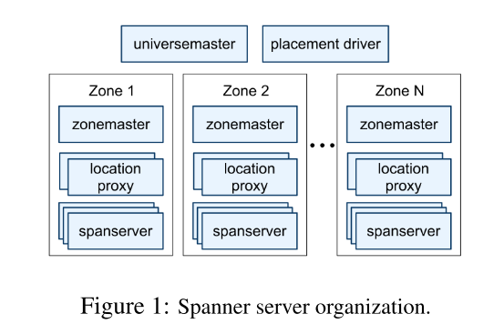
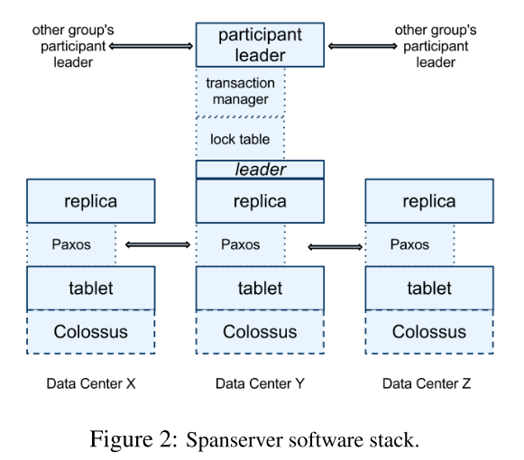

# Spanner

Spanner 是 Google 自研的**全球分布式、强一致、多版本、同步复制的 NewSQL 数据库**，核心突破是在跨地域 / 全球规模下，实现**外部一致性（线性一致性）的分布式事务**，兼顾关系型数据库的事务 / SQL 能力与分布式系统的可扩展性、高可用。

---

Corbett J C, Dean J, Epstein M, et al. [Spanner: Google’s globally distributed database](https://dl.acm.org/doi/abs/10.1145/2491245)[J]. ACM Transactions on Computer Systems (TOCS), 2013, 31(3): 1-22.

---
# 核心定位与设计目标

- 解决痛点：传统分布式数据库要么强一致但难扩展、要么高扩展但弱一致；Spanner 做到**全球分布 + 强一致 + 高可用 + SQL/ACID 事务**。

- 核心能力：

    1. 跨数据中心 / 大洲的**同步复制、自动故障转移**

    2. 全局**外部一致性（External Consistency）**：事务提交顺序与真实时间顺序一致，后提交的事务一定能看到先提交事务的结果。

    3. 支持标准 SQL、跨行 / 跨表 / 跨分片 / 跨区域的分布式事务、多版本快照读。

- 典型应用：Google Ads（F1）、Gmail、Google Photos、金融 / 电商 / 全球业务系统。

## 核心架构（分层 + 分片 + Paxos 复制）

### 1. 部署层级（Universe → Zone → SpanServer）

- **Universe**：一个完整 Spanner 部署实例（全球一套）

- **Zone**：物理部署单元（一个数据中心 = 1 个 / 多个 Zone），包含：

    - **ZoneMaster**：数据分片分配、负载管理

    - **Location Proxy**：客户端路由，定位数据所在 SpanServer

    - **SpanServer**：核心存储 / 计算节点，管理 100~1000 个 Tablet（数据分片）

- **Placement Driver**：后台自动迁移数据、跨 Zone 负载均衡、副本放置控制

其中，最高级的是Universe，在论文中谷歌表示目前只有三个Universe，包括一个用于测试或后台运行的Universe，一个用于部署或生产的Universe和一个仅用于生产的Universe。

    每个Universe下面包含多个Zone，每个Universe使用UniverseMaster和PlaceDriver检测和管理Zone，这里的Zone就相当于Bigtable的Server，对应实际情况中的一台或多台物理机器。

    而每个Zone中有一个ZoneMaster管理多个LocationProxy和数百至数千个SpannerServer，其中，LocationProxy负责将客户端的请求转发到对应的SpannerServer。

### 2. 数据分片与复制（Tablet + Paxos Group）

- **Tablet**：数据存储基本单元，多版本 KV 结构：`(key, timestamp) → value`，底层基于 LSM 树、B 树、WAL 日志，存储在 Colossus（GFS 继任者）。

- **Paxos Group**：每个 Tablet 对应一个独立 Paxos 组，**同步复制多副本（3~5 个）**，分布在不同 Zone / 数据中心：

    - 1 个 Leader 处理写入、发起 Paxos 共识

    - 多个 Follower 同步日志、提供就近读

    - 多数派（如 3 副本需 2 台确认）写入成功才返回，保证强一致、不丢数据。

- **Directory**：数据放置 / 迁移最小单元（同前缀键集合），支持精细控制副本的地域分布、数量、读写延迟。

以三副本的情况为例介绍了Spanner Server的内部架构。Spanner和Bigtable相似的地方在于，他们都基于分布式的文件系统GFS，这里的Colossus是第二代GFS，具体的实现细节仍未公布，而且他们都使用了Tablet作为单位管理存储数据，但是，这里的Tablet和Bigtable中Tablet是有些不同的。但是再上面一层就有些不同了，因为Bigtable中数据基于爬虫获得而且使用了SSTable存储数据，这保证了数据的唯一性，所以在Bigtable中没有使用具体的算法保证数据的一致性，但也因为这一点，Bigtable没有很好地支持事务。Spanner中使用了多副本的机制备份数据，同时在副本之间使用Single Paxos算法保证了数据一致性，在这里，谷歌可能是为了提高Paxos算法的性能并降低耦合，他们并不是把整个机器作为Paxos算法的基本角色，而是将机器中的数据分割为多个Paxos Group，每个机器中的相同数据被标识为同一Group，每次运行Paxos算法都仅由关联的Paxos Group参与。再往上一层就是各机器之间的关系了，Spanner使用主从结构管理副本，Leader节点要额外维护LockTable和Transaction Manager，其中LockTable的作用类似Bigtable中的Chubby，用于协调各副本之间的并发操作，Transaction Manager则用于管理分布式事务。Leader节点还要负责所有的写操作和和其他节点的沟通。

Paxos Group仍然是很大的操作单位，想要更加灵活地进行数据迁移工作就需要更小的数据单位。于是Spanner将每个Paxos Group分割为多个Directory，而每个Directory包含若干个拥有连续前缀Key的数据。不得不说，这里的连续前缀Key有点像SSTable的设计。Spanner将Directory作为物理位置记录的单元，同时也是均衡负载和数据迁移的基础单元。这很好理解，负载均衡是把请求转发到拥有相同数据的机器，数据迁移是把数据从一台机器复制到另一台机器，这两者都需要目的机器的物理地址，所以最小只能把Directory作为单位。

## 核心技术基石：TrueTime API

这是 Spanner 实现全局一致性的**最关键创新**：

- 本质：暴露**时钟不确定性**的时间接口，返回一个时间区间 `[earliest, latest]`，保证真实绝对时间一定落在这个区间内（误差通常 <10ms）。

- 实现：每个数据中心部署**GPS + 原子钟**，结合时间同步协议，把全局时钟偏差控制在极小范围。

- 作用：

    1. 为每个事务分配**全局唯一、单调递增的提交时间戳**，保证事务顺序与真实时间一致

    2. 实现**Commit Wait**：事务提交后，等待时间区间覆盖完成，再对外可见，消除时钟偏差带来的不一致。

## 事务模型（强一致 + 高性能）

### 1. 读写事务（RW Transaction）

- 跨分片 / 跨区域时，用**2PC（两阶段提交）+ Paxos** 保证原子性、一致性。

- 流程：获取锁 → 执行读写 → Paxos 同步 → 分配 TrueTime 时间戳 → Commit Wait → 释放锁。

- 单分片事务：直接走 Paxos，**绕过 2PC、性能更高**。

### 2. 只读事务（RO Transaction）

- **无锁、非阻塞、就近读**：直接从任意最新副本读取指定时间戳的快照数据，不影响写入、低延迟。

- 时间戳选择：用 TrueTime 获取当前最新安全时间，保证读到已提交的最新数据。

### 3. 快照读（Snapshot Read）

- 读取历史版本数据（按时间戳），支持一致性备份、全局一致的批量分析、原子 Schema 变更。

## 关键特性总结

1. **全局强一致**：TrueTime + Paxos + 2PC，实现跨地域外部一致性，解决分布式事务 “一致性难题”。

2. **高可用与灾备**：多副本跨 Zone / 大洲同步复制，自动故障转移，容忍数据中心级故障。

3. **SQL 兼容**：支持类标准 SQL、事务、索引、JOIN、Schema，降低迁移成本。

4. **多版本与快照**：自动版本化、按时间戳读历史、无锁快照读、原子 Schema 变更。

5. **灵活数据放置**：精细控制副本数量、地域、距离，平衡读延迟、写延迟、可用性。

6. **自动扩展**：自动分片、重分片、数据迁移，水平扩展到百万节点、万亿行数据。

---

Spanner 以 **TrueTime 全局时钟 + Paxos 同步复制 + 分布式 2PC** 为核心，打造了全球首个能在跨地域规模下，同时提供**强一致 ACID 事务、标准 SQL、高可用、水平扩展**的分布式关系数据库。

