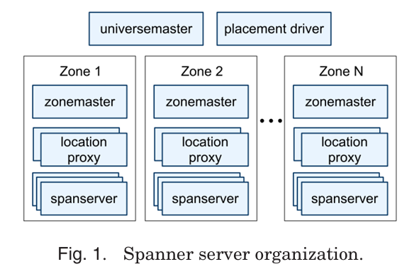
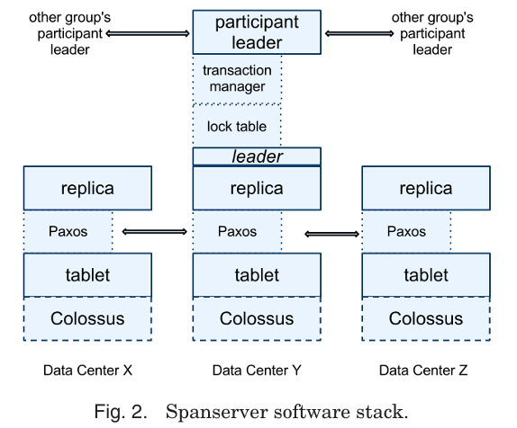
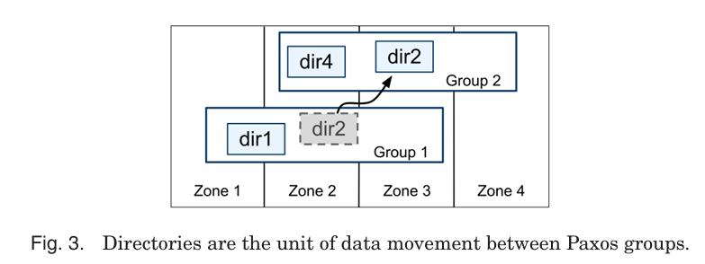
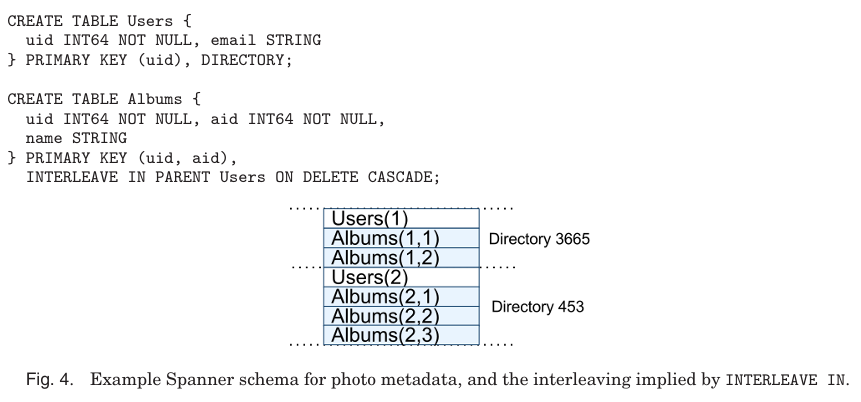
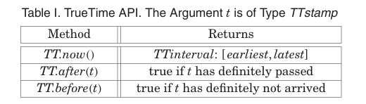
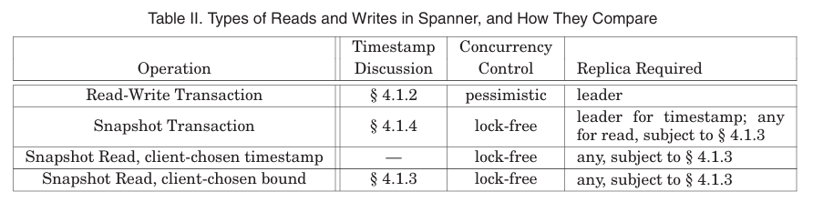
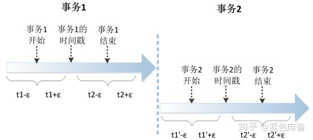
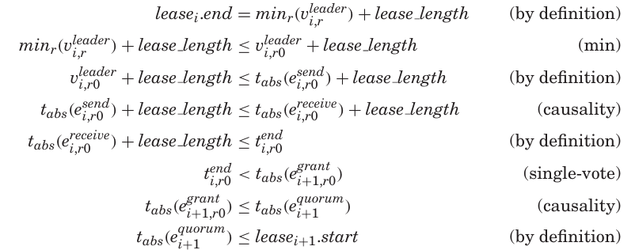

# Spanner 论文解读

Spanner 是 Google 在 2013 年发表于 **ACM TOCS** 的经典论文，系统介绍了 Google 自研的**全球分布式、可扩展、多版本、同步复制** 数据库 Spanner，核心突破是**全球规模下实现外部一致性分布式事务**。

[CnBlogs - Spanner 总结](https://www.cnblogs.com/brianleelxt/p/13449540.html#autoid-3-2-2)


[知乎 - 浅谈Spanner](https://zhuanlan.zhihu.com/p/338578860)


# 设计目标

Spanner 是 Google 面向**全球跨数据中心**场景设计的数据库，解决 Bigtable、Megastore 等系统的痛点：

- 支持**半关系型表结构 + SQL 类查询语言**

- 全球数据分片、自动复制、故障自动切换

- **首个在全球规模实现外部一致性**的分布式系统

- 支持多版本、无锁快照读、原子 schema 变更

设计目标：**可扩展性 + 高可用 + 强一致 + 全球分布**。

# 整体架构

Spanner 以 **Universe** 为部署单元，内部按 **Zone** 划分（类似数据中心部署单元）。

### 核心组件

1. **Zonemaster**：给 SpanServer 分配数据

2. **SpanServer**：核心服务节点，负责数据读写

3. **Location Proxy**：客户端路由，找到对应 SpanServer

4. **Universe Master**：控制台，监控全局状态

5. **Placement Driver**：自动在 Zone 间迁移数据、负载均衡

### SpanServer 软件栈

- **Tablet**：数据存储单元，类似 Bigtable Tablet，但带**时间戳多版本**

- **Paxos 组**：每个 Tablet 对应一个 Paxos 状态机，实现同步复制与一致性

- **Lock Table**：leader 节点上做两阶段锁，并发控制

- **Transaction Manager**：处理跨 Paxos 组的分布式事务

---

### 核心抽象：Directory（目录）

- Directory 是**数据放置、复制、迁移的最小单元**（一组连续前缀的 key）

- 应用可通过主键设计控制数据本地性

- 超大 Directory 会自动切分为 Fragment，支持在线迁移

- 支持**精细控制复制策略**：副本数、地域分布、读写延迟

# 核心技术：TrueTime API

TrueTime 是 Spanner 实现**强一致**的**基石**，直接暴露**时钟不确定性**。

### 接口定义

- `TT.now()`：返回时间区间 `[earliest, latest]`，保证绝对时间落在其中

- `TT.after(t)`：判断 t 绝对已过

- `TT.before(t)`：判断 t 绝对未到

### 实现原理

- 底层依赖 **GPS + 原子钟** 双重时间源，避免单点失效

- 每个数据中心部署时间 master，节点运行 timeslave daemon

- 时钟误差 **ε 通常 <10ms**，生产环境平均约 4ms

- 用 Marzullo 算法剔除错误时钟源，保证安全边界

---

---

摘要

    Spanner 是谷歌推出的具备**可扩展性、多版本特性、全球分布式部署与同步复制能力**的数据库。它是**首个在全球范围分发数据并支持外部一致性分布式事务**的系统。

    本文阐述了 Spanner 的系统架构、功能特性、各项设计决策背后的依据，以及一种**显式暴露时钟不确定性**的新型时间应用程序接口（API）。该 API 及其实现是保障外部一致性的关键，同时支撑着 Spanner 全域范围内多项核心功能：**非阻塞历史数据读取、无锁快照事务与原子化模式变更**。

# 1. Introduction

Spanner 是由谷歌设计、构建并部署的一款可扩展、全球分布式数据库。从最高抽象层次来看，它是**一个将数据分片存储在遍布全球数据中心内的多组 Paxos 状态机上的数据库**。系统采用复制机制实现**全球高可用**与**地理就近访问**；客户端可在副本之间**自动故障切换**。随着数据量或服务器数量变化，Spanner 会自动对数据进行重新分片，并在机器之间（甚至跨数据中心）**自动迁移数据**，以实现**负载均衡**与**故障应对**。Spanner 的设计目标是扩展至跨数百个数据中心的数百万台机器，支撑数万亿行数据库记录。

Spanner 从一个类似 Bigtable 的带版本键值存储，演进为**时序多版本数据库**。数据以**带模式的半关系型表**存储；数据自带版本，每个版本会被自动打上**提交时间戳**；旧版本数据遵循可配置的**垃圾回收策略**；应用可以读取指定历史时间戳的数据。Spanner **支持通用事务**，并提供基于 SQL 的查询语言。

作为一款全球分布式数据库，Spanner 具备多项突出特性：

1. **应用可以细粒度、动态地控制数据地复制配置**

    应用可通过约束

    - 指定哪些数据中心存储哪些数据、

    - 数据距离用户多远（以控制读延迟）、

    - 副本之间距离多远（以控制写延迟），

    - 维护多少副本（以控制持久性、可用性与读性能）

    系统还能在数据中心之间动态、透明地移动数据，以平衡跨数据中心的资源使用。

1. **提供外部一致地读写，以及在指定时间戳下对整个数据库地全局一致读**

---

这些特性得以实现，核心在于 Spanner 会**为事务分配具备全局意义的提交时间戳**，即便事务是分布式的。时间戳反映了串行化顺序。此外，该串行化顺序满足**外部一致性**（等价于线性一致性）：

如果事务 T1 先于事务 T2 开始前提交，那么 T1 的提交时间戳一定小于 T2 的提交时间戳。

Spanner 是首个在全球规模下提供此类保证的系统。

---

支撑这些特性的关键，是全新的 **TrueTime API** 及其实现。

该 API **直接显式暴露时钟不确定性**，而 Spanner 时间戳的保证依赖于实现所提供的误差边界。

如果不确定性较大，Spanner 会**通过等待来抵消这段不确定性**。

谷歌集群管理软件提供了 TrueTime API 的实现，该实现通过采用 GPS 与原子钟两种现代时间参考源，将不确定性控制在很小范围（通常小于 10ms）。

**保守上报不确定性是保证正确性的必要条件；**

**将不确定性边界控制在较小范围，则是保证性能的关键。**

# 2. Implementation  实现

### 基本部署单元

- **Universe（全域）**

    - **Spanner 的完整部署实例**，全球只运行少数几个（测试、开发、生产）。

    - 管理跨全球数百数据中心、数百万台机器的集群。

- **Zone（区域）**

    - **系统管理部署、物理隔离、数据复制的基本单位**。

    - 一个数据中心可包含多个 Zone，实现不同业务隔离。

    - 可在线增删，适配数据中心上下线。

---

一个 Spanner 全域所包含的服务器



一个区域包含一台**区域主节点（Zonemaster）和一百到数千台SpanServer**。

### 核心组件职责

1. **Zonemaster**

    每个 Zone 一个，**负责将数据分配给 SpanServer**。

1. **SpanServer**

    **实际承载数据、提供读写服务的节点**，一个 Zone 可包含数百至数千台。

1. **Location Proxy 位置代理**

    **给客户端提供寻址定位能力，找到数据所在的 SpanServer**。

1. **Universe Master 全域主节点（单点）**

    全域主节点，**全局控制台，展示所有区域的状态、用于交互式调试**，单点部署。

1. **Placement Driver（单点）**

    **全局调度组件，以分钟级粒度自动在 Zone 之间迁移数据**。

    - 它会定期与 SpanServer 通信，识别需要迁移的数据，以满足更新后的**复制约束**或实现**负载均衡**。

---

## 2.1 SpanServer Software Stack 软件栈

每个 SpanServer 运行完整的存储 + 复制 + 事务栈。



### 2.1.1 Tablet（数据存储单元）

- 一个 SpanServer 管理 **100~1000 个 Tablet**。

- 数据模型：**`(key: string, timestamp: int64) → string`**。

- **多版本键值结构，是 Spanner 支持多版本并发的基础**。

- 数据与日志存储在 Colossus（GFS 第二代分布式文件系统）。

- Tablet 的 存储格式：**类 B-tree 文件 + WAL 预写日志**。

### 2.1.2 Paxos 复制

- **每个 SpanServer 在每个 Tablet 之上实现 一个 Paxos 状态机**，实现同步复制与一致性。

- Paxos实现支持**长生命周期 Leader 和 基于时间的主节点租约**，默认租约 10 秒，减少选举开销。

- 每一次 Paxos 写入记录两次（Tablet 日志 + Paxos 日志），为实现简化，未来会优化。

- 使用 **流水线 Paxos**（multi-decree），**一次选举支持多次决议**，并支持对不同决议进行并发投票，提升广域网延迟下的吞吐量。

    - 尽管决议可能乱序通过，但会**按序应用**

- Paxos 状态机用于实现一致性复制的映射集合。每个副本的键值映射状态存储在对应的 Tablet 中。一组副本共同构成一个**Paxos 组**。

- **读写操作**

    - **写入必须在主节点 Leader 发起 Paxos协议**

    - **读可从任意已同步的副本(足够新的副本)直接读取底层Tablet数据**

### 2.1.3 Lock Table（并发控制）

在每个作为主节点的副本上，SpanServer 会实现一个**锁表（Lock Table）以实现并发控制。**

- **锁表只在 Paxos Leader 上存在** 。

- **实现严格两阶段锁（SS2PL），按 key range 管理锁。**

    - **将键范围映射到锁状态**

    - 长生命周期 Paxos 主节点对高效管理锁表至关重要。

- **长事务友好**（如报表生成），避免乐观锁在冲突多的场景下性能差。

- 需要同步的操作（如事务读）会在锁表中获取锁，其他操作则绕过锁表

- **锁状态基本为易失性，不通过 Paxos 复制**，提升性能。

### 2.1.4 Transaction Manager（事务管理器）

- **同样只运行在 Leader 上**。

- **事务管理器用于实现参与者主节点（Participant Leader）**；组内其他副本称为**参与者从节点（Participant Slave）**。

- **单 Paxos 组事务：可绕过事务管理器**，**Paxos + Lock Table** 即可保证事务。

- **多 Paxos 组事务：使用 2PC（两阶段提交） 协调。**

    - 选出一个参与者组作为 **Coordinator（协调者）**，统一决定提交或中止。

    - 该组的参与者主节点称为**协调者主节点**，从节点称为**协调者从节点**。

- **事务管理器状态通过 Paxos 复制**，保证故障恢复。

---

---

## 2.2 Directories and Placement 目录与放置

### 2.2.1 Directory（目录）是什么

在键值映射之上，Spanner 实现了一种称为**目录（Directory）的分桶抽象：目录是一组共享相同前缀的连续键。**

- 定义：**具有相同键前缀的一组连续 key**，是 Spanner 最关键的调度单元。

- 作用：让应用能通过主键设计**控制数据的本地性**。

### 2.2.2 Directory 的核心地位

1. **数据放置最小单元**

    **一个目录内所有数据使用相同复制配置**（副本数、地域、延迟策略）。

1. **数据迁移最小单元**

    系统在负载均衡、副本调整、故障转移时，**以目录为单位移动数据。**

    

1. **支持在线迁移**

    迁移过程不阻塞前端读写，50MB 目录可在数秒内完成。

1. **目录过大自动分片**

    超大目录会切分为 **Fragment（片段）**，Movedir 实际迁移片段。

1. 一个 Paxos 组可以包含多个目录，这意味着 Spanner 的 Tablet 与 Bigtable 的 Tablet 不同：前者不一定是行空间的连续字典序分区，而是一个可以封装多个行空间分区的容器。这一设计使得**频繁一起访问的多个目录可以被 colocated（同置）**。

### 2.2.3 Movedir 后台任务

- **负责目录 / 片段在 Paxos 组之间迁移的后台任务**。

- 支持副本添加、删除、替换。

    - 通过将一个组的所有数据迁移到具备目标配置的新组，来为Paxos组添加或移除副本，因为Spanner暂不支持 Paxos内配置变更。

- **迁移非事务性执行，避免阻塞正在进行的读写。**

    - Movedir 先注册迁移开始，然后在后台迁移数据

    - 当仅剩少量数据未迁移时，用一个**小事务原子迁移**剩余数据并**更新**两个Paxos组的**元数据**

- 当目录过大时，Spanner 会将其拆分为多个**片段（Fragment）**。片段可由不同 Paxos 组（即不同服务器）提供服务。**Movedir 实际迁移的是片段**，而非完整目录。

### 2.2.4 复制放置策略

**目录是应用可指定 地理复制属性(放置策略) 的最小单位。**

将复制配置的管理职责分离

- 管理员定义：副本数量、类型、地域布局，并创建一组命名选项。

- 应用指定：给数据库或目录绑定放置策略，控制数据如何复制

- **可实现用户级精细化调度**：例如 A 用户数据存在欧洲，B 用户数据存在北美。

## 2.3 数据模型（半关系型设计）

### 2.3.1 设计动机

- Bigtable 问题：无强事务、缺少跨行事务、Schema 不灵活、**跨机房最终一致性复制**。

- Megastore 问题：半关系模型好用，支持跨数据中心同步复制，但**写吞吐量低**。

- Spanner 目标：结合**关系型易用性** + **分布式可扩展性** + **强一致性**。

### 2.3.2 模型特点

- **带 Schema 的半关系表**，支持类 SQL 查询。

- 应用数据模型构建在实现层提供的**目录分桶键值映射**之上。

- **必须定义主键**，保留键值存储的有序与分片能力。

    - Spanner 的数据模型并非纯关系型，因为**行必须有名称**。

    - 每张表必须拥有一个或多个有序主键列。

    - 主键构成行的名称，每张表定义了从主键列到非主键列的映射。

    - 只有当行的键被定义了某个值（甚至为 NULL）时，行才存在。让应用可通过键的选择控制数据本地性。

- **多版本持久化**：每个修改自动打上提交时间戳，旧数据可配置 GC。

- 支持**通用分布式事务**（跨行、跨表、跨分片）。

### 2.3.3 INTERLEAVE IN 表嵌套（关键优化）

- 允许将子表数据**物理交错存储**在父表同一目录下。

---

按用户、按相册存储照片元数据的 Spanner 模式示例



---

- 示例：`Users` 表为父，`Albums` 表通过 `INTERLEAVE IN` 成为子表。

    - 每个 Spanner 数据库必须由客户端划分为一个或多个表层次结构

    - 客户端应用在数据库模式中通过 **INTERLEAVE IN** 声明声明层次结构

    - 层次结构顶端的表为**目录表（Directory Table）**

    - 目录表中键为 K 的一行，连同后代表中所有以 K 字典序开头的行，共同构成一个**目录**。

    - `ON DELETE CASCADE` 表示删除目录表中的一行会级联删除所有关联子行

- 意义：相关联的数据物理在一起，描述多表之间的本地性关系，**大幅降低分布式事务与关联查询的延迟**。

## 核心要点总结

1. Spanner 采用 **Universe-Zone** 两层部署，适配全球大规模分布式环境。

2. **SpanServer + Tablet + Paxos** 构成可靠、一致的存储底座。

3. **Directory** 是数据调度核心，实现可控的本地性、复制、迁移。

4. 锁表 + 事务管理器 + 2PC 提供 **跨分片分布式事务**。

5. 数据模型为**半关系型**，支持 Schema、主键、表嵌套，兼顾易用性与性能。

6. 整体设计解决了 Bigtable 无强事务、Megastore 性能低的痛点。

# 3. TrueTime

本节描述 **TrueTime API** 并概述其实现方式。我们将大部分实现细节留给另一篇文章；本节的目标是证明提供这样一种 API 的强大能力。

## 3.1 TrueTime API 接口

表 I 列出了该 API 的方法。TrueTime 显式地将时间表示为一个 **TTinterval**，这是一个带有**有界时间不确定性**的时间区间（这与标准时间接口不同，标准接口不会向客户端暴露任何不确定性信息）。



TTinterval 的两个端点类型为 **TTstamp**。

---

- **TT.now()**

    **返回一个 TTinterval：[earliest, latest]，该区间保证包含调用 TT.now () 那一刻的绝对时间。**时间纪元类 Unix 时间，并做了闰秒平滑（leap-second smearing）。

- **TT.after(t)**

    如果时刻 t **绝对已经过去**，则返回 true。

- **TT.before(t)**

    如果时刻 t **绝对还未到来**，则返回 true。

将事件 e 的绝对时间记为 **t_abs(e)**。更形式化地说，TrueTime 保证：对于一次调用 **`tt = TT.now()`**，一定满足：

              **tt.earliest ≤ t_abs(e_now) ≤ tt.latest**

其中， e_now 是本次调用发生的事件。

---

## 3.2 TrueTime 实现原理

TrueTime 底层依赖的时间参考源是 **GPS** 和 **原子钟**。使用两种时间源是因为它们的失效模式互不相关：

- GPS 可能出现的问题：天线 / 接收机故障、局部无线电干扰、GPS 系统故障、欺骗攻击等。

- 原子钟的失效与 GPS 无关，彼此之间相互独立，但长期运行会因频率误差产生明显漂移。

### 3.2.1 时间主节点（Time Master）

每个数据中心部署**一组 time master 机器** 和 **每台机器上的 timeslave 守护进程**实现 ：

- 大部分 master 配备带专用天线的 **GPS 接收机**，物理上分散部署，降低干扰与失效影响。

- 其余 master（称为 **Armageddon master**）配备**原子钟**，成本与 GPS master 相近。

所有 master 会定期互相比对时间。每个 master 也会将自身时间源的走时速率与本地时钟交叉校验；若偏差过大则自动剔除自身。

在两次同步之间，Armageddon master 对外公布的时间不确定性会缓慢增大，该值基于保守的最坏情况时钟漂移计算得出。GPS master 公布的不确定性通常接近 0。

### 3.2.2 时间从节点 daemon（Timeslave）

每台机器运行一个 timeslave 守护进程：

- **轮询多个不同的 time master（就近 GPS master + 远端 GPS + 原子钟 master）**，降低单一节点错误带来的风险。

- 使用 **Marzullo 算法** 检测并剔除 “说谎” 的时间源。

- 将本机时钟同步到可信时间源。

- 时钟频率偏移超出最坏情况 bound 的机器会被自动剔除，保证正确性。

- 正确性依赖于对最坏情况边界的严格执行。

## 3.3 时间不确定性 ε

ε 由保守的本地时钟最坏情况漂移决定，同时也受 time master 自身不确定性以及到 time master 的通信延迟影响。

**定义瞬时误差边界 ε：为时间区间宽度的一半。**生产环境中，ε 表现为随轮询周期变化的**锯齿波**：

- 轮询间隔：30 秒

- 漂移率：200 微秒 / 秒

- 通信延迟：约 1ms

- 结果：ε 通常在 **1ms～7ms** 之间，平均约 **4ms**

在故障情况下可能出现 ε 冲高：

- 部分 time master 不可用，会导致数据中心级别的 ε 上升

- 机器 / 网络过载但正确性不受影响，因为 Spanner 会**等待不确定性过去**，只是性能会下降。

---

### 核心要点

1. TrueTime 是**带不确定性边界**的时间 API，返回区间而不是单点时间。

2. 底层用 **GPS + 原子钟** 双源保障，误差 ε 通常 <10ms。

3. 正确性依赖**保守的误差 bound**，性能依赖**把 ε 做得足够小**。

4. 它是 Spanner 实现**外部一致性、无锁快照、原子 Schema 变更**的根基。

# 4. Concurrency Control 并发控制

本章介绍 Spanner 如何使用 **TrueTime** 来保证并发控制的正确性属性，以及如何利用这些属性实现**外部一致性事务、无锁快照事务和非阻塞历史读**等功能。

## 4.1 时间戳管理

Spanner 支持三种核心操作，都依赖**时间戳**实现一致性：

1. **读写事务（RW Transaction）**：悲观锁、需要协调、分配提交时间戳

    - **支持读 + 写、支持跨分片、提供外部一致性的分布式事务。**

    - 独立写入以读写事务实现

1. **快照事务（Snapshot Transaction）**：只读、无锁、分配读时间戳

    - **预先声明为只读、基于快照隔离、无锁、提供外部一致性的分布式事务。**

    - 非快照的独立读以快照事务实现

    - 快照事务是一类具备**快照隔离**性能优势的事务

    - 快照事务必须预先声明为**只读**，不能只是没有写入的读写事务

    - 快照事务中的读在系统选定的时间戳上执行，**不加锁**，因此不会阻塞新写入

    - 快照事务中的读可以在任何**数据足够新**的副本上执行

1. **快照读（Snapshot Read）**：历史读、无锁、指定时间戳或允许过期

    - **在指定历史时间戳上执行的单次非阻塞只读操作。**

    - 快照读是**历史读**，执行时不加锁

    - 客户端可以为快照读指定时间戳，或提供期望的最大过期程度，由 Spanner 选择时间戳

    - 快照读可以在任何数据足够新的副本上执行

所有操作的一致性保证，都建立在 **TrueTime** 与 **时间戳规则**之上。

**对于快照事务与快照读，一旦选定时间戳，提交就是必然的，除非该时间戳的数据已被垃圾回收**。因此客户端可以避免在重试循环中缓存结果。当服务器故障时，客户端可以通过复用时间戳与当前读位置，在另一台服务器上继续执行查询。

---

Spanner支持的操作类型



---

### 4.1.1 Paxos Leader 租约

#### 1. 作用

- 实现**长生命周期 Leader**（默认 10s 租约）

- 副本在成功写入时隐式延长租约投票，Leader 在租约即将到期时请求延长

- 避免频繁选举，保证锁表、时间戳单调、事务协调高效

- 定义 Leader 的**租约区间**：从确认获得多数派投票开始，到不再拥有多数派投票结束（部分投票过期）

#### 2. 核心不变式（最重要）

**同一个 Paxos 组，任意两个 Leader 的租约区间一定不重叠。**→ 保证时间戳跨 Leader 仍然单调递增。

#### 3. 让位规则

Spanner 允许 Paxos Leader 通过释放从节点的租约投票主动让位。

**不相交不变式**

**Leader 主动退位前，必须等待：**

                      **$TT.after(Smax） = True$**

Smax 为该 Leader 分配过的最大时间戳 → **确保新旧 Leader 时间戳不交叉。**

### 4.1.2 读写事务时间戳分配

#### 1. 时间戳分配时机

- **事务读写使用严格两阶段锁（2PL）**

- **可以在所有锁获取后、释放前 任意时刻**分配提交时间戳

- 时间戳 = Paxos 对本次提交写入的时间戳

- **将Paxos分配给提交写入的时间戳作为该事务的提交时间戳**

#### 2. 两大不变式

1. **单调性不变式**

    2. **同一个 Paxos 组内，时间戳单调递增，跨 Leader 也保持Paxos写入分配的时间戳 单调递增。**

    3. 该不变式通过**不相交不变式**跨 Leader 保证：Leader 只能在其租约区间内分配时间戳。

    4. 每当分配时间戳 s 时，Smax 会被推进到 s 以保持不相交性。

5. **外部一致性不变式（论文灵魂）**

    6. 若 T1 提交 **早于** T2 开始⇒ **s₁ < s₂**（提交时序 = 时间戳时序）

    7. **如果事务 T₂ 的开始发生在事务 T₁ 提交之后，则 T₂ 的提交时间戳一定大于 T₁ 的提交时间戳。**

    8. 设事务 Tᵢ 的开始与提交事件为 $eᵢ^{start}$ 与 $eᵢ^{commit}$，提交时间戳为 sᵢ。不变式可写为：

                      $t_{abs} (e₁^{commit}) < t_{abs} (e₂^{start}) ⇒ s₁ < s₂$



#### 3. 两条黄金规则（保证外部一致性）

定义写入事务 Tᵢ 的提交请求到达协调者 Leader 的事件为 $eᵢ^{server}$

1. **Start 规则**

    写入事务 Tᵢ 的协调者 Leader 分配的提交时间戳 sᵢ，**不小于**在 $eᵢ^{server}$ 之后计算的 $TT.now ().latest$

    **提交时间戳 s ≥ TT.now().latest**（在提交请求到达协调者之后计算）

1. **Commit Wait 规则**

    **协调者必须等待 TT.after(s) 为真，才对外可见**。

    → 确保 s < 真实提交时间    $sᵢ <t_{abs} (eᵢ^{commit})$

#### 4. 极简证明

s₁ <t_abs (T1 提交) < t_abs (T2 开始) ≤ t_abs (T2 请求到达) ≤ s₂⇒ **s₁ < s₂**

1.  $s₁ <t_{abs} (e₁^{commit}) $                （Commit Wait）

2.  $t_{abs} (e₁^{commit}) < t_{abs} (e₂^{start}) $  （前提）

3.  $t_{abs} (e₂^{start}) ≤ t_{abs} (e₂^{server}) $   （因果关系）

4.  $t_{abs} (e₂^{server}) ≤ s₂ $                 （Start 规则）

5.  $s₁ < s₂ $                                 （传递性）

### 4.1.3 安全时间 t_safe

#### 1. 作用

**判断一个副本是否 “足够新”，可以执行指定时间戳 t 的读。**

每个副本维护一个称为 **安全时间 t_safe** 的值，它是副本能够确定已更新到位的最大时间戳。当且仅当 t ≤ t_safe 时，副本可以满足时间戳 t 的读。

#### 2. 公式

**$t_{safe} = min(t_{safe}^{Paxos}, t_{safe}^{TM})$**

- **t_safe^Paxos：**已应用的最大 Paxos 写入时间戳

- **t_safe^TM：**事务管理器安全时间

    - **无 prepared 事务 → t_safe^TM = ∞**

    - **有 prepared 事务 → min (所有 prepare 时间戳) − 1**

        - 若存在 prepared 事务，则参与者副本无法确定这些事务是否会提交。

        - 提交协议保证每个参与者知道 prepared 事务时间戳的下界。

        - 每个参与者 Leader 为 prepare 记录分配 prepare 时间戳 sᵢ,ᵍ^prepare。

        - 协调者 Leader 保证事务提交时间戳 sᵢ ≥ 所有参与者组的 sᵢ,ᵍ^prepare。

#### 3. 可读条件

**t ≤ t_safe** 才能读→ 避免读到未提交、半提交数据。

### 4.1.4 快照事务（只读）时间戳分配

#### 1. 执行两步

1. **分配 s_read**

2. **在 s_read 执行无锁快照读**（任意足够新副本）

#### 2. 最简单分配方式

                       **$s_{read} = TT.now().latest$**

→ 保证外部一致性，但可能需要等待 t_safe 推进。

#### 3. Spanner 优化（减少阻塞）

分配**满足外部一致性的最旧可用时间戳**：

- 单 Paxos 组：直接用 **LastTS()**（最后提交写入的时间戳）

- 多 Paxos 组：用 TT.now ().latest，避免跨组协商

---

### 核心总结

Spanner 通过 **Leader 租约不重叠 + 时间戳单调 + Start/Commit Wait 规则**，实现**全球外部一致性**；并用 **t_safe** 保证任何副本都能安全、一致地提供历史快照读。

---

## 4.2 实现细节

**读写事务、快照事务、原子Schema 变更、Leader 租约**的落地实现细节，是 Spanner 强一致的工程核心。

把 4.1 的理论规则变成**可运行的工程实现**，重点讲：

1. 读写事务完整流程（2PC + 锁 + Commit Wait）

2. 快照事务如何分配时间戳

3. 原子 Schema 变更如何做到非阻塞

4. 三大工程优化（消除伪冲突）

5. Leader 租约如何保证不相交（核心正确性）

### 4.2.1 读写事务（Read-Write Transaction）

#### 1. 客户端行为

- **写入先缓存在客户端，不立即发送**

- **事务内的读看不见自己的写入**

    - 因为读会返回数据时间戳，未提交写入未分配时间戳

- **读写事务的 读 用 wound-wait 避免死锁**

    - 客户端向对应组的 Leader 副本发送读请求，Leader 获取读锁后读取最新数据。

    - 客户端事务保持开启期间，会发送心跳避免参与者 Leader 超时事务。

#### 2. 两阶段提交（2PC）流程

当客户端完成所有读并缓存所有写入后，开始**两阶段提交**。

1. 客户端向所有参与者组发读请求，Leader 加读锁

2. 客户端收集完读写，发起提交，指定**协调者组**

    3. 由客户端驱动两阶段提交，可避免数据在广域链路上重复传输

4. **非协调者 Leader：**

    - 加写锁

    - 分配 **prepare 时间戳**（必须单调递增，大于此前所有事务时间戳）

    - 通过 Paxos 持久化 prepare 记录

    - 把 prepare 时间戳 通知 给协调者

1. **协调者 Leader：**

    - 加写锁，但跳过prepare阶段

    - 收到所有参与者消息后，选**全局提交时间戳 s**，必须满足：

        - s ≥ 所有参与者的 prepare 时间戳

        - s ≥ TT.now ().latest（提交请求到达后）

        - s > 自己之前分配的所有时间戳

1. 之后协调者通过 Paxos 提交记录（或等待参与者超时时中止）

2. **Commit Wait**：协调者必须等 **TT.after(s)** 才暴露结果

3. 等待结束后，协调者将提交时间戳发送给客户端与所有其他参与者Leader，每个参与者Leader通过Paxos记录事务结果

4. 所有参与者应用提交、释放锁

#### 3. 关键保证

- **只有 Paxos Leader 持锁**

- **锁状态只在 prepare 时持久化**

    - 若 prepare 前锁丢失（死锁规避、超时、Leader 变更），参与者中止。

    - Spanner 保证只有持有全部锁时才会记录 prepare 或提交记录。

- **Leader 切换时，新 Leader在接受新事务前， 会恢复 prepared 未提交事务的锁**

- **在允许协调者副本应用提交记录前，协调者 Leader 必须等待 TT.after(s)**，以遵守 4.1.2 节的 Commit Wait 规则

- **Commit Wait 等待时长 ≈ 2×ε**，通常和 Paxos 通信重叠

---

### 4.2.2 快照事务（Snapshot Transaction）

#### 1. 前提：必须有 Scope（作用域）

分配时间戳需要在所有涉及的 Paxos 组之间进行一次协商。

因此 **Spanner 要求每个 快照事务 都有 作用域表达式** ，用于概括整个事务将要读取的键集合。

独立查询的作用域由 Spanner 自动推导。

- 必须声明要读的键范围（Spanner 可自动推导）

- 用于确定需要联系哪些 Paxos 组

#### 2. 单个 Paxos 组读（最常见）

- 客户端将快照事务发往该组 Leader

- 直接在该 Paxos 组 Leader 分配 s_read 时间戳 并 执行读

- 最优策略：**s_read = LastTS()**

    - 定义 LastTS 为 Paxos组最后一次提交写入的时间戳

    - 可天然满足外部一致性：**事务将看到最后一次写入的结果，并排在其之后**

    - 无阻塞、最老、满足一致

#### 3. 多 Paxos 组读

- 不做跨组协商，避免延迟

- 直接用 **s_read = TT.now().latest 执行读**

    - 可能需要等待安全时间 t_safe 推进，但实现简单、稳定

    - **事务内所有读可发往足够新的副本**

#### 4. 特点

- **全程无锁**

- 可在任意 ** 足够新（t ≤ t_safe）** 的副本读

- 不阻塞写入，写入不阻塞 读

---

### 4.2.3 原子 Schema 变更（全球非阻塞）

**TrueTime 使 Spanner 能够支持原子 Schema 变更。**

#### 1. 传统问题

- 使用标准事务不可行，普通事务参与者可达数百万，无法用 2PC

- Bigtable 在单个数据中心内支持原子变更 Schema ，但会**阻塞全部读写**

#### 2. Spanner 方案（靠 TrueTime）

Spanner 的 Schema 变更事务是标准事务的**非阻塞变体**：

1. 给 Schema 变更显式分配一个**未来时间戳 t**

2. 在 prepare 阶段把 t 注册到所有组

3. 隐式依赖 Schema 的读写操作，会与注册的 Schema 变更时间戳 t 同步：

    - **自身时间戳 < t：正常执行**

    - **自身时间戳 ≥ t：必须阻塞等待 Schema 变更生效**

1. 生效时刻 t 到达后，全系统原子切换

#### 3. 优势

- **全球原子**

- **基本不阻塞业务**

- 不需要停服务、不需要锁全库

---

### 4.2.4 系统优化（重要工程改进）

#### 优化 1：细粒度 $t_{safe}^{TM}$（消除伪冲突）

- 问题：单个 prepared 事务会**卡住整个组的 t_safe**

- 解决：**把 t_safe 按键范围拆分**

    - 将 t_safe^TM 扩展为**键范围到 prepared 事务时间戳的细粒度映射**来消除

    - 该信息可存在锁表中，锁表本身已维护键范围到锁元数据的映射

- 读请求 只检查自己相关键范围的细粒度 safe time

- 不冲突的读可以继续跑

#### 优化 2：细粒度 LastTS ()

- 问题：一个提交会让所有快照读事务都取更晚的时间戳，可能导致读延迟

- 解决：**按键范围记录最后提交时间**

    - 在锁表中增加键范围到提交时间戳的细粒度映射 (未实现)

- 无冲突的读可以用更老、更不阻塞的时间戳

    - 当快照事务到达时，可仅取冲突键范围的 LastTS () 最大值，除非存在冲突的 prepared 事务

#### 优化 3：t_safe^Paxos 空闲推进（解决 “无写入就不能读新时间”）

- 问题：无 Paxos 写入时 t_safe^Paxos 无法推进，旧副本不能读新快照

    - 若 Paxos 组最后一次安全写入早于 t，该组无法执行 t 时刻的快照读

- 解决：**利用 Leader 租约区间不相交** 解决该问题

    - **每个 Paxos Leader 维护 MinNextTS(n)表示 Paxos 日志序号 n 的下一次写入至少用什么时间戳**

    - 副本可把 t_safe^Paxos 推进到 **MinNextTS(n) − 1**

    - 默认每 8s 推进一次；空闲组也能提供较新的快照读

单个 Leader 可轻松保证 MinNextTS () 承诺。由于 MinNextTS () 承诺的时间戳位于 Leader 租约内，不相交不变式保证跨 Leader 的承诺。若 Leader 希望将 MinNextTS () 推进到租约结束之后，必须先延长租约。注意 Smax 始终被推进到 MinNextTS () 中的最大值，以保持不相交性。

Leader 默认每 8 秒推进一次 MinNextTS ()。因此，在无 prepared 事务时，空闲 Paxos 组的健康从节点在最坏情况下，可服务**8 秒前**时间戳的快照读。Leader 也可根据从节点请求即时推进 MinNextTS ()。

---

### 4.2.5 Paxos Leader 租约管理（保证不相交，核心正确性）

#### 1. 目标

**任意时刻一个 Paxos 组只有一个 Leader**

租约区间不重叠 → 时间戳一定单调

#### 2. 不用额外写日志，靠 TrueTime 实现

- 副本授予投票时，记录到期时间：

        **t_end = TT.now().latest + lease**

- 副本遵守**单投票规则：TT.after (t_end) 为真之前，不再给新 Leader 投票**

- 新 Leader 必须等旧 Leader 租约完全过期

#### 3. 租约区间计算

```SQL
lease_i.start = TT.now().latest
lease_i.end = min(所有投票的起始时间) + lease
```

#### 4. 不相交证明思路

- 新旧两个多数集必定共享至少一个副本 r0

- 旧 Leader 的租约结束 < r0 授予新投票的时间

- 新 Leader 的租约开始 ≥ 授予投票时间

-  →    **旧租约.end < 新租约.start**



---

### 核心总结

4.2 节用**2PC + 锁 + Commit Wait**实现读写事务，用**Scope + LastTS**实现无锁快照，靠**未来时间戳**实现非阻塞原子 Schema 变更，并通过三项关键优化提升性能；最终用 **TrueTime 保证 Leader 租约不相交**，让整个系统的时间与一致性完全可信。

---

# 5. Evaluation

Spanner 在**多副本下写入延迟低、读吞吐可水平扩展**；故障能在**10 秒内恢复**；**TrueTime 时钟稳定可靠**；在 Google F1 广告核心业务上**稳定支撑海量请求、完全替代 MySQL**。

1. **性能**：副本数增加对写入延迟影响小、读吞吐量可水平扩展；2PC 在 50 个参与者内延迟可控。

2. **可用性**：非 Leader 机房故障无影响；Leader 硬断约 10 秒完全恢复（等于租约时长）。

3. **TrueTime**：时钟误差 ε 常态 1–7ms，稳定可靠；误差增大只影响性能，不破坏正确性。

4. **业务价值**：成功支撑 Google 广告 F1 系统，替代分片 MySQL，解决手动扩容难、事务弱问题。

5. **落地效果**：自动故障切换无感、强一致、多副本容灾强，绝大多数请求为单片段高效处理。

# 6. Related Work

1. **与 Megastore 对比**

    - 同样半关系模型、同步复制

    - Megastore 写吞吐极低、不支持长 Leader

    - Spanner 更强一致、性能更高、支持全局事务

1. **与 DynamoDB 对比**

    - DynamoDB 是键值、仅区域内复制

    - Spanner 全球分布、外部一致性、支持事务

1. **与 Calvin / H-Store / Granola 对比**

    - 这些系统都做无锁 / 低冲突事务

    - 但**都不支持外部一致性**

    - Spanner 是第一个全球规模做到外部一致

1. **与传统 NewSQL（VoltDB）对比**

    - VoltDB 只支持主从复制、灾有限

    - Spanner 支持灵活多副本、全球部署

1. **与时钟同步相关工作对比**

    - 前人只 loosely sync 时钟

    - Spanner 首次**显式暴露时钟不确定性**，用 API 保证正确性

---

# 7. Future Work

1. **功能完善**

    - 自动二级索引

    - 自动负载均衡与跨机房数据迁移

    - 原生支持 Paxos 配置动态变更

1. **性能优化**

    - 把 ε 压到 **1ms 以下**（更好时钟 + 更短同步间隔）

    - 提升复杂 SQL 单节点执行性能

    - 并行读优化

1. **架构演进**

    - 让应用与数据**协同自动迁移**

    - 跨数据中心资源统一调度

# 8. Conclusions

1. **Spanner 融合两大领域**

    - 分布式系统：可扩展、自动分片、容错、同步复制

    - 数据库：半关系模型、事务、SQL、强一致

1. **最大创新：TrueTime**

    - 把**时钟不确定性变成显式 API**

    - 用极小等待（2ε）换取**全球外部一致性**

    - 是事务、快照、原子 Schema 变更的基石

1. **工程里程碑**

    - 全球首个**大规模分布式 + 外部一致**数据库

    - 真正解决：广域分布、强一致、高可用、易用性不能兼得的难题

1. **行业启示**

    - 分布式系统不应该再依赖**弱时钟接口**

    - 显式时间语义 + 硬件时钟（GPS + 原子钟）是未来方向

---

Spanner 对比现有系统实现了**外部一致性**突破；未来将持续**缩小时钟误差、完善功能、提升自动化**；它证明**全球分布式强一致数据库**可真正落地，并重新定义了分布式系统的时间与一致性设计。

